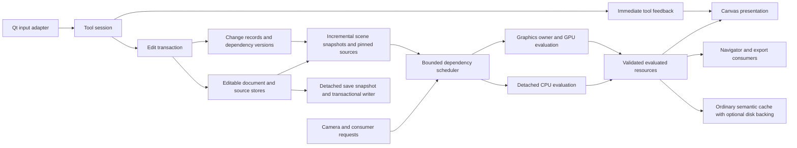

# Blender architecture lessons for the Webtoon Maker refactor

October 6, 2026

Webtoon Maker should evolve toward a renderer that consumes versioned scene inputs independently of the canvas, with short input callbacks, explicit dependencies, retained CPU and GPU results, and bounded background work. Python and Qt can remain the application shell. The largest architectural opportunity is removing scene preparation and evaluation from the path that receives input and presents frames.

The current application already has retained native document tiles, regional effect evaluation, parallel CPU effects, a dedicated graphics worker, lazy source storage, focused history patches, and asynchronous recovery saves. A large refactor should develop these components into a coherent system. Replacing them would discard useful correctness and ownership work.

The goals are responsive drawing, erasing, navigation, selection, text and vector editing, transforms, and modifier changes on long chapters; predictable memory and job lifetimes; and unchanged native artwork, export, history, and recovery behavior. These are proposed architectural directions and acceptance criteria, rather than claims that the refactor has been implemented.

## Evidence and interpretation

The application source is the clean checkout at commit `13d659e9419dac80d57ae6a91a9e5f4a31bb5598`. Blender implementation references are pinned to development commit `491f0d3d8c490ae9d8b8410d8b503028c3fe8b14`, retrieved October 6. That source describes a development version, not necessarily the Blender installed on this machine.

Current source takes precedence over historical reports and guide summaries. In particular, the live effect pool has up to four workers, the navigator already defers updates during interactions, and several exact effects already run on a dedicated graphics thread. The September timing reports do not establish present performance. The [October optimization report](optimization-2026-10-02.md) describes relevant improvements and incomplete integrations, but its timings also remain historical.

The fresh checks at the end establish specific current behavior and a precision failure. They do not measure physical pen latency, native GPU performance, or the relative cost of every subsystem. Architectural bottlenecks below are verified execution boundaries; their ranking by runtime impact needs the baseline in the migration plan.

## Lessons from Blender

### Input and evaluation have explicit responsibilities

Blender has a sequential main loop: it collects events, dispatches handlers, processes notifiers, and updates drawing. Its dependency evaluator uses native parallel tasks but waits at evaluation stages, with a separate pass for operations that cannot safely run concurrently. Blender can still block input on expensive synchronous work. The useful lesson is to control the work on the interaction path and identify dependencies precisely. [Main loop](https://github.com/blender/blender/blob/491f0d3d8c490ae9d8b8410d8b503028c3fe8b14/source/blender/windowmanager/intern/wm.cc#L581), [dependency evaluation](https://github.com/blender/blender/blob/491f0d3d8c490ae9d8b8410d8b503028c3fe8b14/source/blender/depsgraph/intern/eval/deg_eval.cc#L252).

Parallelizing an algorithm and running it independently of input are different choices. Blender's native task pool can make its caller participate in work while waiting for completion. Its background job system instead defines worker computation separately from main-thread initialization, update, completion, and cancellation. Webtoon Maker needs both boundaries: background render jobs with explicit publication, and efficient native work inside those jobs. [Task pools](https://github.com/blender/blender/blob/491f0d3d8c490ae9d8b8410d8b503028c3fe8b14/source/blender/blenlib/intern/task_pool.cc#L255), [job responsibilities](https://github.com/blender/blender/blob/491f0d3d8c490ae9d8b8410d8b503028c3fe8b14/source/blender/windowmanager/intern/wm_jobs.cc#L63).

Blender distinguishes intermediate mouse movement from the newest movement, so painting can consume samples that another tool may ignore; trackpad navigation can accumulate deltas. It also deduplicates notifiers. For Webtoon Maker, coalesce evaluation and presentation requests while preserving timestamped drawing samples and ordered press, release, commit, and cancellation events. [Event handling](https://github.com/blender/blender/blob/491f0d3d8c490ae9d8b8410d8b503028c3fe8b14/source/blender/windowmanager/intern/wm_event_system.cc#L5426), [notifier deduplication](https://github.com/blender/blender/blob/491f0d3d8c490ae9d8b8410d8b503028c3fe8b14/source/blender/windowmanager/intern/wm_event_system.cc#L302).

Blender operators have invocation, modal update, completion, cancellation, and undo semantics. That provides a useful model for uniform tool sessions. Its modal autosave policy is not a reason to replace Webtoon Maker's existing detached recovery system; the transferable part is a clear transaction lifetime. [Operator lifecycle](https://developer.blender.org/docs/features/interface/operators/).

### Editable data and evaluated data have different owners

Blender separates editable originals from evaluated data used by rendering. Its current evaluated copies still share some edit/tool pointers, so they are not a universal immutable snapshot solution. Webtoon Maker should adopt the distinction with stronger isolation: editable records, transient tool state, pinned render inputs, evaluated results, and presentation resources. Share immutable buffers and replace changed records; copying an entire chapter and every image per input would defeat the purpose. [Copy on evaluation implementation](https://github.com/blender/blender/blob/491f0d3d8c490ae9d8b8410d8b503028c3fe8b14/source/blender/depsgraph/intern/eval/deg_eval_copy_on_write.cc#L508).

### Retained rendering reduces repeated work

Blender's mesh drawing caches prepared batches and buffers, with different dirty modes for geometry, shading, selection, and overlays. Its draw manager separates CPU preparation from context-owned uploads and uses resource and view fingerprints to avoid unnecessary visibility and command regeneration. Webtoon Maker can apply these principles with a much smaller scene and tile graph: preserve artwork results, invalidate affected dependencies, and update camera transforms and editing overlays independently. [Mesh draw cache](https://github.com/blender/blender/blob/491f0d3d8c490ae9d8b8410d8b503028c3fe8b14/source/blender/draw/intern/draw_cache_impl_mesh.cc#L357), [draw synchronization](https://github.com/blender/blender/blob/491f0d3d8c490ae9d8b8410d8b503028c3fe8b14/source/blender/draw/intern/draw_manager.cc#L114).

Blender also retains regional drawing surfaces and uses redraw flags to avoid unnecessary region work. Its drawing path disallows certain data writes while rendering. Webtoon Maker's paint callback should similarly consume prepared results and overlays, and enqueue missing work without changing document truth or evaluating entire effect stacks. [Window and region drawing](https://github.com/blender/blender/blob/491f0d3d8c490ae9d8b8410d8b503028c3fe8b14/source/blender/windowmanager/intern/wm_draw.cc#L1199).

### The compositor is the closest rendering analogy

Blender's compositor groups compatible pixel operations and chooses a native CPU procedure or GPU shader operation according to the evaluation context. Its scheduler starts from required outputs and considers intermediate buffer pressure. Those ideas map directly to source images, masks, modifiers, layers, and document tiles. Webtoon Maker already has regional evaluation and exact point-chain compilation; extend them into a demand-driven execution plan with explicit fusion boundaries. [Pixel operation compilation](https://github.com/blender/blender/blob/491f0d3d8c490ae9d8b8410d8b503028c3fe8b14/source/blender/compositor/intern/node_tree_evaluator.cc#L219), [output and memory scheduling](https://github.com/blender/blender/blob/491f0d3d8c490ae9d8b8410d8b503028c3fe8b14/source/blender/compositor/intern/scheduler.cc#L140).

Compositor results distinguish CPU and GPU backing, explicit transfer operations, shared storage, and lifetimes. A comparable resource representation would let Webtoon Maker pass a GPU result into another compatible effect and then presentation, without turning every stage back into a CPU image. The semantic image must remain independent of where its bytes reside. [Result storage and transfers](https://github.com/blender/blender/blob/491f0d3d8c490ae9d8b8410d8b503028c3fe8b14/source/blender/compositor/intern/result.cc#L472).

GPU execution alone is insufficient. Blender's sequencer documentation describes CPU to GPU to CPU transfers for individual effects and warns that simple graphs can be slower. Its compositor manual describes UI stalls from shared GPU resources. Measure complete chains, transfers, and presentation delay, and bound GPU submissions. [Sequencer transfer costs](https://developer.blender.org/docs/release_notes/5.2/sequencer/), [compositor limitations](https://docs.blender.org/manual/en/4.5/compositing/limitations.html).

Blender treats source color conversion, alpha association, working buffers and display conversion as explicit boundaries. Its color-management code uses alpha-aware processors and bypasses color transforms for non-color data. Apply that separation to Webtoon Maker's color images, masks and evaluated resources while preserving each existing pixel policy. Adopting Blender's scene-linear working convention wholesale would change legacy native pixels. [Color and alpha processing](https://github.com/blender/blender/blob/491f0d3d8c490ae9d8b8410d8b503028c3fe8b14/source/blender/imbuf/intern/colormanagement.cc#L1823).

### Undo and language choices follow ownership

Blender's memfile undo coordinates outstanding preview jobs, restored data, dependency retagging, and regenerated previews. Webtoon Maker should preserve its focused patches and sparse raster history while routing undo through the same change and dependency system as forward edits. Worker completion must not resurrect an undone revision. [Undo integration](https://github.com/blender/blender/blob/491f0d3d8c490ae9d8b8410d8b503028c3fe8b14/source/blender/editors/undo/memfile_undo.cc#L79).

Blender's native core and GPU operations should not be confused with its Python extension API, whose documentation warns about threading safety. In ordinary CPython, CPU-bound Python bytecode also does not gain multicore execution merely by adding threads. Keep Python for UI and orchestration initially; choose compiled kernels, processes, or shaders from measured work and explicit data boundaries. A language rewrite would preserve architectural stalls if it preserved broad invalidation and GUI waits. [Blender Python threading](https://docs.blender.org/api/5.0/info_gotchas_threading.html), [CPython threading considerations](https://docs.python.org/3.13/library/threading.html#gil-and-performance-considerations).

## Current Webtoon Maker execution map

| Function | CPU and GPU work | Current owner and limitation |
| --- | --- | --- |
| Mouse, pen, keyboard and touch | Python tool dispatch and native Qt input | GUI thread. Drawing samples retain pressure, tilt, rotation and timestamps; navigation and several handles already coalesce updates. |
| Raster brush and eraser | CPU brush orchestration and native image painting | Immediate GUI work on sparse source tiles; dirty notifications aggregate. A completed stroke produces one history transaction. |
| Selection and vector editing | CPU geometry, hit testing and spatial indexes | GUI-owned tool state. Changed strokes can retain unrelated geometry and rasterized results. |
| Scene traversal, masks and source capture | Mainly CPU geometry and QPainter into QImage | Canvas-thread backend reads live document and ambient canvas state. A GPU widget does not detach this work. |
| Exact tile evaluation | CPU dependency traversal and region kernels | Fixed native tile addresses; finite halos, disjoint islands and explicit full-source fallbacks. Some kernels execute inline; eligible expensive work is detached. |
| Deferred CPU effects | Detached CPU kernels and immutable inputs | Live canvas configures up to four workers with a shared 256 MiB admission budget, cancellation and guarded publication. |
| Exact point chains | CPU compiled tables; eligible large detached inputs use GPU tables and float textures | Dedicated OpenGL 4.3 worker after initialization; GUI ordinarily uses CPU tables. A standalone GUI GPU fallback remains before worker preparation. Masks, float contracts and unsupported operations have eligibility limits. |
| Exact scalar blur | CPU reference/regional path or GPU pyramid for eligible large detached byte inputs | GPU worker owns resources; final float output is read back. Regional graph blur remains CPU. |
| Pattern, cage and selected custom blends | Optional shaders, with CPU preparation and QImage results | Older context-owned helpers can run synchronously on the GUI; readback remains an explicit cost. |
| Canvas presentation | Retained OpenGL tile textures, transforms and overlays | GUI graphics context, with raster fallback. Native tile pixels are independent of zoom and display density. |
| Large fill and replay | GUI capture followed by detached CPU work | Qt global pool. Capture yields between tiles; publication checks source, history, selection and document dependencies. |
| Navigator | CPU scene rendering into cached preview bands | Deferred 120 ms, pauses during interaction, processes 32-pixel bands, publishes completed regions. Its paint handler only displays cache. A band can still contain expensive indivisible work. |
| Recovery save | GUI metadata/resource capture; detached encoding and publication | One recovery worker; newest queued snapshot per document. Explicit save/close may intentionally finish a conflicting transaction. |
| Manual save and export | Repository publication; canvas exact render and image encoding | Ordinary UI paths are synchronous. Export still calls the canvas renderer and then encodes a complete image. |
| Disk render backing | Normal exact render service plus hashing, compression and IO | Two IO workers. Recording is explicit; draft/live results are excluded. It is not a separate renderer. |

Execution evidence: [input dispatch](C:/Users/hopper/Documents/GitHub/webtoon-maker/comic_editor/ui/canvas.py:14062), [brush packets](C:/Users/hopper/Documents/GitHub/webtoon-maker/comic_editor/ui/brush_features.py:97), [navigation batching](C:/Users/hopper/Documents/GitHub/webtoon-maker/comic_editor/ui/canvas.py:14653), [scene backend](C:/Users/hopper/Documents/GitHub/webtoon-maker/comic_editor/ui/scene_render_backend.py:27), [tile evaluator](C:/Users/hopper/Documents/GitHub/webtoon-maker/comic_editor/render/tile_graph.py:54), [live CPU worker count](C:/Users/hopper/Documents/GitHub/webtoon-maker/comic_editor/ui/spatial_modifier_features.py:119), [effect jobs](C:/Users/hopper/Documents/GitHub/webtoon-maker/comic_editor/ui/effect_jobs.py:177), [point eligibility](C:/Users/hopper/Documents/GitHub/webtoon-maker/comic_editor/ui/point_lut.py:34), [graphics worker](C:/Users/hopper/Documents/GitHub/webtoon-maker/comic_editor/render/gpu/worker.py:88), [scalar GPU blur](C:/Users/hopper/Documents/GitHub/webtoon-maker/comic_editor/ui/gpu_effects.py:10), [legacy GPU cage](C:/Users/hopper/Documents/GitHub/webtoon-maker/comic_editor/ui/gpu_textures.py:102), [presentation](C:/Users/hopper/Documents/GitHub/webtoon-maker/comic_editor/ui/document_presentation.py:196), [fill capture](C:/Users/hopper/Documents/GitHub/webtoon-maker/comic_editor/ui/canvas.py:19334), [navigator scheduling](C:/Users/hopper/Documents/GitHub/webtoon-maker/comic_editor/ui/preview.py:86), [autosave](C:/Users/hopper/Documents/GitHub/webtoon-maker/comic_editor/ui/autosave.py:33), [manual save](C:/Users/hopper/Documents/GitHub/webtoon-maker/comic_editor/ui/main_window.py:2451), [export](C:/Users/hopper/Documents/GitHub/webtoon-maker/comic_editor/ui/main_window.py:6747), [disk backing](C:/Users/hopper/Documents/GitHub/webtoon-maker/comic_editor/ui/disk_cache.py:286).

## Boundaries that still constrain responsiveness

**The render snapshot describes identity rather than an evaluated scene.** `RenderDocument` freezes identity, revision and display metadata. `CanvasSceneBackend` still reads live stores and temporarily changes canvas flags during capture. The service is a useful abstraction, but the production backend cannot simply be moved to a worker. [Render document](C:/Users/hopper/Documents/GitHub/webtoon-maker/comic_editor/render/service.py:50), [capture state](C:/Users/hopper/Documents/GitHub/webtoon-maker/comic_editor/ui/scene_render_backend.py:36).

**A deadline between capture blocks cannot bound one expensive capture.** The service starts at least one fixed 4 by 4 tile block and checks the deadline between blocks. The UI's eight-millisecond target therefore cannot constrain an expensive first block, source preparation, global mask, or GPU readback. Preserve fixed capture origins needed for Qt antialiasing until equivalence is proved; move expensive capture away from presentation rather than merely shrinking the deadline. [Batch scheduling](C:/Users/hopper/Documents/GitHub/webtoon-maker/comic_editor/render/service.py:264), [UI deadline](C:/Users/hopper/Documents/GitHub/webtoon-maker/comic_editor/ui/document_projection_features.py:295).

**GPU results usually become CPU images before final display.** Exact point-chain cache hits still read float pixels back, and scalar blur returns CPU pixels. Older cage/pattern helpers return QImages. Document presentation later uploads composed tile images. The effect accelerator and final presenter therefore do not yet form a continuous device-resident graph. [Point readback](C:/Users/hopper/Documents/GitHub/webtoon-maker/comic_editor/render/gpu/point_chain.py:225), [blur readback](C:/Users/hopper/Documents/GitHub/webtoon-maker/comic_editor/render/gpu/blur.py:318), [presentation uploads](C:/Users/hopper/Documents/GitHub/webtoon-maker/comic_editor/ui/document_presentation.py:204).

**Focused history still triggers broad work.** History patches can retain existing model objects, yet restoration cancels jobs and clears broad render caches. Some transform/property callers also serialize full chapter state at gesture boundaries before compiling a focused patch. Modifier/layer cache identities recursively derive serialized state. These are opportunities for centralized change records and maintained dependency generations, not evidence that present invalidation is incorrect. [History restore](C:/Users/hopper/Documents/GitHub/webtoon-maker/comic_editor/ui/canvas.py:1940), [focused patch](C:/Users/hopper/Documents/GitHub/webtoon-maker/comic_editor/core/document_patch.py:74), [layer signatures](C:/Users/hopper/Documents/GitHub/webtoon-maker/comic_editor/ui/canvas.py:8399), [whole chapter serialization](C:/Users/hopper/Documents/GitHub/webtoon-maker/comic_editor/core/models.py:5067).

**Separate pools and budgets lack one admission view.** Effect, fill, GPU, recovery, cache IO and tile-pinning work have different owners. Individual limits are valuable, but total memory and nested native parallelism can exceed what one subsystem sees, especially with multiple open sessions. This is an architectural risk to measure, not an established memory leak. [Effect budget](C:/Users/hopper/Documents/GitHub/webtoon-maker/comic_editor/ui/effect_jobs.py:16), [cache executor](C:/Users/hopper/Documents/GitHub/webtoon-maker/comic_editor/render/cache.py:198), [pinning executor](C:/Users/hopper/Documents/GitHub/webtoon-maker/comic_editor/core/tile_backing.py:18), [session ownership](C:/Users/hopper/Documents/GitHub/webtoon-maker/comic_editor/ui/sessions.py:28).

`canvas.py` has 25,657 lines and `main_window.py` has 6,924 at this revision. Their size helps explain the migration surface; the actual problem is shared responsibilities and mutable ownership. Dividing the same logic into more mixins would not by itself remove a synchronous capture or transfer.

## Proposed target architecture

Keep Qt's event loop and existing document schemas. Make the canvas a presenter and interaction surface, with tools, transactions, evaluation and resource ownership behind explicit interfaces.



### Ownership and interfaces

The following names describe proposed interfaces, not existing classes to rename mechanically.

| Boundary | Owner and input | Output and rule |
| --- | --- | --- |
| `InputAdapter` and `ToolSession` | GUI; ordered device samples and tool context | Gesture-local state and edit operations. Begin, update, commit and cancel have explicit semantics. |
| `EditTransaction` | GUI document owner; changed records and resource patches | One history entry and a structured `ChangeSet`. Forward edits and undo use the same dependency propagation. |
| `EvaluatedScene` compiler | Incremental GUI-owned metadata extraction initially; detached compilation where safe | Stable entity order, transforms, geometry, clip/mask relationships, text layouts and source-revision handles. No live canvas reference. |
| `EvaluationScheduler` | Bounded coordinator; consumer requests and dependency plans | Deduplicated tasks with readiness, cancellation, priority and memory reservations. It never fills a worker queue by blocking input. |
| CPU evaluator | Workers; immutable scene data, distinct writable destinations | Exact or explicit preview results. Shared intermediate caches contain immutable values. |
| GPU evaluator | Graphics context owner; compatible planned segments | Completed device resources or explicit CPU materialization. Upload, execution, fences and destruction have one documented lifetime. |
| `ResultRegistry` | Coordinator; semantic keys and validated completion | CPU/GPU backing, region/origin, precision, color/alpha contract and quality. Consumer identity is separate from reusable content identity. |
| Presenter and UI observers | GUI; ready resources and relevant changes | Camera transforms, overlays and selective panel refresh. Painting does not wait for evaluation. |
| Save/export writers | IO owner; pinned revision and output plan | Atomic publication with correct revision reporting, errors and recovery. No reads of a changing live document. |

A `ChangeSet` should identify changed entities, fields, hierarchy/order operations, old and new influence bounds, raster tile generations, image/mask generations, and whether the change is transient or committed. Dependencies include clipping ancestors, mask contributors, compound operands, target-layer effect sources, fonts and color configurations. Unknown cases retain conservative invalidation. A dirty rectangle alone is insufficient.

A render ticket should carry document epoch, scene revision, semantic dependency identity, requested native region, output phase, quality and pixel contract. The epoch prevents results for a closed or replaced document from publishing. Dependency identities permit reuse when content is unchanged. Camera changes reprioritize demand; they need not destroy semantically valid results. An obsolete consumer ticket may stop publication while its exact result remains reusable if its dependencies are still valid.

Snapshot creation must be incremental. Reuse unchanged geometry, layouts, records, images and pinned tiles. The existing detached tile snapshots and immutable encoded image pins are starting points. Avoid replacing live-scene access with a full deep copy at every pointer event. [Pinned tile snapshots](C:/Users/hopper/Documents/GitHub/webtoon-maker/comic_editor/core/tiles.py:77), [original image ownership](C:/Users/hopper/Documents/GitHub/webtoon-maker/comic_editor/core/images.py:19).

Publication must also preserve composition coherence. The current projection presents tiles progressively during unchanged-artwork loading/navigation, but edits and split base/top passes retain whole-frame publication. Keep that policy until a replacement proves equivalent: an exact edited view needs a matching document, configuration, revision and complete phase set. Retain the previous coherent view while replacements finish, or explicitly present a provisional composition with current tool feedback. Validating each tile independently cannot prevent mixed-revision masks or mismatched phases. [Current publication policy](C:/Users/hopper/Documents/GitHub/webtoon-maker/comic_editor/ui/document_projection_features.py:226).

### Scheduling and resource policy

Use one admission policy across the existing execution domains while retaining separate compute, graphics and IO owners. A recovery writer may remain serial for publication safety; independent CPU tiles may run concurrently. Choose CPU concurrency with native-library thread counts and memory bandwidth in view. A worker waiting synchronously on the graphics thread consumes a CPU slot, so plan that dependency explicitly instead of treating every queued effect as independent computation.

Priorities should favor immediate tool feedback, visible edited content and interaction completion, then visible missing coverage, navigator/thumbnails, nearby prefetch, and explicit cache preparation. Save and export need their own progress and fairness policy so they eventually complete without starving the canvas. Older requests can be canceled or deduplicated; publication batches should also be bounded so many simultaneous completions cannot flood the GUI.

Reserve source, halo, intermediate, upload, result and snapshot bytes before starting work. Count pinned buffers once by shared ownership rather than once per reference, and expose CPU/GPU/queue/history residency separately. Oversized exact work can receive exclusive bounded admission or be deferred; admission pressure must never silently run the costly fallback inline on the GUI. Preserve dirty source and undo resources under eviction. The existing tile residency and private history spill are useful assets; they are distinct from durable exact render caches. [Tile eviction](C:/Users/hopper/Documents/GitHub/webtoon-maker/comic_editor/core/tile_backing.py:128), [history spill](C:/Users/hopper/Documents/GitHub/webtoon-maker/comic_editor/core/tile_history.py:33).

Current defaults illustrate why aggregate accounting matters: the graphics worker allows 128 MiB for GPU resources and 128 MiB for queued inputs/results, while the presenter separately retains up to 256 MiB of tile textures. Source decoded tiles and images have their own budgets. These limits are capacities, not measured simultaneous usage; the coordinator must count actual ownership and leave headroom for active work. [Graphics budgets](C:/Users/hopper/Documents/GitHub/webtoon-maker/comic_editor/render/gpu/worker.py:89), [presentation budget](C:/Users/hopper/Documents/GitHub/webtoon-maker/comic_editor/ui/document_presentation.py:123).

### GPU migration and Qt constraints

Start with the existing graphics owner and exact point/blur implementations. Introduce GPU handles between eligible nodes before broadening shader coverage. Retain CPU materialization for an actual CPU dependency, reference comparison, export encoder, or explicit disk recording. Device residency is an optimization for the same semantic result, not a separate correctness or invalidation system.

The current presenter and graphics worker do not establish a ready shared-texture pipeline. Direct consumption needs tested shared-context or equivalent transfer ownership, fences, resource leases, and destruction after all consumers finish. Qt supports threaded offscreen resource production, but context affinity and sharing are explicit constraints. Keep that migration gated; uploading a ready CPU tile remains a valid interim path. [Qt OpenGL widget threading](https://doc.qt.io/qt-6.8/qopenglwidget.html#threading), [offscreen surface lifecycle](https://doc.qt.io/qt-6/qoffscreensurface.html).

Qt supports QPainter on separate QImages in workers; painting widgets there is unsupported, and implicit sharing does not permit concurrent writes to one image instance. Detached scene rendering is therefore feasible without replacing Qt, provided live widgets, painter state, writable buffers and text resources have proper owners. [Qt painting and sharing rules](https://doc.qt.io/qt-6/threads-modules.html).

## Application to core workflows

| Workflow | Refactor direction | Behavior to preserve |
| --- | --- | --- |
| Drawing and erasing | Timestamped sample stream, sparse tile updates, independently scheduled feedback and exact dependent effects | Pressure/time/spacing, blending, erasing through underlying content, final samples, one undo gesture. A render backlog must not withhold strokes. |
| Navigation | Reuse ready native tiles; update transforms and visible demand; cancel obsolete presentation tickets | Pan/rotation/zoom behavior, camera snapping, no artwork supersampling from zoom or DPI. |
| Shapes, vectors and selection | Retain compiled geometry/spatial indexes; update changed entities and clip dependencies | Hit ordering, compound edges, curves, mask-only rules and screen-sized handles. Selection alone should not invalidate artwork. |
| Text | Retain font resolution, shaping, wrapping and layout separately from glyph presentation | Strict shape-dependent wrapping, edited text feedback, metrics, font dependencies and editable source text. |
| Transform and cage tools | Gesture-local draft from a stable baseline; metadata transforms where sampling permits; scheduled preview/exact work | Cancel restores baseline, release flushes final state, masks/linked helpers move correctly, existing resampling origin and rounding. |
| Masks and modifiers | Compiled reverse dependencies, finite halos or explicit full-source plans, compatible prefix reuse and fusion | Mask cycles rejected, external source links tracked, coordinate phase, global decisions and stage precision. |
| Fill | Reuse batched detached capture and guarded publication; integrate admission and cancellation | No stale source/reference application; canceled fill restores only resources it owns. |
| Navigator, thumbnails and outliner | Independent consumers and selective UI observers with controlled refresh | Existing interaction deferral, atomic preview publication, hierarchy order and selection behavior. |
| Undo and redo | Apply focused transactions through the same change graph; cancel obsolete consumers and reuse valid results | Sparse pixel history, unchanged entity identities, correct resources after delete/save/undo, no stale completion. |
| Save, recovery and export | Revision-pinned plans, background encoding and transactional publication; export consumes the evaluator | Original encoded bytes, source precision, last-good recovery, save/close serialization, exact native output and format behavior. |
| Blender publication and external imports | Validate then adopt immutable source revisions through edit transactions | Atomic publication bytes, external source identity, deferred imports during locked operations, no worker mutation of live stores. |

Unify viewport, navigator, asset, baking and export consumers around one evaluator gradually. Today export and special captures still use legacy canvas kernels. Keep the legacy adapter as a pixel oracle while migrating each consumer, then remove production dependence on it. Disk backing must always use the ordinary semantic caches and renderer. Streaming export is useful only where an encoder and dependency plan can preserve exact native output; it is not a prerequisite for the first ownership migration.

## Rendering and persistence contracts

The refactor must retain [AGENTS.md](../AGENTS.md), the [rendering guide](llm/02-canvas-rendering-and-drawing.md), and the [persistence guide](llm/03-data-session-and-persistence.md).

1. Final exact document tiles use one sample per canvas pixel. Camera zoom and display density never increase derived artwork resolution. Presentation surfaces and gizmos may use physical display pixels. Transient previews may use less detail, with explicit quality/status.
2. Original imported/raster pixels, source/effect grids, transforms, lattice origins, odd-size sampling, alpha conventions, color policy, float precision and legacy interstage rounding remain authoritative. GPU promotion and regionalization require native-pixel correctness and performance evidence.
3. A node explicitly declares its required source regions. Whole-field extrema, some patterns, contour/smudge behavior and Qt affine sampling cannot be converted into a local halo by assumption. Retain full-source dependencies until a specialized equivalent kernel is proved. [Current footprint exceptions](C:/Users/hopper/Documents/GitHub/webtoon-maker/comic_editor/ui/tile_effects.py:31).
4. Memory and disk use the same semantic identities, dependency validation and exact results. Renderer/library/color/font environment dependencies remain part of durable validation. GPU handles, runtime object IDs and camera state are not durable content identities.
5. Drafts and live edit results remain outside durable exact cache admission. Private dirty source/history spill and recovery save are different storage domains. Manual Cache to disk policy remains explicit; ordinary viewing does not automatically record.
6. Source publication remains immutable and atomic. Resource files publish before the manifest, pending markers and last-good revisions preserve recovery, and writers coordinate with pinned readers. An asynchronous manual save marks only its captured revision saved; newer edits remain dirty. [Repository publication](C:/Users/hopper/Documents/GitHub/webtoon-maker/comic_editor/core/persistence.py:308).
7. Working precision and display precision are distinct. Current foundations carry pixel contracts and several float kernels, but final tile presentation converts to RGBA8 and complete color integration remains unfinished. Finish and verify import, working, mask/effect/composition, display and export edges before enabling a broader float/HDR policy. [Pixel contract edges](C:/Users/hopper/Documents/GitHub/webtoon-maker/comic_editor/render/pixels.py:136), [display upload conversion](C:/Users/hopper/Documents/GitHub/webtoon-maker/comic_editor/ui/document_presentation.py:204).

Immediate tool feedback must depict the active gesture, while incomplete exact coverage remains distinguishable. A short paint that shows an old frame is not evidence of responsiveness. A preview must not change the source model, be called exact, or become a durable cache result.

## Migration plan and exit gates

Proceed in vertical slices that replace ownership paths end to end. Keep each slice reviewable and maintain the reference backend until corresponding consumers have equivalent output. File extraction can support the migration, but each phase must remove a real coupling or repeated operation.

| Phase | Concrete change | Evidence required to exit |
| --- | --- | --- |
| 0 Establish current gates | Capture representative saved-project workloads, resource/transfer counters and source/pixel manifests; resolve the reproduced import precision failures | Repeatable native/offscreen baselines by cache state, documented exact pixels and current failing tests explained and corrected before affected migrations. |
| 1 Centralize edit transactions | Add structured changes and dependency generations; migrate focused parameter/object edits and undo first | Same saved/history behavior; no unrelated record serialization or cache/tree rebuild for migrated edits; old/new damage and mask/compound dependencies validated. |
| 2 Standardize tool sessions | Extract input normalization, begin/update/commit/cancel, transient ownership and presentation requests | Drawing samples/pixels agree; final release flushes; focus loss, Escape and tool/chapter switches preserve each tool's commit/cancel policy, including brush commit on interrupted contact; one gesture equals one history entry. |
| 3 Detach scene evaluation | Compile incremental scene/source snapshots; add detached scene backend using existing kernels; migrate source/clip/text capture | Worker code has no live canvas/document/widget access; copied bytes proportional to change; stale/reentrant results rejected; exact fixed-origin reference agreement. |
| 4 Make presentation consumption only | Integrate bounded scheduling, shared admission and coherent result publication; move cold preparation away from paint/input | Paint/input callbacks do not wait for exact work; no mixed-revision edited views or mismatched base/top passes; representative cold and sustained workloads meet agreed latency gates while exact output converges; no inline expensive fallback under pressure. |
| 5 Retain GPU graph segments | Add resource handles/lifetimes, integrate exact point/blur segments, then measured high-value pattern/cage/blend paths | Native CPU/GPU equality at contract-required precision; fewer transfers per compatible chain; correct sharing/fences, fallback/context-loss behavior, bounded VRAM and no presentation starvation. |
| 6 Consolidate consumers and writers | Move navigator/assets/baking/export to common evaluator; background revision-pinned save/export; centralize observer updates | Cache/export/reference consistency; incremental UI behavior; reopen/recovery and injected-failure tests; save newer edits during publication; multi-session fairness and resource limits. |
| 7 Finish color integration and remaining hotspots | Complete explicit color edges; implement measured native kernels; remove migrated canvas coupling and compatibility adapters from production | End-to-end policy coverage, source precision tests, full feature/native regression suite, repeated performance comparisons and no unexplained quality/timing regressions. |

Phases 1 and 3 are foundational. Starting with a full C++ UI rewrite, a graphics API replacement, or more worker threads would leave the snapshot and publication problems unresolved. A small compiled geometry/brush kernel can be introduced earlier when profiling proves its value and its interface is already isolated; it need not wait for every feature migration.

## Measurement and acceptance

Track arrival to dispatch, handler time, preview readiness/presentation, exact readiness/presentation, GUI heartbeat gaps, snapshot/capture/signature time, admission/queue wait, cancellation waste, bytes uploaded/read back, GPU execution/fence wait, cache misses, and CPU/GPU/history/source residency. Distinguish inclusive wall time from CPU time and GPU time. Existing monitoring does not prove input-to-photon latency. [Monitor scope](C:/Users/hopper/Documents/GitHub/webtoon-maker/comic_editor/ui/performance_monitor.py:480), [process resource semantics](C:/Users/hopper/Documents/GitHub/webtoon-maker/comic_editor/core/performance_resources.py:142).

| Gate | Required coverage |
| --- | --- |
| Responsiveness | Sustained timestamped tablet input during cold loading, warm drawing, draw then navigate then draw, tall overviews, text/property edits, undo, autosave, cache pressure and multiple open sessions. Include queue delay and visible current input, not just a fast handler. |
| Performance targets | Retain existing warmed offscreen input p95 8 ms, paint p95 16.7 ms, commit 100 ms and vector long-stroke growth ratio at most 1.25 gates. For native representative workloads, propose the same warm timing targets plus a p99 stall budget agreed from phase 0. Treat those as acceptance targets, not current guarantees or exact-effect completion deadlines. |
| Exact convergence | Requests eventually complete after input settles; no unbounded queue, starvation or permanently stale frames. Expensive exact effects may take longer than a frame, but current gesture feedback remains available and incomplete coverage is explicit. |
| Pixels and precision | Compare native final tiles/export with the reference path across masked stacks, clipping, compounds, transformed sources, negative/odd coordinates, tile seams, float policies, fonts and CPU fallback. Require exact agreement wherever the current contract requires it. |
| Concurrency and lifecycle | Source edits, undo/redo, view/chapter replacement and closing during work; canceled/failed jobs; reentrancy; context loss; simultaneous writers and cache reads. Old completions cannot publish or falsely mark a revision saved; exact edited views cannot mix revisions, masks or unmatched base/top passes. |
| Memory and storage | Cold/warm/evicted/disk-backed results, private dirty/history spill, oversized jobs, pinned snapshots, corruption/version changes, reopen/copy/Save As, multi-session aggregate bounds and interrupted publication. |
| Camera and density | Zoom, rotation, resize and high DPI never increase native derived samples; overlays remain sharp and tile captures retain correct phase. |

Use repeated runs with the same source revision, workload, hardware, cache state and settings. Separate instrumented profiles from latency measurements, report p50/p95/p99 and maxima, and retain manifests and reference images. The sustained-input harness already posts events independently of render progress and can check exact convergence; reuse it. [Sustained workload](C:/Users/hopper/Documents/GitHub/webtoon-maker/tests/benchmark_drawing_stutters.py:511), [exact progress tracking](C:/Users/hopper/Documents/GitHub/webtoon-maker/tests/drawing_benchmark_support.py:7), [existing smoke thresholds](C:/Users/hopper/Documents/GitHub/webtoon-maker/tests/smoke_canvas_latency.py:33).

Existing regression families to retain include render service/backend, tile graph, projection publication/retention/culling, GPU worker/blur/point chain, input/navigation, preview scheduling, fill, document patches, undo, lazy/incremental storage, pixel contracts, cache dependencies, disk backing, save integrity and asynchronous autosave. Native GPU cases are necessary in addition to offscreen tests. Add tests for new ownership and failure boundaries rather than merely reproducing implementation details.

## Fresh validation and the precision gate

In Python 3.11.15, PySide6 6.11.1 and NumPy 2.4.6 with Qt offscreen, this check completed in 53.08 seconds:

```text
python -m pytest tests/test_render_service.py tests/test_async_autosave.py tests/test_pixel_contract.py tests/test_disk_render_cache.py
105 passed, 2 failed
```

Both failures are the byte and 16-bit variants of `test_straight_source_alpha_is_multiplied_after_entering_float_storage` at [the precision regression](C:/Users/hopper/Documents/GitHub/webtoon-maker/tests/test_pixel_contract.py:53). An isolated rerun reproduces both failures. The render service, asynchronous save and disk cache cases in this run pass; this selection does not prove the entire application or GPU backend correct.

The import path uses Qt's conversion to straight float storage before explicitly multiplying RGB by alpha. A one-pixel diagnostic reproduces changed RGB already at that conversion. For 16-bit straight input `(32768, 16384, 8192, 1)`, normalized RGB is approximately `(0.500008, 0.250004, 0.125002)`; the converted straight float RGB is `(1, 0, 0)`, with alpha `1/65535`. This localizes the observed loss to the conversion boundary in this environment; it does not establish Qt's internal cause or behavior on every version. [Import conversion](C:/Users/hopper/Documents/GitHub/webtoon-maker/comic_editor/render/pixels.py:147).

Resolve that precision gate before expanding the affected float import/color pipeline. Preserve the legacy policy and existing source bytes while doing so. Application implementation and user projects were not modified for this analysis.
