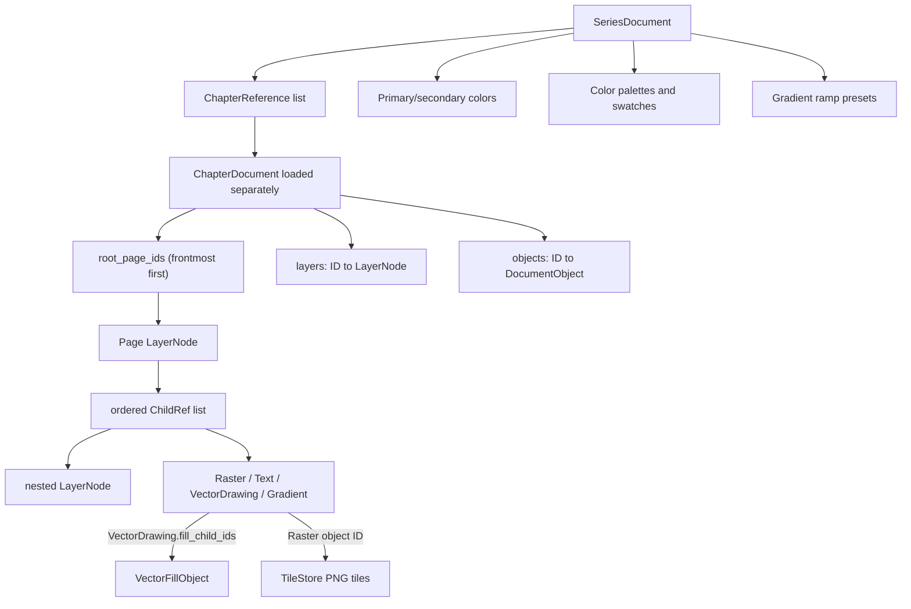

# Drawing data, session state, and persistence

## Data domains at a glance

The application separates four kinds of state:

| Domain | Primary owner | Durable? | Location |
| --- | --- | --- | --- |
| Series metadata/preferences | `SeriesDocument` | Yes | Portable project `series.json` |
| Chapter structured drawing data | `ChapterDocument` | Yes | Portable `chapters/<id>/chapter.json` |
| Raster pixels | `TileStore` | Yes | Portable per-object PNG tile directories |
| Asset document and metadata | `AssetManifest` | Yes | Portable `assets/<id>/asset.json` |
| Asset raster/thumbnail | `TileStore`, rendered `QImage` | Yes | Portable `assets/<id>/raster/` and `thumbnail.png` |
| Editor settings/workspace | `EditorSettings` | Yes, per user | Qt application config `settings.json` |
| Live editing session | `MainWindow`, `_CanvasLogic`, `CommandStack` | Mostly no | Process memory; recovery autosave contains only chapter/tile data |

There is no separate `SessionDocument` or session database. “Session data” in this codebase means the live application state described below.

## Saved document graph



All graph entities use UUID hex strings generated by `new_id()`. A chapter serializes layers and objects as arrays but rebuilds ID-keyed dictionaries in memory. Relationships are explicit stable IDs, not array indices.

### Ordering contract

- `root_page_ids` is frontmost first.
- Every `LayerNode.children` list is frontmost first and may interleave `layer` and `object` references.
- `VectorDrawingObject.fill_child_ids` is frontmost first within the fill stack, but all owned fills render behind the drawing's strokes.
- The renderer reverses these lists to paint back-to-front.

## Series data

`SeriesDocument` stores:

- `schema_version` (currently 14);
- series ID and name;
- ordered chapter references containing chapter ID/name only;
- primary and secondary canonical ARGB colors;
- color palettes, each with a stable ID, name, and stable-ID swatches;
- active palette ID; and
- gradient ramp presets, each with a stable ID, name, and copied ramp.

Validation canonicalizes colors to `#AARRGGBB`, ensures at least one palette and one gradient preset, repairs duplicate palette/preset/swatch IDs, and chooses a valid active palette. Legacy `brush_color` can seed series primary color.

Series preferences save independently from the current chapter. Color/palette/gradient-preset changes use a 250 ms debounce or immediate flush at interaction boundaries/close.

## Chapter data

`ChapterDocument` stores:

- ID and name;
- `size: [width, height]`, with width required to equal 1080;
- background color;
- chapter grid;
- ordered root page IDs;
- every `LayerNode` record;
- every typed object record; and
- schema version 14 and `document_kind` (`chapter` or `asset`).

The default height is 3240. `ensure_height_for()` grows past a layer's bottom by an additional 1080-pixel margin. Other canvas workflows also grow for raster/object/page bounds. `trim_height()` rejects a height above which any root page remains visible; the UI also includes object bounds in its minimum.

### LayerNode

A layer record contains:

- stable ID, name, `is_page`, and `layer_kind` (`bounded`, `open_shape`, or `fill`);
- parent layer ID or null for a root page;
- ordered mixed `ChildRef` records (`kind` + entity ID);
- visible flag and opacity;
- local translation;
- optional `BoundGeometry`;
- `ShapeStyle`;
- optional grid override;
- `last_raster_id` for contextual pencil/eraser activation;
- compound enabled flag and operation (`add`, `subtract`, `ignore`); and
- `ignore_parent_mask`.

Fill layers are special boundless leaves: they require a parent and fill color and may not own a bound, children, grid, border, compound state, or mask-escape behavior. Pages must be parentless roots and cannot be open, compound, or direct-mask-ignoring.

### BoundGeometry and ShapeStyle

`BoundGeometry` stores:

- main ordered `PathNode` list;
- open/closed flag;
- primitive tag (`rectangle`, `ellipse`, `custom`); and
- additional `PathContour` values, each with its own nodes and open/closed flag.

Each `PathNode` stores stable ID, position, point type (`vector`/`bezier`), optional incoming/outgoing controls, lock flag, roundness, explicit roundness-enabled flag, and width multiplier.

`ShapeStyle` stores optional core/fill color, base thickness, outline color/thickness, and start/end cap. Thickness values are rounded/clamped to pixel values during validation.

## Object records

All objects inherit these common fields:

- stable ID, type string, name, and parent layer ID;
- local `(x, y)`;
- visible and opacity;
- opacity lock;
- geometry reference (`direct` or `compound`);
- ignore-direct-parent-mask flag; and
- underlay opacity.

### RasterObject

Adds `tile_size` (256) and `interaction_rect: [left, top, width, height]`. Pixel data is deliberately absent from JSON and is loaded into `TileStore` from the raster directory. The frame must remain positive-sized but may include negative local coordinates.

### TextObject

Adds plain text, logical width/height, font family/size, bold, italic, kerning, layout mode, horizontal/vertical alignment, margin, and an optional four-point transform quad. Its display name is derived at runtime from content.

Legacy text alignment is migrated into an explicit free transform quad. Invalid alignment/layout values are corrected or rejected during load/validation.

### VectorDrawingObject

Adds an ordered list of `VectorStroke`, an ordered list of owned vector-fill IDs, and a drawing revision.

Each stroke stores stable ID, canonical color, closed flag, caps, per-stroke render revision, and points. Each `VectorStrokePoint` stores stable ID, position, incoming/outgoing cubic controls, absolute width, and opacity.

Stroke render revisions are serialized so render cache invalidation remains explicit across edits. Width is clamped to 1–1000 and opacity to 0–1.

### VectorFillObject

Adds owner drawing ID, closed multi-contour geometry, fill color, optional source seed, optional source enclosure/lasso, and a dictionary snapshot of fill settings.

A fill is present in the chapter object dictionary but not in any layer's `children`. It must be referenced exactly once by its owner drawing, share the owner's parent layer, and cannot change owner by drag/drop. Moving/deleting a drawing updates/cascades all owned fills.

### GradientObject and ColorFillGradientObject

The base gradient stores gradient type, active field type, all three field payloads, and a gradient revision. Dormant field payloads remain serialized so switching types does not destroy edits.

- `LineGradientField`: open `BoundGeometry`, parallel/perpendicular direction, reverse flag, perpendicular distance.
- `RadialGradientField`: origin, radii, rotation, ellipse flag, auto/manual center, reverse, uniform, distance.
- `ShapeGradientField`: auto/manual center, reverse, uniform, distance.
- `ColorFillGradientObject`: stable-ID ARGB ramp stops, interpolation type (`linear`), and loaded preset ID.

The chapter enforces at most one direct gradient child of each field type per parent shape.

## Chapter graph validation

`ChapterDocument.validate()` is the central invariant gate before save and after load. It verifies or normalizes:

- supported schema and exactly 1080-pixel width;
- unique and valid root pages;
- legal layer kinds, bounds, compound operations, and shape styles;
- every non-page layer has a valid non-fill parent;
- every layer/object appears exactly once in the reachable graph, except owned vector fills which use owner lists;
- no duplicate child references and no hierarchy cycles;
- object parent/container rules;
- vector drawing, stroke, point, and fill ownership integrity;
- gradient field validity and per-parent uniqueness through add/move paths;
- opacity, underlay, mask, geometry-reference, raster-frame, and text-layout constraints; and
- absence of unreachable normal entities.

Model mutations are intended to validate after drag/drop and before persistence. The tree model restores the serialized pre-move state if a reparent/reorder operation raises `ValueError`.

## Sparse raster data

`TileStore` keeps the in-memory mapping:

```python
dict[str, dict[tuple[int, int], QImage]]
```

The outer key is Raster object ID. Inner keys are signed tile coordinates. Each image is a 256×256 premultiplied ARGB `QImage`.

The store also has a `dirty` set of `(object_id, tile_x, tile_y)` tuples. `save_directory()` supports dirty-only publication, but `SeriesRepository` currently requests a complete tile publication for both manual saves and recovery autosaves. Empty or deleted tile images remove their PNG. Directories for no-longer-live Raster IDs are removed during save.

On disk, tile names are `<x>_<y>.png`, so negative coordinates are represented naturally, such as `-1_2.png`.

## Portable on-disk project layout

```text
<series-folder>/
├── series.json
└── chapters/
    └── <chapter-id>/
        ├── chapter.json
        ├── raster/
        │   └── <raster-object-id>/
        │       ├── 0_0.png
        │       ├── 1_0.png
        │       └── ...
        ├── last_good/
        │   ├── chapter.json
        │   └── raster/...          # previous complete manual revision
        ├── .save_pending           # exists only across an interrupted manual save
        └── autosave/
            ├── chapter.json
            ├── recovery.json       # saved_at timestamp
            └── raster/...
```

Not every recovery/backup item exists at all times. A successful manual save removes `autosave/` and `.save_pending`.

Each series may also contain self-contained assets:

```text
<series-folder>/assets/<asset-id>/
├── asset.json
├── thumbnail.png
├── raster/<raster-object-id>/*.png
├── last_good/...
└── autosave/...
```

Asset folders use stable UUIDs, so a rename changes only the manifest. Asset manual saves use the same tile-first/manifest-last pending-marker protocol as chapters and publish the updated thumbnail in the same transaction.

## Save, autosave, and recovery protocol

### Atomic JSON

`atomic_json()` writes a process-specific hidden temporary file, flushes it, calls `fsync`, and atomically replaces the destination.

### Manual chapter save

1. Validate the complete chapter graph.
2. If a current manifest exists, replace `last_good/` with a copy of the current manifest and raster directory.
3. Atomically create `.save_pending` with a start time.
4. Publish raster tiles first.
5. Atomically publish `chapter.json` last.
6. Remove `.save_pending` and clear dirty tile markers.
7. Remove recovery autosave data.

Publishing the manifest last prevents a new graph from pointing at partially published tile state without leaving a detectable marker.

### Interrupted save recovery

When loading the normal chapter, `_recover_interrupted_save()` first checks `.save_pending`. If present, it requires `last_good/chapter.json`, replaces the current raster directory and manifest with that complete revision, and removes the marker. An interrupted first-ever save without a previous revision is reported as unrecoverable.

### Recovery autosave

Any document change marks the current chapter dirty and starts a two-second single-shot timer. Autosave is rate-limited to once per 30 seconds. It writes a complete, independent chapter/tile snapshot beneath `autosave/` and does not clear the manual-save dirty state.

On chapter open, `has_recovery()` compares the recovery manifest modification time to the manual manifest. The UI can load the recovery snapshot instead. A successful manual save clears recovery data.

## Editor settings data

`EditorSettings` is version 12 and is written to the platform path returned by Qt's `QStandardPaths.AppConfigLocation`, in `settings.json`. It is not stored in the portable series folder.

It contains:

- tablet navigation, snap-to-grid, legacy page-scope flag, predictive ink, and renderer choice;
- pencil/eraser S/M/L sizes and defaults;
- pencil presets and active preset;
- eraser shape;
- transform and rectangle edit modes;
- text formatting presets, active preset, and whether font-list entries preview their own families;
- all hotkey chords and Hold flags;
- vector eraser, fitting, redraw, and simplify settings;
- fill tracing/area settings;
- three workspace splitter states; and
- up to 12 recent series paths.

Loading progressively backfills/migrates settings from earlier versions, filters unknown fields, clamps values, protects the default Linear pencil and Default text presets, adds the default Delete Selected binding, and always emits version 12 on save. Text-preset sizes normalize to integers from 6 through 250. Settings save through a temporary file followed by replace.

The chapter `TextObject.font_size` field remains numeric and the chapter schema stays at version 14. Fractional or out-of-range legacy document values continue rendering unchanged until a user edits that specific object's size through a ribbon or canvas control; such edits store an integer from 6 through 250.

Primary/secondary colors, palettes, and gradient presets are **series** preferences, not editor settings. `brush_color` remains as a compatibility/current-primary bridge for drawing behavior.

## Live session state

### MainWindow state

The window holds one `EditorSession` per project tab. A session owns its repository/project context, active document and tiles, dirty/autosave timing, canvas session state, hierarchy expansion, and ribbon choice. The window also owns the active-session proxies, hotkey chord/hold state, and application timers.

Most of this is transient. Persisted pieces are project data, editor settings, recent paths, and splitter sizes.

### Canvas state

The canvas holds:

- active chapter and `TileStore`;
- current `ToolKind`;
- selected entity plus active layer/page/object IDs;
- camera center/scale/rotation;
- active pointer, stylus hover, touch navigation, and predictive-ink state;
- raster stroke and transform snapshots;
- text caret, selection, local history, and pre-session chapter state;
- shape creation/edit selection, controls, and conversion state;
- vector samples, sweep paths, selections, preview payloads, connect endpoints, and pre-gesture object graph;
- drawing-selection geometry, transform quad, pivot, and raster/vector before state;
- page-creation and page-gap staged transaction state; and
- compound/vector/gradient/navigation/transform render caches, including the
  vector cache's byte count and lazy per-drawing spatial indexes.

Selection, camera position, command history, active tool, gesture state, local text undo, and render caches are not written into project JSON or recovery autosaves. Switching project tabs retains the committed state in memory; switching chapters inside a series still binds a new chapter/tile store and resets chapter-local transient state.

## Undo/redo data

`CommandStack` stores at most 200 commands in memory. Pushing a command clears redo history. It is reset when a chapter is bound.

Three command forms are used:

- `CallbackCommand`: arbitrary redo/undo callbacks, commonly restoring complete serialized chapter snapshots for structural/model changes.
- `TilePatchCommand`: before/after QImages for only touched raster tile keys, plus optional before/after frame or other state through a callback.
- `ObjectPatchCommand`: deep-copied before/after serialized records for a focused set of object IDs. Restore updates same-type live objects in place when possible.

The canvas also has specialized vector graph restore logic that preserves drawing/stroke/point object identity where IDs and types match.

Undo history itself is never saved. Recovery autosave represents only the latest autosaved document and raster state.

## Migration behavior

- Future chapter or series schemas above version 14 are rejected without rewrite.
- Chapter load accepts older schema values, rebuilds typed objects, migrates legacy text alignment into free quads, normalizes current invariants, validates, and sets the in-memory schema to 14.
- `LayerNode.from_dict()` accepts legacy fill/border/radius fields and converts them into `ShapeStyle`/node roundness.
- `BoundGeometry.from_dict()` accepts legacy rectangle/circle representations.
- Gradient distance accepts the old `outward_distance` key.
- Series loading accepts legacy `brush_color` and can receive the old global brush color from the UI when no series color exists.
- Settings have their own independent version-11 migration pipeline.

## Safe modification rules for future agents

- Add new saved fields to both serialization and deserialization, then decide how older files default or migrate.
- Keep graph IDs stable across ordinary edits; selection, outliner restoration, vector caches, and undo rely on them.
- Do not add Vector Fill IDs to a layer's normal child list.
- Preserve frontmost-first list semantics.
- Validate before save and after complex hierarchy changes.
- If adding raster-like data, coordinate its publication with the manifest-last recovery protocol.
- Do not treat the interaction frame as pixel bounds or clipping.
- Decide explicitly whether a new preference belongs to portable series data, chapter data, or per-user settings.
- Treat render/gesture/camera state as transient unless a product requirement explicitly asks to persist it.
