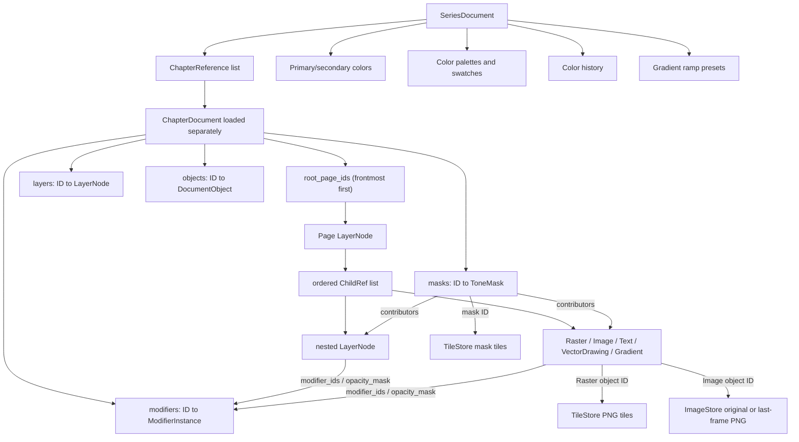

# Drawing data, session state, and persistence

## Data domains at a glance

The application separates several kinds of state:

| Domain | Primary owner | Durable? | Location |
| --- | --- | --- | --- |
| Series metadata/preferences | `SeriesDocument` | Yes | Portable project `series.json` |
| Chapter structured drawing data | `ChapterDocument` | Yes | Portable `chapters/<id>/chapter.json` |
| Raster pixels | `TileStore` | Yes | Portable per-object PNG tile directories |
| Tone-mask paint pixels | `TileStore` (mask IDs) | Yes | Portable per-mask PNG tile directories |
| Embedded/cached image pixels | `ImageStore` | Yes | Portable per-object image directories |
| Blender publication imports | `BlenderImageSourceController` + `ImageStore` | Yes after acceptance | Original atomic publication PNG bytes embedded per linked Image Object |
| Asset document and metadata | `AssetManifest` | Yes | Portable `assets/<id>/asset.json` and `assets/library.json` |
| Asset raster/thumbnail | `TileStore`, rendered `QImage` | Yes | Portable `assets/<id>/raster/` and `thumbnail.png` |
| Editor settings/workspace | `EditorSettings` | Yes, per user | Qt application config `settings.json` |
| Live editing session | `MainWindow`, `_CanvasLogic`, `CommandStack` | Mostly no | Process memory; recovery autosave contains only chapter/tile/mask/image data |

There is no separate `SessionDocument` or session database. "Session data" in this codebase means the live application state described below.

## Saved document graph



All graph entities use UUID hex strings generated by `new_id()`. A chapter serializes layers and objects as arrays but rebuilds ID-keyed dictionaries in memory. Relationships are explicit stable IDs, not array indices.

### Ordering contract

- `root_page_ids` is frontmost first.
- Every `LayerNode.children` list is frontmost first and may interleave `layer` and `object` references.
- Modifier stacks are ordered by their per-entity `modifier_ids` list, applied in card order.
- The renderer reverses these lists to paint back-to-front.

## Series data

`SeriesDocument` stores:

- `schema_version` (currently 17);
- series ID and name;
- ordered chapter references containing chapter ID/name only;
- primary and secondary canonical ARGB colors;
- color palettes, each with a stable ID, name, and stable-ID swatches;
- active palette ID;
- color history, capped at 24 canonical ARGB entries; and
- gradient ramp presets, each with a stable ID, name, and copied ramp.

Validation canonicalizes colors to `#AARRGGBB`, ensures at least one palette and one gradient preset, repairs duplicate palette/preset/swatch IDs, caps the color history, and chooses a valid active palette. Legacy `brush_color` can seed series primary color.

Series preferences save independently from the current chapter. Color/palette/gradient-preset changes use a 250 ms debounce or immediate flush at interaction boundaries/close.

## Chapter data

`ChapterDocument` stores:

- ID and name;
- `size: [width, height]`, with width required to equal 1080 for chapter documents;
- background color;
- chapter grid;
- ordered root page IDs;
- every `LayerNode` record;
- every typed object record;
- every `ModifierInstance` record;
- every `ToneMask` record;
- schema version 21 and `document_kind` (`chapter` or `asset`); and
- runtime-only `legacy_fill_migrations` plans for pending one-time fill materialization.

The default height is 3240. `ensure_height_for()` grows past a layer's bottom by an additional 1080-pixel margin. Other canvas workflows also grow for raster/object/page bounds. `trim_height()` rejects a height above which any root page remains visible; the UI also includes object bounds in its minimum.

### LayerNode

A layer record contains:

- stable ID, name, `is_page`, and `layer_kind` (`bounded` or `open_shape`);
- parent layer ID or null for a root page;
- ordered mixed `ChildRef` records (`kind` + entity ID);
- visible flag and opacity;
- local translation;
- optional `BoundGeometry`;
- `ShapeStyle`;
- optional grid override;
- `last_raster_id` for contextual pencil/eraser activation;
- compound enabled flag and operation (`add`, `subtract`, `ignore`);
- `ignore_parent_mask`;
- `mask_only` and `fill_reference` flags;
- `modifier_ids` (non-page bounded layers only);
- paired `transform_frame` and `transform_quad` for projective layer placement; and
- optional `opacity_mask: ParameterMaskBinding`.

Legacy `"fill"` layers are not a runtime kind: they are converted during load into sparse raster fill plans (`fill_migration.py`). Pages must be parentless roots and cannot be open, compound, direct-mask-ignoring, mask-only, or modifier-bearing.

### BoundGeometry and ShapeStyle

`BoundGeometry` stores:

- main ordered `PathNode` list;
- open/closed flag;
- primitive tag (`rectangle`, `ellipse`, `custom`); and
- additional `PathContour` values, each with its own nodes and open/closed flag.

Each `PathNode` stores stable ID, position, point type (`vector`/`bezier`), optional incoming/outgoing controls, lock flag, roundness, explicit roundness-enabled flag, and width multiplier.

`ShapeStyle` stores optional core/fill color, base thickness, outline color/thickness, and start/end cap. Thickness values are rounded/clamped to pixel values during validation.

## Tone masks and parameter masks

A `ToneMask` stores a stable ID, name, `saved` flag, an ordered `contributors` list of `(kind, entity_id)` tuples where kind is `layer` or `object`, and a `revision` integer bumped by `touch()`. Its grayscale field is the sum of contributor coverage plus optional sparse paint tiles stored in `TileStore` under the mask ID (persisted beneath `masks/`). Mask dependencies must be acyclic: validation rejects a mask that transitively requires its own rendered target.

A `ParameterMaskBinding` stores `mask_id`, `black_value`, and `white_value`. It appears as `opacity_mask` on layers and objects and inside modifier `parameter_masks` for intensity and per-type attributes. Rendering maps the mask field through the endpoints; endpoint edits update bound model values and coalesce into one undo command.

## Modifier records

`ModifierInstance = HueSaturationLightnessModifier | BlurModifier | OutlineModifier`. All share `modifier_id`, `modifier_type`, `name`, `intensity` (0–100), `expanded`, and `parameter_masks`.

- **HSL**: `hue` (−180…180), `saturation` (−100…100), `lightness` (−100…100).
- **Blur**: `strength` (0–100 px), `mode` (`full` | `focal`), `focal_center`, `focal_radius`, `focal_ramp` (0–1), `focal_angle`.
- **Outline**: `thickness` and `opacity` (0–100), `color` (canonical `#AARRGGBB`).

Eligibility (`modifier_target`): non-page bounded layers and Raster, Vector Drawing, and Image objects. Text, gradient objects, pages, and open shapes are excluded. Validation filters `modifier_ids` to existing modifiers, enforces eligibility, and garbage-collects unreferenced modifiers.

## Object records

All objects inherit these common fields:

- stable ID, type string, name (with separate `custom_name` when renamed), and parent layer ID;
- local `(x, y)`;
- visible and opacity;
- opacity lock;
- geometry reference (`direct` or `compound`);
- ignore-direct-parent-mask flag;
- `mask_only` and `fill_reference` flags;
- underlay opacity;
- `modifier_ids` where eligible; and
- optional `opacity_mask`.

### RasterObject

Adds `tile_size` (256), `interaction_rect: [left, top, width, height]`, and paired `transform_frame`/`transform_quad`. Pixel data is deliberately absent from JSON and is loaded into `TileStore` from the raster directory. The frame must remain positive-sized but may include negative local coordinates.

### ImageObject and image sources

An Image Object stores its source descriptor, pixel dimensions, placement mode, optional projective transform frame/quad, and fit mode:

- `EmbeddedImageSourceDescriptor` records the embedded filename and MIME type.
- `BlenderComicViewSourceDescriptor` records Blender project UUID, Comic View UUID, display-name hint, and last accepted revision.
- Placement is `free` or `fit_parent` with `auto_width`, `auto_height`, `stretch`, or `fit_inside`.

Schema-16 image records without a nested descriptor load as embedded sources. The migration exists only in memory until the chapter is next saved.

`ImageStore` owns persistent source bytes and decoded premultiplied images. For a Blender-linked object, the controller validates the notified absolute PNG path, size, format, revision, and dimensions, then stores the original bytes directly as `last-frame.png`; there is no runtime frame override or re-encode. Replacement changes no hierarchy and creates no Undo command, but it marks the chapter dirty for normal save/autosave persistence. Resolution changes preserve the Image Object's displayed width, center, and editor transform while adjusting its height to the new aspect.

### TextObject

Adds plain text, logical width/height, font family/size, bold, italic, kerning, object-wide `line_spacing`, layout mode, horizontal/vertical alignment, margin, and an optional four-point transform quad. `line_spacing` is persisted as a 0.5–3.0 multiplier, defaults to 1.0 for legacy records, and is applied through the shared Qt text document used by rendering and editing. Its display name is derived at runtime from content.

Legacy text alignment is migrated into an explicit free transform quad. Invalid alignment/layout values are corrected or rejected during load/validation.

### VectorDrawingObject

Adds an ordered list of `VectorStroke`, a drawing revision, and paired `transform_frame`/`transform_quad`. Owned vector-fill children no longer exist.

Each stroke stores stable ID, canonical color, closed flag, caps, per-stroke render revision, and points. Each `VectorStrokePoint` stores stable ID, position, incoming/outgoing cubic controls, absolute width, and opacity.

Stroke render revisions are serialized so render cache invalidation remains explicit across edits. Width is clamped to 1–1000 and opacity to 0–1.

### GradientObject and ColorFillGradientObject

The base gradient stores gradient type, active field type, all three field payloads, and a gradient revision. Dormant field payloads remain serialized so switching types does not destroy edits.

- `LineGradientField`: open `BoundGeometry`, parallel/perpendicular direction, reverse flag, perpendicular distance.
- `RadialGradientField`: origin, radii, rotation, ellipse flag, auto/manual center, reverse, uniform, distance.
- `ShapeGradientField`: auto/manual center, reverse, uniform, distance.
- `ColorFillGradientObject`: stable-ID ARGB ramp stops, interpolation type (`linear`), and loaded preset ID.

The chapter enforces at most one direct gradient child of each field type per parent shape.

### Legacy records

- `VectorFillObject` no longer exists at runtime. Legacy records are converted during load into raster fill materialization plans; a legacy record reaching the typed parser raises a hard migration error.
- `SpeedLinesGradientObject` and `SpeedLineCenterObject` remain in the model only for migration. `add_object` rejects speed lines, legacy speed-line records and centers are dropped at load with warnings, and references are repaired.

## Legacy fill materialization

`comic_editor/core/fill_migration.py` implements the one-time conversion that keeps old documents visually intact:

- Legacy geometric fill layers are rasterized from their parent's effective compound path.
- Legacy owned vector fills are rasterized from their stored geometry.
- `materialize_legacy_fills()` paints the antialiased color into 256-pixel sparse tiles after the chapter's tile directory loads.
- Plans are runtime-only; saving is blocked while any plan is pending.

## Chapter graph validation

`ChapterDocument.validate()` is the central invariant gate before save and after load. It verifies or normalizes:

- supported schema (≤ 20) and exactly 1080-pixel width for chapter documents;
- unique and valid root pages;
- legal layer kinds, bounds, compound operations, and shape styles;
- every non-page layer has a valid parent;
- every layer/object appears exactly once in the reachable graph;
- no duplicate child references and no hierarchy cycles;
- object parent/container rules;
- vector drawing, stroke, and point integrity;
- modifier eligibility and existence; mask existence, acyclicity, and reference integrity;
- transform-frame/quad pairing and non-degenerate quads;
- gradient field validity and per-parent uniqueness through add/move paths;
- opacity, underlay, mask, geometry-reference, raster-frame, and text-layout constraints; and
- absence of unreachable normal entities.

Model mutations are intended to validate after drag/drop and before persistence. The tree model restores the serialized pre-move state if a reparent/reorder operation raises `ValueError`.

## Sparse raster data

`TileStore` keeps the in-memory mapping:

```python
dict[str, dict[tuple[int, int], QImage]]
```

The outer key is a Raster object ID or a tone-mask ID. Inner keys are signed tile coordinates. Each image is a 256×256 premultiplied ARGB `QImage`.

The store also has a `dirty` set of `(owner_id, tile_x, tile_y)` tuples and a cached alpha-bounds map. `save_directory()` supports dirty-only publication, but `SeriesRepository` currently requests complete publication for both `raster/` and `masks/` on manual saves and recovery autosaves. Empty or deleted tile images remove their PNG. Directories for no-longer-live IDs are removed during save.

On disk, tile names are `<x>_<y>.png`, so negative coordinates are represented naturally, such as `-1_2.png`.

## Image storage

`ImageStore` keeps immutable original bytes per object ID (`ImageSource(filename, mime_type, data)`), a decoded premultiplied `QImage` cache, and a dirty set. Validated Blender publications enter through `put_decoded()` without another decode. Directory saves write only dirty IDs on incremental saves and delete stale files/directories.

## Portable on-disk project layout

```text
<series-folder>/
├── series.json
├── chapters/
│   └── <chapter-id>/
│       ├── chapter.json
│       ├── raster/
│       │   └── <raster-object-id>/
│       │       ├── 0_0.png
│       │       └── ...
│       ├── masks/
│       │   └── <mask-id>/
│       │       └── ...
│       ├── images/
│       │   └── <image-object-id>/
│       │       └── <embedded-name-or-last-frame.png>
│       ├── last_good/
│       │   ├── chapter.json
│       │   ├── raster/...        # previous complete manual revision
│       │   ├── masks/...
│       │   └── images/...
│       ├── .save_pending         # exists only across an interrupted manual save
│       └── autosave/
│           ├── chapter.json
│           ├── recovery.json     # saved_at timestamp
│           ├── raster/...
│           ├── masks/...
│           └── images/...
├── assets/
│   ├── library.json
│   └── <asset-id>/
│       ├── asset.json
│       ├── thumbnail.png
│       ├── raster/...
│       ├── masks/...
│       ├── images/...
│       ├── last_good/...
│       ├── .save_pending
│       └── autosave/...
└── exports/
```

Not every recovery/backup item exists at all times. A successful manual save removes `autosave/` and `.save_pending`.

Asset folders use stable UUIDs, so a rename changes only the manifest. Asset manual saves use the same tile-first/manifest-last pending-marker protocol as chapters and publish the updated thumbnail in the same transaction.

## Asset documents

`AssetManifest` (schema 2) stores the asset ID, name, `root_kind` (`layer` or `object`), `root_id`, a `ChapterDocument` of kind `asset` (default 512×512, transparent background), fitted `visual_bounds`, and the schema version. `assets/library.json` (schema 1) stores folder records and asset-to-folder memberships with tolerant loading for broken links. Extraction clones a subtree with fresh IDs (including referenced modifiers and masks) into a fitted canvas with 64-pixel padding; instantiation places an independent fresh-ID copy into a chapter.

## Save, autosave, and recovery protocol

### Atomic JSON

`atomic_json()` writes a process-specific hidden temporary file, flushes it, calls `fsync`, and atomically replaces the destination.

### Manual chapter save

1. Validate the complete chapter graph.
2. If a current manifest exists, replace `last_good/` with a copy of the current manifest plus raster, masks, and image directories.
3. Atomically create `.save_pending` with a start time.
4. Publish raster tiles, mask tiles, and images first.
5. Atomically publish `chapter.json` last.
6. Remove `.save_pending` and clear dirty tile/image markers.
7. Remove recovery autosave data.

Publishing the manifest last prevents a new graph from pointing at partially published tile state without leaving a detectable marker.

### Interrupted save recovery

When loading the normal chapter, `_recover_interrupted_save()` first checks `.save_pending`. If present, it requires `last_good/chapter.json`, replaces the current raster/mask/image directories and manifest with that complete revision, and removes the marker. An interrupted first-ever save without a previous revision is reported as unrecoverable.

### Recovery autosave

Any document change marks the current chapter dirty and starts a two-second single-shot timer. Autosave is rate-limited to once per 30 seconds. It writes a complete, independent chapter/tile/mask/image snapshot beneath `autosave/` and does not clear the manual-save dirty state.

On chapter open, `has_recovery()` compares the recovery manifest modification time to the manual manifest. The UI can load the recovery snapshot instead. A successful manual save clears recovery data.

### Save As

`SeriesRepository.clone_to()` stages a whole-series clone in a sibling temporary directory (ignoring autosave, last_good, pending markers, and temp files), writes in-memory session state through an overlay callback, and publishes with `os.replace`. `MainWindow` generates a fresh series ID and rebinds open tabs to the clone.

## Editor settings data

`EditorSettings` is version 21 and is written to the platform path returned by Qt's `QStandardPaths.AppConfigLocation`, in `settings.json`. It is not stored in the portable series folder.

It contains:

- tablet navigation, snap-to-grid, predictive ink, renderer choice, and global grid visibility/size/divisions/color/opacity defaults;
- pencil/eraser S/M/L sizes and defaults;
- pencil presets and active preset;
- eraser shape;
- transform and rectangle edit modes;
- transform-handle visibility, vector point icon visibility/size/opacity;
- text formatting presets, active preset, and whether font-list entries preview their own families;
- all hotkey chords and Hold flags;
- vector eraser, fitting, redraw, and simplify settings;
- fill subtool profiles (five subtools with blend mode, tolerance, gap, scaling, reference mode, stabilization, and exclusions) and raster fill tolerance;
- mask pencil pressure sensitivity and From/To alpha values;
- five workspace splitter states (including legacy key compatibility) and navigator expansion;
- the Blender loopback bridge endpoint and token (host clamped to loopback); and
- up to 12 recent series paths.

Loading progressively backfills/migrates settings from earlier versions, filters unknown fields, clamps values, protects the default Linear pencil and Default text presets, adds the default Delete Selected and Alt+G bindings, and always emits version 21 on save. Text-preset sizes normalize to integers from 6 through 250. Settings save through a temporary file followed by replace.

Primary/secondary colors, palettes, color history, and gradient presets are **series** preferences, not editor settings. `brush_color` remains as a compatibility/current-primary bridge for drawing behavior.

## Live session state

### MainWindow state

The window holds one `EditorSession` per project tab. A session owns its `ProjectContext` (repository, series, assets), active chapter, tiles, images, asset manifest, `CanvasSessionState`, dirty flag, autosave timing, hierarchy expansion, and manual ribbon choice. The window also owns the active-session proxies, hotkey chord/hold state, the Blender image-source controller, and application timers.

Most of this is transient. Persisted pieces are project data, editor settings, recent paths, and splitter sizes.

### Canvas state

The canvas holds:

- active chapter, `TileStore`, and `ImageStore`;
- current `ToolKind`;
- selected entity plus active layer/page/object IDs;
- camera center/scale/rotation;
- active pointer, stylus hover, touch navigation, and predictive-ink state;
- raster stroke and transform snapshots;
- text caret, selection, local history, and pre-session chapter state;
- shape creation/edit selection, controls, and conversion state;
- vector samples, sweep paths, selections, preview payloads, connect endpoints, and pre-gesture object graph;
- drawing-selection geometry, transform quad, pivot, and raster/vector before state;
- page-creation and page-gap staged transaction state;
- the active tone mask, mask paint state, and mask overlay caches; and
- compound/vector/gradient/modifier/navigation/transform render caches, including the vector cache's byte count and lazy per-drawing spatial indexes.

Selection, camera position, command history, active tool, gesture state, local text undo, and render caches are not written into project JSON or recovery autosaves. Switching project tabs retains the committed state in memory; switching chapters inside a series still binds a new chapter/tile/image store and resets chapter-local transient state.

## Undo/redo data

`CommandStack` stores at most 200 commands in memory. Pushing a command clears redo history. It is reset when a chapter is bound.

Three command forms are used:

- `CallbackCommand`: arbitrary redo/undo callbacks, commonly restoring complete serialized chapter snapshots for structural/model changes.
- `TilePatchCommand`: before/after QImages for only touched raster/mask tile keys, plus optional before/after frame or other state through callbacks.
- `ObjectPatchCommand`: deep-copied before/after serialized records for a focused set of object IDs. Restore updates same-type live objects in place when possible, and a `None` payload deletes the object.

The canvas also has specialized vector graph restore logic that preserves drawing/stroke/point object identity where IDs and types match.

Undo history itself is never saved. Recovery autosave represents only the latest autosaved document and raster state.

## Migration behavior

- Chapter schema 20 and series schema 17 are current; anything newer is rejected without rewrite.
- Chapter load accepts older schemas, rebuilds typed objects, migrates legacy text alignment into free quads, normalizes current invariants, validates, and sets the in-memory schema to 20.
- Legacy fill layers and owned vector fills are converted into pending tile materialization plans and rasterized after tile loading.
- Legacy speed-line records and centers are dropped with warnings; references are repaired.
- `LayerNode.from_dict()` accepts legacy fill/border/radius fields and converts them into `ShapeStyle`/node roundness.
- `BoundGeometry.from_dict()` accepts legacy rectangle/circle representations.
- Gradient distance accepts the old `outward_distance` key.
- Series loading accepts legacy `brush_color` and can receive the old global brush color from the UI when no series color exists.
- Image records accept legacy filename/mime fields and become embedded source descriptors.
- Settings have their own independent version-1-to-20 migration pipeline, including hotkey renames and splitter keys.

## Safe modification rules for future agents

- Add new saved fields to both serialization and deserialization, then decide how older files default or migrate.
- Keep graph IDs stable across ordinary edits; selection, outliner restoration, vector caches, and undo rely on them.
- Preserve frontmost-first list semantics.
- Keep mask dependencies acyclic and keep modifier eligibility rules in one place.
- Treat `transform_frame` and `transform_quad` as a paired record.
- Validate before save and after complex hierarchy changes.
- If adding raster-like data, coordinate its publication with the manifest-last recovery protocol.
- Do not treat the interaction frame as pixel bounds or clipping.
- Decide explicitly whether a new preference belongs to portable series data, chapter data, or per-user settings.
- Treat render/gesture/camera state as transient unless a product requirement explicitly asks to persist it.
- If you re-introduce geometric fill objects, integrate them with `fill_migration.py` and the save-block invariant.
