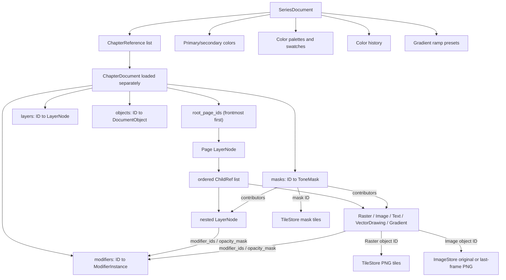

# Drawing data, session state, and persistence

## Data domains at a glance

The application separates several kinds of state:

| Domain | Primary owner | Durable? | Location |
| --- | --- | --- | --- |
| Series metadata/preferences | `SeriesDocument` | Yes | Portable project `series.json` |
| Chapter structured drawing data | `ChapterDocument` | Yes | Portable `chapters/<id>/chapter.json` |
| Raster pixels | `TileStore` | Yes | Portable per-object PNG tile directories |
| Optional exact render caches | `PersistentRenderCache` | Yes, manually | `chapters/<id>/.render-cache/index.json` and content-addressed lossless `values/*.cache`; derived and safe to clear |
| Tone-mask paint pixels | `TileStore` (mask IDs) | Yes | Portable per-mask PNG tile directories |
| Embedded/cached image pixels | `ImageStore` | Yes | Portable per-object image directories |
| Blender publication imports | `BlenderImageSourceController` + `ImageStore` | Yes after acceptance | Original atomic publication PNG bytes embedded per linked Image Object |
| Asset document and metadata | `AssetManifest` | Yes | Portable `assets/<id>/asset.json` and `assets/library.json` |
| Asset raster/thumbnail | `TileStore`, rendered `QImage` | Yes | Portable `assets/<id>/raster/` and `thumbnail.png` |
| Editor settings/workspace | `EditorSettings` | Yes, per user | Qt application config `settings.json` |
| Document viewport | `EditorSettings.document_viewports` | Yes, per user | Camera center, zoom, and rotation keyed by resolved project path and chapter ID in `settings.json` |
| Navigator cache range | `EditorSettings.document_cache_ranges` | Yes, per user | Draggable full-width start/end positions, snapped outward to native tile rows when caching |
| Live editing session | `MainWindow`, `_CanvasLogic`, `CommandStack` | Mostly no | Process memory; recovery autosave contains only chapter/tile/mask/image data |

There is no separate `SessionDocument` or session database. "Session data" in this codebase means the live application state described below.

Shared series preference changes use the same serial save coordinator as chapter
and asset publication. Model capture and verification yield between declared
fields; validation/serialization and file publication occur on the writer.
Queued changes for the same series coalesce and a change made during publication
is reconciled before completion. Close drains the preference request before
shutting down the writer. Ordinary color/preset changes enqueue without waiting.

Disk render caches are separate from source artwork, autosave and document
transactions. Saving does not populate or evict them. Missing, incompatible or
corrupt values are cache misses and can be regenerated by the ordinary renderer.
Cache index publication follows immutable blob writes and uses atomic replacement.
There is no automatic disk eviction; the navigator size menu clears selected
sections or all cached data. Shared intermediate values are removed when clearing
a segment; final cached rows outside that segment remain reusable.

Ordinary folder copies/moves can reuse content identities. Save As excludes
`.render-cache` while cloning/remapping the project and starts an empty derived
cache in the new location. Renderer/library/pixel-contract versions isolate
incompatible entries without discarding source data.

## Saved document graph

Chapter schema **27** adds `ToneMask.paint_offset`, a finite document-space
translation of the original sparse painted-mask grid. Older documents default
to `(0, 0)` without changing their appearance. Translation changes this origin
and the mask's owned gradient geometry, while preserving paint pixels and tile
addresses. It survives ordinary saves, recovery, undo/redo, asset extraction and
placement. Shared masks/rigs move only when every consuming target moves in the
same operation; linked contributor entities keep their normal scene placement.
Transient rig/mask preview copies and translation-cache state are not persisted.

Chapter schema **24** adds `CageTransformModifier` geometry (frame, lattice,
deformed points, optional source quad, pivot, smoothness, interpolation, and
uniform mode). Legacy repeating-texture settings are ignored when loading;
their layers retain ordinary shape behavior and source artwork.
Cage targets are validated atomically and
exclude raster/vector drawings, page roots, and text containers. Asset extraction
and placement carry cage geometry; ImageStore retains original image bytes.
The series schema is unchanged. Remembered modifier selection lives in
`CanvasSessionState`, not the saved document. Cage tool transactions restore
pixel/model snapshots on undo; unfinished direct previews cancel on tab changes.

External image projects use `document_kind="image"`, allow the source image's
native width, and retain a fixed canvas height. `external_image_path` stores the
original file as the fallback Export Again destination; per-user export settings
can override it after Export As. `prepare_image_project()` validates and embeds
the original image bytes, builds a transparent page without an outline, saves a
complete series in sibling staging storage, then publishes the image-stem folder.
Repeated launches reuse the matching project; unrelated folder or image-extension
collisions are rejected. Existing cached sessions retain unsaved edits.

View preferences `view_overflow`, `export_rect_enabled`, and `export_rect`
(x, y, width, height in document coordinates) are optional chapter fields.
Existing projects default to hidden overflow and full-chapter exports. Export
rectangle geometry survives toggling, session switches, Save, and recovery;
the interactive edit mode itself is transient. Per-user export destination
keys append `export_rect` for cropped exports. Full-image launch registration
must never overwrite the crop destination.

Blender texture handoffs optionally add a separate embedded image whose
`reference_role` is `uv_map`. Its source filename includes a digest of UV
metadata and canvas size. Reopening unchanged metadata reuses the guide;
changed UVs refresh its image bytes without replacing painted objects. Clean
previews/exports omit these guides even while the editor shows them.



```mermaid
flowchart TD
    S["SeriesDocument"] --> CR["ChapterReference list"]
    S --> CP["Primary/secondary colors"]
    S --> PAL["Color palettes and swatches"]
    S --> CH["Color history"]
    S --> GP["Gradient ramp presets"]
    CR --> C["ChapterDocument loaded separately"]
    C --> RP["root_page_ids (frontmost first)"]
    C --> LM["layers: ID to LayerNode"]
    C --> OM["objects: ID to DocumentObject"]
    C --> MM["modifiers: ID to ModifierInstance"]
    C --> TM["masks: ID to ToneMask"]
    RP --> P["Page LayerNode"]
    P --> CHR["ordered ChildRef list"]
    CHR --> L["nested LayerNode"]
    CHR --> O["Raster / Image / Text / VectorDrawing / Gradient"]
    O -->|"Raster object ID"| T["TileStore PNG tiles"]
    O -->|"Image object ID"| I["ImageStore original or last-frame PNG"]
    TM -->|"contributors"| L
    TM -->|"contributors"| O
    TM -->|"mask ID"| MT["TileStore mask tiles"]
    L -->|"modifier_ids / opacity_mask"| MM
    O -->|"modifier_ids / opacity_mask"| MM
```

All graph entities use UUID hex strings generated by `new_id()`. A chapter serializes layers and objects as arrays but rebuilds ID-keyed dictionaries in memory. Relationships are explicit stable IDs, not array indices.

### Ordering contract

- `root_page_ids` is frontmost first.
- Every `LayerNode.children` list is frontmost first and may interleave `layer` and `object` references.
- Modifier stacks are ordered by their per-entity `modifier_ids` list, applied in card order.
- The renderer reverses these lists to paint back-to-front.

## Series data

`SeriesDocument` stores:

- `schema_version` (currently 17);
- series ID and name;
- ordered chapter references containing chapter ID/name only;
- primary and secondary canonical ARGB colors;
- color palettes, each with a stable ID, name, and stable-ID swatches;
- active palette ID;
- color history, capped at 24 canonical ARGB entries; and
- gradient ramp presets, each with a stable ID, name, and copied ramp.

Validation canonicalizes colors to `#AARRGGBB`, ensures at least one palette and one gradient preset, repairs duplicate palette/preset/swatch IDs, caps the color history, and chooses a valid active palette. Legacy `brush_color` can seed series primary color.

Series preferences save independently from the current chapter. Color/palette/gradient-preset changes use a 250 ms debounce or immediate flush at interaction boundaries/close.

## Chapter data

Chapter schema **23** adds `LayerNode.layer_kind="text_container"` (Text children only, `bound=null`) and persistent `text_transform_behavior` on containers / `transform_behavior` on Text objects (`bounds` or `stretch`). New objects default to Bounds. Missing text behavior fields load as Stretch without altering old free quads. Explicit strict-to-free conversion resolves placement and logical dimensions together and chooses Bounds.

Raster prefix baking with Radial Blur also records an optional `modifier_source_frame` in tile coordinates (legacy default `null`). This retains the processed stage's transparent padding and sampling grid after baked stages are removed, so remaining effects and restored documents do not change appearance. Existing Raster stacks without radial baking retain their previous sampling behavior; object transforms are not rewritten.

Blur records now include `algorithm` (`normal` or `legacy`). Missing algorithms load as Legacy, preserving IDs, stack position, masks, links, and pixels; the default name becomes “Blur Legacy”. Newly constructed Blur uses normal. `RadialBlurModifier` stores standard modifier fields plus finite document-space `center` and `angle` clamped to 0–360° (default 15°); intensity and angle can bind parameter masks. All fields survive chapter/asset round trips, session snapshots, and undo. This migration does not revisit schema-22 background choices or change series/settings schemas.

Chapter schema **22** adds `MirrorModifier` and shape-node outline metadata.
Mirror records common modifier fields plus `axis_start`, `axis_end` (distinct,
finite document-space points), and `compound_operation` (default `ignore`).
Nodes record `outline_multiplier` (finite, clamped 0–10, default 1) independently
from open-path core width, and `outline_enabled` (default true) for the outgoing
edge. Chapter/asset cloning and model undo retain these fields.

The real-time outline renderer does not change schema 22. Compiled contours,
stroke meshes, boundary attribution, and precision/cache keys are transient and
are never persisted. Existing multipliers/flags continue to load unchanged.
Splitting an edge interpolates its outline width by arc distance and copies its
enabled state to both halves; deleting an anchor enables the joined edge only
when both replaced edges were enabled. Baseline-zero and double-click/tap reset
do not remove any other node attributes.

On loading a pre-22 chapter only, an opaque-white background is migrated to
`#00000000`. Page fills and nonwhite backgrounds are preserved. Schema-22 white
backgrounds are intentional and are not migrated again.

`EditorSettings.export_destinations` maps a JSON-encoded pair of normalized
absolute series location and chapter ID to the last successful named PNG path.
This local preference is outside portable chapter data. Export writes to a
unique sibling temporary PNG and replaces the destination only after encoding
succeeds; cancellation and failure do not change the remembered path.

`ChapterDocument` stores:

- ID and name;
- `size: [width, height]`, with width required to equal 1080 for chapter documents;
- background color;
- chapter grid;
- ordered root page IDs;
- every `LayerNode` record;
- every typed object record;
- every `ModifierInstance` record;
- every `ToneMask` record;
- schema version 24 and `document_kind` (`chapter`, `asset`, or `image`); and
- runtime-only `legacy_fill_migrations` plans for pending one-time fill materialization.

The default height is 3240. `ensure_height_for()` grows past a layer's bottom by an additional 1080-pixel margin. Other canvas workflows also grow for raster/object/page bounds. `trim_height()` rejects a height above which any root page remains visible; the UI also includes object bounds in its minimum.

### LayerNode

A layer record contains:

- stable ID, name, `is_page`, and `layer_kind` (`bounded` or `open_shape`);
- parent layer ID or null for a root page;
- ordered mixed `ChildRef` records (`kind` + entity ID);
- visible flag and opacity;
- local translation;
- optional `BoundGeometry`;
- `ShapeStyle`;
- optional grid override;
- `last_raster_id` for contextual pencil/eraser activation;
- compound enabled flag and operation (`add`, `subtract`, `ignore`);
- `ignore_parent_mask`;
- `mask_only` and `fill_reference` flags;
- `modifier_ids` (non-page bounded layers only);
- paired `transform_frame` and `transform_quad` for projective layer placement; and
- optional `opacity_mask: ParameterMaskBinding`.

Legacy `"fill"` layers are not a runtime kind: they are converted during load into sparse raster fill plans (`fill_migration.py`). Pages must be parentless roots and cannot be open, compound, direct-mask-ignoring, mask-only, or modifier-bearing.

### BoundGeometry and ShapeStyle

`BoundGeometry` stores:

- main ordered `PathNode` list;
- open/closed flag;
- primitive tag (`rectangle`, `ellipse`, `custom`); and
- additional `PathContour` values, each with its own nodes and open/closed flag.

Each `PathNode` stores stable ID, position, point type (`vector`/`bezier`), optional incoming/outgoing controls, lock flag, roundness, explicit roundness-enabled flag, and width multiplier.

`ShapeStyle` stores optional core/fill color, base thickness, outline color/thickness, and start/end cap. Thickness values are rounded/clamped to pixel values during validation.

## Tone masks and parameter masks

A `ToneMask` stores a stable ID, name, `saved` flag, an ordered `contributors` list of `(kind, entity_id)` tuples where kind is `layer` or `object`, and a `revision` integer bumped by `touch()`. Its grayscale field is the sum of contributor coverage plus optional sparse paint tiles stored in `TileStore` under the mask ID (persisted beneath `masks/`). Mask dependencies must be acyclic: validation rejects a mask that transitively requires its own rendered target.

A `ParameterMaskBinding` stores `mask_id`, `black_value`, and `white_value`. It appears as `opacity_mask` on layers and objects and inside modifier `parameter_masks` for intensity and per-type attributes. Rendering maps the mask field through the endpoints; endpoint edits update bound model values and coalesce into one undo command.

## Modifier records

`ModifierInstance = HueSaturationLightnessModifier | BlurModifier | OutlineModifier | MirrorModifier | RadialBlurModifier`. All share `modifier_id`, `modifier_type`, `name`, `intensity` (0–100), `expanded`, persistent `muted`, and `parameter_masks`. Legacy records without `muted` load as `false`; muting preserves every other field.

- **HSL**: `hue` (−180…180), `saturation` (−100…100), `lightness` (−100…100).
- **Blur**: `strength` (0–100 px), `mode` (`full` | `focal`), `focal_center`, `focal_radius`, `focal_ramp` (0–1), `focal_angle`.
- **Outline**: `thickness` and `opacity` (0–100), `color` (canonical `#AARRGGBB`).

Eligibility (`modifier_target`): non-page shape layers (including open shapes), Free Text containers, and Raster, Vector Drawing, and Image objects. Individual Text boxes, gradient objects, and pages are excluded. Validation filters `modifier_ids`, enforces eligibility, and garbage-collects unreferenced modifiers.

## Object records

All objects inherit these common fields:

- stable ID, type string, name (with separate `custom_name` when renamed), and parent layer ID;
- local `(x, y)`;
- visible and opacity;
- opacity lock;
- geometry reference (`direct` or `compound`);
- ignore-direct-parent-mask flag;
- `mask_only` and `fill_reference` flags;
- underlay opacity;
- `modifier_ids` where eligible; and
- optional `opacity_mask`.

### RasterObject

Adds `tile_size` (256), `interaction_rect: [left, top, width, height]`, and paired `transform_frame`/`transform_quad`. Pixel data is deliberately absent from JSON and is loaded into `TileStore` from the raster directory. The frame must remain positive-sized but may include negative local coordinates.

### ImageObject and image sources

An Image Object stores its source descriptor, pixel dimensions, placement mode, optional projective transform frame/quad, and fit mode:

- `EmbeddedImageSourceDescriptor` records the embedded filename and MIME type.
- `BlenderComicViewSourceDescriptor` records Blender project UUID, Comic View UUID, display-name hint, and last accepted revision.
- Placement is `free` or `fit_parent` with `auto_width`, `auto_height`, `stretch`, or `fit_inside`.

Schema-16 image records without a nested descriptor load as embedded sources. The migration exists only in memory until the chapter is next saved.

`ImageStore` owns persistent source bytes, native decoded images and bounded working images. For a Blender-linked object, the controller validates the notified absolute PNG path, size, format, revision, and dimensions, then stores the original bytes directly as `last-frame.png`; there is no runtime frame override or re-encode. Replacement changes no hierarchy and creates no Undo command, but it marks the chapter dirty for normal save/autosave persistence. Resolution changes preserve the Image Object's displayed width, center, and editor transform while adjusting its height to the new aspect.

### TextObject

Adds plain text, logical width/height, font family/size, bold, italic, kerning, object-wide `line_spacing`, layout mode, horizontal/vertical alignment, margin, and an optional four-point transform quad. `line_spacing` is persisted as a 0.5–3.0 multiplier, defaults to 1.0 for legacy records, and is applied through the shared Qt text document used by rendering and editing. Its display name is derived at runtime from content.

`text_color` stores the object's base ARGB color (legacy default `#FF111111`).
`color_runs` stores sparse `{start, end, color}` overrides with exclusive ends
and Python string indexes. Loading clamps and merges ranges; later overlapping
entries win. Text replacement shifts surviving ranges and inherits the insertion
color. Whole-object recoloring replaces the base and clears overrides. The
shared Qt document applies these colors for editing, effects, and exports;
UTF-16 positions are converted at the UI boundary. Chapter saves, assets, and
undo snapshots retain these additive fields.

Legacy text alignment is migrated into an explicit free transform quad. Invalid alignment/layout values are corrected or rejected during load/validation.

### VectorDrawingObject

Adds an ordered list of `VectorStroke`, a drawing revision, and paired `transform_frame`/`transform_quad`. Owned vector-fill children no longer exist.

Each stroke stores stable ID, canonical color, closed flag, caps, per-stroke render revision, and points. Each `VectorStrokePoint` stores stable ID, position, incoming/outgoing cubic controls, absolute width, and opacity.

Stroke render revisions are serialized so render cache invalidation remains explicit across edits. Width is clamped to 1–1000 and opacity to 0–1.

### GradientObject and ColorFillGradientObject

The base gradient stores gradient type, active field type, all three field payloads, and a gradient revision. Dormant field payloads remain serialized so switching types does not destroy edits.

- `LineGradientField`: open `BoundGeometry`, parallel/perpendicular direction, reverse flag, perpendicular distance.
- `RadialGradientField`: origin, radii, rotation, ellipse flag, auto/manual center, reverse, uniform, distance.
- `ShapeGradientField`: auto/manual center, reverse, uniform, distance.
- `ColorFillGradientObject`: stable-ID ARGB ramp stops, interpolation type (`linear`), and loaded preset ID.

The chapter enforces at most one direct gradient child of each field type per parent shape.

### Legacy records

- `VectorFillObject` no longer exists at runtime. Legacy records are converted during load into raster fill materialization plans; a legacy record reaching the typed parser raises a hard migration error.
- `SpeedLinesGradientObject` and `SpeedLineCenterObject` remain in the model only for migration. `add_object` rejects speed lines, legacy speed-line records and centers are dropped at load with warnings, and references are repaired.

## Legacy fill materialization

`comic_editor/core/fill_migration.py` implements the one-time conversion that keeps old documents visually intact:

- Legacy geometric fill layers are rasterized from their parent's effective compound path.
- Legacy owned vector fills are rasterized from their stored geometry.
- `materialize_legacy_fills()` paints the antialiased color into 256-pixel sparse tiles after the chapter's tile directory loads.
- Plans are runtime-only; saving is blocked while any plan is pending.

## Chapter graph validation

`ChapterDocument.validate()` is the central invariant gate before save and after load. It verifies or normalizes:

- supported schema (≤ 20) and exactly 1080-pixel width for chapter documents;
- unique and valid root pages;
- legal layer kinds, bounds, compound operations, and shape styles;
- every non-page layer has a valid parent;
- every layer/object appears exactly once in the reachable graph;
- no duplicate child references and no hierarchy cycles;
- object parent/container rules;
- vector drawing, stroke, and point integrity;
- modifier eligibility and existence; mask existence, acyclicity, and reference integrity;
- transform-frame/quad pairing and non-degenerate quads;
- gradient field validity and per-parent uniqueness through add/move paths;
- opacity, underlay, mask, geometry-reference, raster-frame, and text-layout constraints; and
- absence of unreachable normal entities.

Model mutations are intended to validate after drag/drop and before persistence. The tree model restores the serialized pre-move state if a reparent/reorder operation raises `ValueError`.

## Sparse raster data

`TileStore` keeps the in-memory mapping:

```python
dict[str, dict[tuple[int, int], QImage]]
```

The outer key is a Raster object ID or a tone-mask ID. Inner keys are signed tile coordinates. Ordinary brush truth uses 256×256 premultiplied ARGB byte `QImage`s. Imported native 16-bit source tiles retain their original precision and profile through PNG save, lazy decode and render import; decoded native sources are not forced through ARGB32.

The store also has a `dirty` set of `(owner_id, tile_x, tile_y)` tuples and a cached alpha-bounds map. `save_directory()` supports dirty-only publication, but `SeriesRepository` currently requests complete publication for both `raster/` and `masks/` on manual saves and recovery autosaves. Empty or deleted tile images remove their PNG. Directories for no-longer-live IDs are removed during save.

On disk, tile names are `<x>_<y>.png`, so negative coordinates are represented naturally, such as `-1_2.png`.

Alpha bounds include every positive native coverage value, including 16-bit or
float alpha below one byte step. `.tile-index.json` records alpha-policy version
2; current metadata provides bounds without decoding clean tiles. Older
byte-era bounds are invalidated and rebuilt lazily from preserved source pixels.
This index stores source metadata, independently of the renderer's semantic
artwork caches. Native images and profiles also survive raw history spill.

## Image storage

`ImageStore` keeps immutable original bytes per object ID (`ImageSource(filename, mime_type, data)`), a bounded native decoded `QImage` cache, a separately keyed working-image cache, and a dirty set. Source precision, straight/associated alpha and embedded color profiles survive decoding. Working entries include the pixel policy and captured color environment; source replacement invalidates both caches. Validated Blender publications enter through `put_decoded()` without another decode. Directory saves write only dirty IDs on incremental saves and delete stale files/directories.

Custom OCIO configuration/LUT contents and resolved context are captured on the
serial color-resource worker before detached scene publication. Editor readiness
tickets are transient; saved exact cache entries use only the actual captured
configuration/resource signature. Pending and invalid environments never become
durable exact entries. Queued native output owns its accepted environment and
therefore survives later external file edits/deletion without changing source
pixels, sampling grids or the persisted pixel contract.

## Portable on-disk project layout

```text
<series-folder>/
├── series.json
├── chapters/
│   └── <chapter-id>/
│       ├── chapter.json
│       ├── raster/
│       │   └── <raster-object-id>/
│       │       ├── 0_0.png
│       │       └── ...
│       ├── masks/
│       │   └── <mask-id>/
│       │       └── ...
│       ├── images/
│       │   └── <image-object-id>/
│       │       └── <embedded-name-or-last-frame.png>
│       ├── last_good/
│       │   ├── chapter.json
│       │   ├── raster/...        # previous complete manual revision
│       │   ├── masks/...
│       │   └── images/...
│       ├── .save_pending         # marks an unfinished manual save
│       └── autosave/
│           ├── chapter.json
│           ├── recovery.json     # saved_at timestamp
│           ├── last_good/...     # previous complete autosave, when present
│           ├── .save_pending     # marks an unfinished autosave
│           ├── raster/...
│           ├── masks/...
│           └── images/...
├── assets/
│   ├── library.json
│   └── <asset-id>/
│       ├── asset.json
│       ├── thumbnail.png
│       ├── raster/...
│       ├── masks/...
│       ├── images/...
│       ├── last_good/...
│       ├── .save_pending
│       └── autosave/...
└── exports/
```

Not every recovery/backup item exists at all times. A successful manual save removes `autosave/` and `.save_pending`.

Asset folders use stable UUIDs, so a rename changes only the manifest. Asset manual saves use the same tile-first/manifest-last pending-marker protocol as chapters and publish the updated thumbnail in the same transaction.

## Asset documents

`AssetManifest` (schema 2) stores the asset ID, name, `root_kind` (`layer` or `object`), `root_id`, a `ChapterDocument` of kind `asset` (default 512×512, transparent background), fitted `visual_bounds`, and the schema version. `assets/library.json` (schema 1) stores folder records and asset-to-folder memberships with tolerant loading for broken links. Extraction clones a subtree with fresh IDs (including referenced modifiers and masks) into a fitted canvas with 64-pixel padding; instantiation places an independent fresh-ID copy into a chapter.

Copy as Asset retains the source pixel contract and captured color resources.
Its bounded owner-thread capture feeds detached extraction and the ordinary
thumbnail renderer. Library publication follows the serial chapter/recovery
writer. Older queued saves for a replaced asset are superseded; a writer already
publishing finishes first. A replaced open tab reloads only when its edit
revision still matches the accepted copy. Later edits retain their source,
dirty state and history. Closing drains accepted asset publications.

## Save, autosave, and recovery protocol

### Atomic JSON

`atomic_json()` writes a process-specific hidden temporary file, flushes it, calls `fsync`, and atomically replaces the destination.

### Manual chapter save

Ordinary `MainWindow.save()` queues work and returns whether the request was
accepted. The GUI first finishes the applicable tool transaction, then
`RecoveryCapture` copies durable model records and source ownership in bounded
slices. An edit during capture retires that partial view and restarts from a
coherent revision. Clean file pins register on the existing revision-reader IO
lane; no tile decode or chapter serialization runs in the capture callback.

Capture pin batches also retain ownership for the live tile store. Completed
pins are adopted on its owner thread only while the source path and pixel
version still match. This keeps cold raster and painted-mask originals readable
after the writer removes recovery files, including before Save's completion
callback and on the next capture. Newer edits retire those pins normally.

Manual and recovery requests share `AutosaveJobs`' serial writer and the
repository transaction below. Manual asset thumbnails use the same detached
native renderer as export. Completion follows the originating session after a
tab switch and clears dirty state only when its edit revision still matches.
Later edits remain unsaved. Series preferences are recaptured on their owning
thread and reconciled through the same writer if they change during publication.
`save(wait=True)` and `_save_editor_session(..., wait=True)` are reserved for
destructive close/switch flows that must observe a completed transaction before
discarding state. Save As retains its existing staged-clone transaction.

1. Validate the complete chapter graph.
2. Recover any pending disk revision before rotating `last_good/`. Copy the current raster, masks, and images into the backup, publishing its manifest last.
3. Atomically create `.save_pending` with a start time.
4. Publish raster tiles, mask tiles, and images first.
5. Atomically publish `chapter.json` last.
6. Remove `.save_pending` and clear dirty tile/image markers.
7. Remove recovery autosave data.

Publishing the manifest last prevents a new graph from pointing at partially published tile state without leaving a detectable marker.

### Interrupted save recovery

When loading either a manual chapter or its autosave, `_recover_interrupted_save()` first checks `.save_pending` in that snapshot's directory. If present, it requires `last_good/chapter.json`, replaces the current raster/mask/image directories and manifest with that complete revision, and removes the marker. The same shared protocol covers asset manifests and thumbnails. Retrying a save recovers disk state before replacing the backup, without changing the current in-memory edits. An interrupted first-ever save without a previous revision is reported as unrecoverable when loading; a save retry can rebuild it from memory without promoting partial files into a backup.

### Recovery autosave

Any document change marks the current chapter dirty and starts a two-second single-shot timer. Autosave is rate-limited to once per 30 seconds. It writes a complete, independent chapter/tile/mask/image snapshot beneath `autosave/`, protected by its own pending marker and last-good backup, and does not clear the manual-save dirty state. Complete tile saves remove obsolete tile PNGs even when their deletion is no longer in the dirty set.

Recovery requests use the same staged owner capture as manual saves. Capturing
an edited partial view restarts at the latest coherent revision; unfinished tool
transactions pause capture until committed or canceled. Chapter serialization
and source decoding remain on the serial writer. A recovery request cannot
replace a pending manual capture, and a newer manual save supersedes queued
older recovery data for its document scope.

Recovery capture also pauses during page creation's temporary document height,
page-gap drafts, gradient creation/geometry/ramp previews, and pending mask
contributor edits. Manual Save keeps the established page-creation cancellation
and page-gap confirmation policy. It finishes a pending gradient ramp before
capture. Pending contributors commit through their focused history transaction;
mask editing mode stays open and its contributor baseline resets, so leaving
that mode later does not add a duplicate command. Idle mask painting mode is
saveable. Released native drawing contacts and queued successor contacts finish
before their sources become eligible for the save snapshot.

An equal-revision manual request supersedes queued recovery work for the same
document. A writer already publishing a recovery revision finishes before the
manual request starts; newer recovery revisions may follow the manual save.

On chapter open, `has_recovery()` compares the complete recovery manifest modification time to the complete manual manifest, looking in `last_good/` when a pending marker exists. An interrupted first autosave without a backup is not offered. The UI can load the recovery snapshot instead. A successful manual save clears recovery data.

### Save As

`SeriesRepository.clone_to()` stages a whole-series clone in a sibling temporary directory (ignoring autosave, last_good, pending markers, and temp files), writes in-memory session state through an overlay callback, and publishes with `os.replace`. `MainWindow` generates a fresh series ID and rebinds open tabs to the clone.

Save As captures each open document with `RecoveryCapture` and shared preferences
with `SeriesCapture`, yielding between owned fields and source handles. The
existing serial save owner performs folder copying, native source publication,
validation, serialization, and asset thumbnail rendering. The explicit clone
wait pumps GUI events while observing completion. Only matching source versions
adopt the clone's published backing paths; a newer edit stays in memory and dirty
after rebind. Accepted cage/Cut/duplicate source transactions finish before this
capture. Derived render caches remain excluded from the clone.

## Editor settings data

`EditorSettings` is version 23 and is written to the platform path returned by Qt's `QStandardPaths.AppConfigLocation`, in `settings.json`. It is not stored in the portable series folder.

It contains:

- tablet navigation, snap-to-grid, predictive ink, renderer choice, and global grid visibility/size/divisions/color/opacity defaults;
- pencil/eraser S/M/L sizes and defaults;
- pencil presets and active preset;
- separate raster Brush library with embedded PNG tip/texture resources, active Brush ID, size and opacity overrides (settings version 23);
- eraser shape;
- transform and rectangle edit modes;
- transform-handle visibility, vector point icon visibility/size/opacity;
- text formatting presets, active preset, and whether font-list entries preview their own families;
- all hotkey chords and Hold flags;
- vector eraser, fitting, redraw, and simplify settings;
- fill subtool profiles (five subtools with blend mode, tolerance, gap, scaling, reference mode, stabilization, and exclusions) and raster fill tolerance;
- mask pencil pressure sensitivity and From/To alpha values;
- five workspace splitter states (including legacy key compatibility) and navigator expansion;
- the Blender loopback bridge endpoint and token (host clamped to loopback); and
- up to 12 recent series paths.

Loading progressively backfills/migrates settings from earlier versions, filters unknown fields, clamps values, protects the default Linear pencil and Default text presets, adds the default Delete Selected and Alt+G bindings, migrates Paste Image to unified Paste, and always emits version 23 on save. Text-preset sizes normalize to integers from 6 through 250. Settings save through a temporary file followed by replace.

Primary/secondary colors, palettes, color history, and gradient presets are **series** preferences, not editor settings. `brush_color` remains as a compatibility/current-primary bridge for drawing behavior.

## Live session state

### MainWindow state

The window holds one `EditorSession` per project tab. A session owns its `ProjectContext` (repository, series, assets), active chapter, tiles, images, asset manifest, `CanvasSessionState`, dirty flag, autosave timing, hierarchy expansion, and manual ribbon choice. The window also owns the active-session proxies, hotkey chord/hold state, the Blender image-source controller, and application timers.

Most of this is transient. Persisted pieces are project data, editor settings, recent paths, and splitter sizes.

### Canvas state

Manual Save admission also waits for released asynchronous source transactions:
ordinary fills, mask-wand actions, drawing Cut, and cage preparation/commit.
Ordered outliner duplicates and mask deletion also finish before capture.
Save followed immediately by Close drains an existing manual request for the
same edit revision before presenting an unsaved-changes question; a newer edit
still receives the ordinary prompt. A failed pending manual transaction keeps
the document open and dirty.

Close and context retirement resolve already accepted Cut, duplicate, mask-delete,
and cage-commit requests before checking dirty state or retiring the source owner.
Copy preparation may be canceled by document retirement; a completed internal
clipboard survives it. Copy/Cut captures original native source formats off the
GUI thread. Immediate Paste and Paste As New retain their destination and cursor
at the time of the action while preparation is pending. An empty source is
rejected from metadata without decoding tiles, preserving the previous clipboard.

The canvas holds:

- active chapter, `TileStore`, and `ImageStore`;
- current `ToolKind`;
- selected entity plus active layer/page/object IDs;
- camera center/scale/rotation;
- active pointer, stylus hover, touch navigation, and predictive-ink state;
- raster stroke and transform snapshots;
- text caret, selection, local history, and pre-session chapter state;
- shape creation/edit selection, controls, and conversion state;
- vector samples, sweep paths, selections, preview payloads, connect endpoints, and pre-gesture object graph;
- drawing-selection geometry, transform quad, pivot, and raster/vector before state;
- page-creation and page-gap staged transaction state;
- the active tone mask, mask paint state, and mask overlay caches; and
- compound/vector/gradient/modifier/navigation/transform render caches, including the vector cache's byte count and lazy per-drawing spatial indexes.

Selection, camera position, command history, active tool, gesture state, local text undo, and render caches are not written into project JSON or recovery autosaves. Switching project tabs retains committed state in memory, including copied raster regions, vector and shape point selections, selection frames/pivots, and pasted raster overlays. Unfinished drawing-selection transforms are canceled before capture. Switching chapters inside a series binds a new chapter/tile/image store and clears drawing selections; a failed load preserves the current canvas and restores its chapter dropdown label.

## Undo/redo data

`CommandStack` stores at most 200 commands in memory. Pushing a command clears redo history. It is reset when a chapter is bound.

Three command forms are used:

- `CallbackCommand`: arbitrary redo/undo callbacks, commonly restoring complete serialized chapter snapshots for structural/model changes.
- `TilePatchCommand`: before/after QImages for only touched raster/mask tile keys, plus optional before/after frame or other state through callbacks.
- `ObjectPatchCommand`: deep-copied before/after serialized records for a focused set of object IDs. Restore updates same-type live objects in place when possible, and a `None` payload deletes the object.

The canvas also has specialized vector graph restore logic that preserves drawing/stroke/point object identity where IDs and types match.

Focused `RecordSnapshot` transactions compile to paired `DocumentPatch` callbacks and publish the same typed changes on forward edits, undo and redo. Ordinary typing stores only text, color runs and strict margin; text properties store their changed attributes. Text insertion stores the affected parent and new-record tombstones together with collection order and document size. Unrelated records are absent from those history transactions and survive undo unchanged.

Shape and gradient geometry gestures, mask gradients, vector/shape selection
transforms, and ordinary object placement use focused snapshots too. Placement
stores metadata and owned rigs/masks while retaining vector/raster source grids.
Shape/raster/vector/gradient creation and Paste As New retain the parent, new
record tombstones, order and source resources. Their history callbacks preserve
the chapter and unrelated entity identities. Transient geometry publishes typed
dependency changes without serializing an unrelated document graph.

Bake actions retain focused affected graph records and scoped immutable image
source patches. Their detached preparation owns original native raster tiles
and alpha bounds for history. Forward publication and undo/redo restore only
those resources, preserving unrelated image caches and live model identities.

Whole drawing clears use the same owned source/history preparation. The
ordered `clear-canvas` consumer captures affected native raster originals and
vector stroke fields off the GUI, then publishes one focused transaction.
Save, close and document retirement wait for the accepted clear before taking
their saved/dirty snapshot. Forward clear and undo/redo retain unrelated model
records and outliner rows; source history preserves the original native format.
Clear first releases current drawing tools and drains accepted native input
transactions, so its captured originals include a released cold brush result.
Undo then restores that accepted drawing before the preceding brush command.

Undo history itself is never saved. Recovery autosave represents only the latest autosaved document and raster state.

## Migration behavior

- Chapter schema 27 and series schema 18 are current; anything newer is rejected without rewrite.
- Chapter load accepts older schemas, rebuilds typed objects, preserves legacy blur/free-transform behavior, migrates legacy text alignment into free quads and pre-22 white chapter backgrounds to transparency, normalizes invariants, validates, and sets the in-memory schema to 27.
- Legacy fill layers and owned vector fills are converted into pending tile materialization plans and rasterized after tile loading.
- Legacy speed-line records and centers are dropped with warnings; references are repaired.
- `LayerNode.from_dict()` accepts legacy fill/border/radius fields and converts them into `ShapeStyle`/node roundness.
- `BoundGeometry.from_dict()` accepts legacy rectangle/circle representations.
- Gradient distance accepts the old `outward_distance` key.
- Series loading accepts legacy `brush_color` and can receive the old global brush color from the UI when no series color exists.
- Image records accept legacy filename/mime fields and become embedded source descriptors.
- Settings have their own independent version-1-to-20 migration pipeline, including hotkey renames and splitter keys.

## Safe modification rules for future agents

- Add new saved fields to both serialization and deserialization, then decide how older files default or migrate.
- Keep graph IDs stable across ordinary edits; selection, outliner restoration, vector caches, and undo rely on them.
- Preserve frontmost-first list semantics.
- Keep mask dependencies acyclic and keep modifier eligibility rules in one place.
- Treat `transform_frame` and `transform_quad` as a paired record.
- Validate before save and after complex hierarchy changes.
- If adding raster-like data, coordinate its publication with the manifest-last recovery protocol.
- Do not treat the interaction frame as pixel bounds or clipping.
- Decide explicitly whether a new preference belongs to portable series data, chapter data, or per-user settings.
- Treat render/gesture/camera state as transient unless a product requirement explicitly asks to persist it.
- If you re-introduce geometric fill objects, integrate them with `fill_migration.py` and the save-block invariant.
