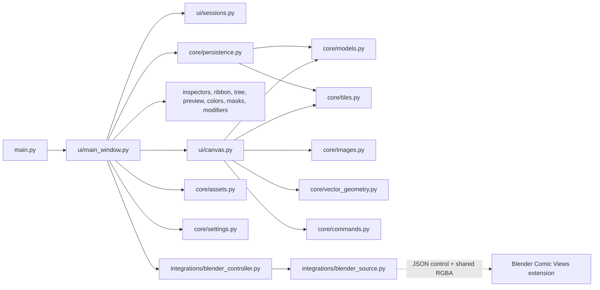

# Codebase hierarchy and script reference

## Repository map

```text
webtoon-maker/
├── main.py                         # desktop entry point
├── run.bat                         # thin launcher delegating to start.bat
├── start.bat                       # Windows launcher with dependency install
├── requirements.txt                # Python runtime/test dependencies
├── pytest.ini                      # pytest defaults and markers
├── README.md                       # user-facing product/run overview
├── program-map.txt                 # older generated architecture map (stale)
├── comic_editor/
│   ├── __init__.py                 # package identity/version
│   ├── core/                       # Qt-light document, geometry, storage, persistence
│   │   ├── __init__.py
│   │   ├── models.py
│   │   ├── commands.py
│   │   ├── persistence.py
│   │   ├── assets.py
│   │   ├── images.py
│   │   ├── fill_migration.py
│   │   ├── pressure.py
│   │   ├── registry.py
│   │   ├── settings.py
│   │   ├── tiles.py
│   │   └── vector_geometry.py
│   ├── integrations/               # live external image-source adapters
│   │   ├── blender_source.py       # protocol/shared-memory client
│   │   └── blender_controller.py   # selection, cache, and repaint lifecycle
│   └── ui/                         # PySide6 window, canvas, controls, models, theme
│       ├── __init__.py
│       ├── main_window.py
│       ├── canvas.py
│       ├── sessions.py
│       ├── selection_settings.py
│       ├── layer_settings.py
│       ├── inspector.py
│       ├── tree_model.py
│       ├── preview.py
│       ├── color_picker.py
│       ├── gradient_tools.py
│       ├── tool_ribbon_pages.py
│       ├── ribbon.py
│       ├── modifier_rendering.py
│       ├── modifier_controls.py
│       ├── mask_controls.py
│       ├── asset_library.py
│       ├── blender_views.py
│       ├── icons.py
│       ├── icons/iconoir/          # vendored MIT icon SVG set
│       ├── windows_input.py
│       ├── hotkeys.py
│       ├── hotkeys_dialog.py
│       ├── pencil_settings_dialog.py
│       ├── pressure_curve_editor.py
│       └── style.qss
├── blender_extension/
│   ├── webtoon_comic_views/        # Blender 4.5 manifest extension source
│   │   ├── __init__.py
│   │   ├── bridge.py
│   │   ├── renderer.py
│   │   ├── state.py
│   │   ├── viewport.py
│   │   ├── blender_manifest.toml
│   │   ├── build.ps1
│   │   └── README.md
│   └── webtoon_comic_views-0.3.0.zip # installable build artifact
├── tests/                           # offscreen Qt and pure-core regression suite
├── docs/
│   ├── llm/                        # this LLM-oriented documentation set
│   ├── blender-comic-views.md      # Blender bridge prototype notes
│   └── .obsidian/                  # Obsidian vault configuration
├── lighter-novel/                   # story/planning content, not application code
├── arst/ and Test/                 # user series data folders created by the editor
└── paint/handles.png                # currently unreferenced image asset
```

## Runtime flow



`MainWindow` is the application coordinator; the canvas is the editing/rendering engine; the core package defines data and algorithms; the remaining UI files break out contextual controls and Qt view models.

## Root files, one by one

### `main.py`

The executable Python entry point. Before creating `QApplication`, it disables Qt tablet-event compression, enables synthesized mouse handling for unhandled tablet events when the Qt build supports it, and sets the default OpenGL surface to core-profile 3.3 with no MSAA and no vertical-sync wait. It names the application "Vertical Comic Editor", constructs `MainWindow`, shows it, and returns the Qt event-loop exit code.

### `run.bat` and `start.bat`

`run.bat` is a one-line launcher delegating to `start.bat`. `start.bat` changes to the batch file's directory, runs `python -m pip install -r requirements.txt` (pausing on failure), then invokes `python main.py`.

### `requirements.txt`

Declares PySide6 6.7+, Pillow 10+, NumPy 2+, SciPy 1.14+, and pytest 8+. PySide6 supplies the native UI/QPainter/OpenGL wrapper, Pillow is used for alpha bounding boxes, NumPy builds complex gradient fields and modifier pixel effects, SciPy supplies compiled connected-component and exact Euclidean-distance operations for raster Fill and Outline, and pytest drives the suite.

### `pytest.ini`

Restricts discovery to `tests/`, enables quiet output by default, and registers the opt-in `blender_live` marker for visible Blender GPU tests.

### `README.md`

User-facing overview, run/test commands, Blender install/connect workflow, default navigation/hotkeys, and detailed explanations of the current drawing, page, vector, color, mask, modifier, and gradient workflows. It is useful product context but does not explain every internal data path.

### `program-map.txt`

A prior generated program map containing an extensive feature and method summary. It is a secondary reference: current source line counts, schema versions, canvas signals, and file lists have changed substantially since it was produced. Prefer `docs/llm/` and the source when conflicts arise.

### `.gitignore` / `.gitattributes`

Excludes Python caches, pytest/coverage output, builds, virtual environments, and `.artifacts/`; normalizes text to LF.

## `comic_editor/` package

### `comic_editor/__init__.py`

Package docstring and public `__version__ = "0.1.0"`.

### `comic_editor/core/__init__.py`, `ui/__init__.py`, `integrations/__init__.py`

Docstring-only package markers: "Document, persistence, and raster core", "PySide6 editor interface", and "External source integrations kept outside the drawing engine".

## Core scripts, one by one

### `comic_editor/core/models.py`

The canonical saved-data model and invariant layer (about 3,900 lines).

- Declares chapter schema version 21, series schema version 17, chapter width 1080, default height 3240, growth margin 1080, and chapter/asset document kinds.
- Normalizes colors to canonical ARGB and generates stable UUID IDs.
- Defines grids, path nodes/contours, shape style, and unified rectangle/ellipse/custom `BoundGeometry`.
- Defines `ToneMask`, `ParameterMaskBinding`, and the HSL/Blur/Outline `ModifierInstance` records.
- Defines mixed layer/object child references and `LayerNode` with shape, page, mask, mask-only, grid, compound, modifier, and opacity-mask fields. Runtime layer kinds are `bounded` and `open_shape` only.
- Defines the object hierarchy: base object, Raster, Image with typed embedded/Blender source descriptors, Text, Gradient, color gradient, and Vector Drawing. Owned vector fills and speed lines exist only as legacy migration records.
- Defines vector stroke points/strokes and gradient field/ramp/preset value objects.
- Defines `ChapterDocument`, including validation, mask acyclicity, modifier eligibility, add/move/reorder/delete operations, gradient uniqueness, inherited grid/opacity queries, compound-ancestor queries, automatic height growth, trimming, render-order iteration, serialization, and legacy migration (fill materialization plans, speed-line dropping).
- Defines `SeriesDocument`, chapter references, color palettes/swatches, color history, gradient presets, and series serialization/migration.

This file is the first place to update when introducing a persisted entity or field.

### `comic_editor/core/commands.py`

Implements in-memory undo/redo:

- `Command` protocol;
- `CallbackCommand` for arbitrary model restores;
- `TilePatchCommand` for sparse raster/mask tile before/after images plus optional frame state;
- `ObjectPatchCommand` for focused serialized object records with in-place same-type restoration; and
- `CommandStack`, with a 200-command default limit, redo clearing on push, a revision counter, and a UI callback.

### `comic_editor/core/persistence.py`

Implements portable series/chapter storage through `SeriesRepository`.

- Atomic JSON writes use temporary files, flush/fsync, and replace.
- Series creation requires an empty folder and initializes `chapters/`.
- New chapters receive a default page, drawing layer, and Raster object.
- Manual saves validate, create `last_good`, mark `.save_pending`, publish raster/mask tiles and images before the manifest, clear the marker, and remove autosave recovery.
- Autosaves write an independent complete snapshot under `autosave/` including `recovery.json`.
- Loading can restore a detected interrupted save or explicitly load recovery.
- `clone_to()` stages a whole-series Save As clone and publishes with `os.replace`.

### `comic_editor/core/assets.py`

Implements per-series asset libraries: manifest schema 2 and library schema 1, asset folders, subtree extraction with fresh IDs (cloning referenced modifiers and masks), fitted visual bounds with 64-pixel padding, fresh-ID instantiation, sparse-raster copying, thumbnail publication, and atomic asset save/recovery storage.

### `comic_editor/core/images.py`

Implements `ImageSource` and `ImageStore`: immutable original bytes per object ID, decoded premultiplied display cache, runtime frame overrides for live Blender previews, `persist_runtime_frame()` writing `last-frame.png`, dirty tracking, safe filenames, and atomic per-object directory save/load with orphan cleanup.

### `comic_editor/core/fill_migration.py`

One-time materialization of legacy geometric fills into sparse raster tiles: `materialize_legacy_fills(document, tiles)` consumes runtime migration plans produced at parse time (legacy fill layers and owned vector fills), rasterizes antialiased color into 256-pixel tiles, and runs after tile directory load. Saves are blocked while plans are pending.

### `comic_editor/core/pressure.py`

Defines pressure response and brush presets.

- `PressureCurve` stores min/max and a cubic control point. Exact evaluation solves X by binary search; hot-path evaluation uses a lazily built 256-value lookup table with interpolation.
- `BrushPreset` stores independent size/opacity curves, channel toggles, start/end taper ratios, density, antialiasing, validation, and serialization.
- `default_pencil_presets()` creates the protected Linear preset.

### `comic_editor/core/registry.py`

Defines small extensibility registries for object and bound types. It registers `raster`, `image`, `text`, `vector_drawing`, `gradient`, and `path` bounds with their contextual-tool metadata. The current application mostly uses direct model type checks; the registries are the extension seam for loading/tool capabilities.

### `comic_editor/core/settings.py`

Defines per-user editor settings, version 21, including persisted global grid defaults/visibility and the loopback Blender bridge endpoint and token.

- Supplies default hotkeys (including Gradient, Eyedropper, Reset Rotation, and Paste Image) and Hold flags (Eyedropper only).
- Defines validated formatting-only `TextPreset` values.
- Defines fill subtool profiles with 36 blend modes, tolerance, gap, scaling, reference mode, stabilization, and exclusion flags.
- Defines `EditorSettings` for renderer/navigation, brushes, presets, hotkeys, vector/fill/transform modes, mask pencil alpha values, splitter sizes, navigator expansion, and recent projects.
- Normalizes all ranges and protects default presets.
- Locates the platform config file with `QStandardPaths`.
- Loads versions 1–20 with progressive backfills and saves through temp-file replacement.

### `comic_editor/core/tiles.py`

Owns sparse raster and mask pixels.

- Allocates premultiplied ARGB QImages per owner/tile only when touched.
- Paints circle/square dabs and density-spaced lines with SourceOver or Clear composition, batching samples per tile.
- Performs finite, four-connected, tolerance-based sparse raster flood fills using compiled per-tile component labeling.
- Tracks dirty tile coordinates and snapshots selected tile sets for undo.
- Iterates tiles with optional rectangle culling, prunes empty tiles, and calculates alpha bounds.
- Transforms an object into a new sparse tile set through quad-to-quad projective mapping and inverse source queries.
- Loads/saves `<x>_<y>.png` tile directories atomically (including the `masks/` tree) and removes orphan directories.

### `comic_editor/core/vector_geometry.py`

The Qt-independent computational geometry library used by Vector Drawing, Shape, and gradient workflows.

- Cubic evaluation/derivatives, de Casteljau split/subsegment/reversal, adaptive flattening, and arc length.
- Nearest-point projection and centerline/variable-width stroke hits.
- Freehand sample cleanup, resampling, recursive cubic fitting, and pressure attribute mapping.
- Circular/square eraser corridor queries, interval extraction, curve splitting, and intersection-bounded erasing.
- Path/self intersection refinement.
- Whole/local simplification and cubic span reconstruction.
- Tangent bridge construction and endpoint connection.
- Polygon tests plus planar/cubic face tracing with provenance, gap closing, and face lookup.

Changes here should retain the dependency-light design and be covered by `test_vector_geometry.py` plus canvas integration tests.

## Integration scripts

### `comic_editor/integrations/blender_source.py`

Client for the Blender Comic Views bridge, protocol version 2. Defines the `b"WCVRGBA\0"` frame magic, header layout, and capability limits. `ComicViewInfo` validates view metadata including base64 PNG thumbnails. `BlenderSourceClient(QObject)` uses a loopback-only `QTcpSocket` with newline-delimited JSON, token-authenticated `HELLO`, view/thumbnail/activate/dirty/stream/render commands, and attaches `multiprocessing.shared_memory` frame blocks (three slots) decoding RGBA8888 to premultiplied QImages with per-slot sequence acks.

### `comic_editor/integrations/blender_controller.py`

Application lifecycle for linked images. Only the selected linked Image Object in the active chapter owns the stream; context changes stop or resume it; frames match objects by project/view UUIDs; preview frames never displace unpersisted committed frames; committed frames update model geometry and are debounced (1 s idle / 5 s maximum) into `last-frame.png`; `aspect_adjusted_quad` preserves width/center on resolution changes.

## UI scripts, one by one

### `comic_editor/ui/main_window.py`

The application shell and workflow coordinator (about 5,800 lines).

- Defines reusable collapsible and scrollable left-tool containers and the navigator panel.
- Builds the toolbar File dropdown and project controls, tool sidebar, Shapes/Drawing Selection groups, colors (Picker/Palette/History), contextual ribbon pages (Tool Settings, Gradient Tools, Vector Tools, Modifiers, Asset Library, Blender Views), canvas/navigator, right dock with Settings/Masks tabs and hierarchy tree, floating inspector, timers, and persisted splitters.
- Opens/creates series and chapters, prompts for autosave recovery, creates/deletes/reorders entities, and orchestrates transactional page insertion.
- Manages cached, closable series/asset tabs (`EditorSession` instances) and the per-series Asset Library workflows.
- Connects canvas/model signals to the outliner, inspectors, status bar, dirty state, and contextual ribbon routing.
- Implements the global chord/hold hotkey event filter, prefix timeout, Delete Selected routing/editor suppression, and stylus forwarding to popups/outliner.
- Owns per-series color/palette/color-history/gradient-preset CRUD and debounce saves.
- Owns manual save, transactional whole-series Save As cloning/rebinding, recovery autosave, recent series, brush-size/preset dialogs, settings writes, image imports/paste, fullscreen, and close confirmation.

### `comic_editor/ui/canvas.py`

The largest and most central runtime script (about 21,300 lines).

- Declares `ToolKind`, including 21 distinct tool values (with Eyedropper and Gradient) and two aliases.
- Defines threaded fill workers, the text gizmo overlay, `CanvasSessionState`, and `CanvasPerformanceMonitor`.
- `_CanvasLogic` owns chapter/tile/image binding, selection, camera, every gesture state, command creation, signals, and all render caches.
- Builds QPainter paths/variable-width meshes and compound Boolean masks.
- Recursively renders layers, masks, objects, vector strokes, gradients, sparse raster tiles, images, and text; applies tone-mask overlays and the modifier stack.
- Draws grids, selections, transform/shape/gradient handles, hover indicators, creation previews, mask overlays, and page-gap UI.
- Implements hit testing and all mouse, tablet, touch, key, wheel, IME, and navigation behavior.
- Implements page creation/gutters, drawing selections/transforms, vector pencil/eraser/redraw/connect/simplify, raster strokes/fills/transforms, image placement, text editing/word selection, selection-scoped typography gizmos, tone-mask painting, gradient creation/editing, and cached free-text transform previews.
- Provides software and OpenGL-backed widget classes plus the OpenGL probe/factory.

### `comic_editor/ui/sessions.py`

Defines `ProjectContext` (repository + series + assets) and `EditorSession`, the per-tab state record: session key and kind (`series`/`asset`), chapter, tiles, images, asset manifest, canvas state, dirty flag, last autosave time, hierarchy expansion set, and manual ribbon page.

### `comic_editor/ui/selection_settings.py`

Right-dock selection settings. `SelectionCommonControls` pins visibility, opacity lock, and opacity (or a dual-endpoint mask slider when an opacity mask is bound) for the exact selection; `SelectionSettingsPanel` stacks Layer, Raster, Vector, and Image object settings pages above the outliner.

### `comic_editor/ui/layer_settings.py`

Permanent right-dock settings for the selected layer or an object's parent layer. It conditionally exposes name/type, visibility/opacity, compound operation/flatten, mask escape, rectangle mode, fill/core, open-shape thickness, outline, selected-node width/roundness, and grid override. Slider drags coalesce into single undo operations.

### `comic_editor/ui/inspector.py`

The floating contextual inspector for vector, fill, and eligible shape-linked properties. Its legacy text panel remains available internally for compatibility, but selected text suppresses the popup and uses Tool Settings.

- Edits name where permitted, visibility, opacity lock/value, mask escape, underlay, and direct/compound geometry reference.
- Retains legacy text font/style/kerning/layout/alignment/margin and preset handlers; the active text UI is `TextObjectControls` in `tool_ribbon_pages.py`.
- Provides transform mode and legacy raster-tool control compatibility.
- Coalesces underlay slider drag into one undo command.
- Repositions above or below the current selection in screen space.

### `comic_editor/ui/tree_model.py`

Qt item model for the layer/object outliner.

- Builds the recursive mixed hierarchy.
- Supplies display/type/opacity/visibility/tooltip roles and protects stale indexes.
- Renames non-text entities and toggles visibility.
- Serializes a custom drag MIME payload and validates drop targets.
- Restricts pages to roots and container behavior to eligible layers/drawings.
- Restores the old chapter snapshot when a move fails validation.

### `comic_editor/ui/preview.py`

The fixed-width chapter navigator. It renders the chapter into a small cached image (92-pixel class), supports dirty-band invalidation, draws the current viewport overlay, and converts click/drag Y positions into canvas scroll fractions.

### `comic_editor/ui/color_picker.py`

All color and palette widgets.

- ARGB/QColor normalization helpers and checkerboard alpha painting.
- HSV/alpha picker with hue ring, SV square, alpha strip, drag modes, and interaction signals.
- Checker-backed color wells and swatches.
- Primary/secondary panel with active slot, swap, popout picker, hex edit/copy/paste, and palette-color routing.
- Popup color editor.
- Palette editor with stable IDs, legacy-format normalization, combo/name/swatch CRUD, single-click apply, double-click edit, and last-palette protection.
- `ColorHistoryWidget` for the per-series color history tab.

### `comic_editor/ui/gradient_tools.py`

Contextual Gradient Tools ribbon implementation.

- `GradientRampEditor` paints a checker-backed ramp and stable stop handles; handles can be selected, dragged, and double-clicked for color editing.
- `GradientToolsControls` builds create/select controls, field-specific direction/reverse/uniform/distance controls, ramp editing, and preset CRUD.
- Enforces field-type uniqueness through model queries.
- Coalesces ramp/distance drags into one undo operation and toggles reduced-resolution canvas preview during the drag.
- Includes the dynamic read-only Primary → Secondary preset identifier.
- Speed-line creation controls are hidden; speed lines are legacy.

### `comic_editor/ui/tool_ribbon_pages.py`

Defines the contextual ribbon control owners.

- `ToolSettingsControls`: Pencil preset/size, Eraser size/shape/vector mode, Mask Pencil alpha, fill subtool profiles and blend modes, Raster Fill tolerance, and drawing-selection transform mode.
- `VectorToolsControls`: free/uniform transform mode; thickness/opacity Redraw parameter, interaction, operation, amount and pressure maximum; Connect; and Simplify amount/tool/apply.
- `RasterObjectControls`: Raster name, visibility, opacity lock/value, mask escape, underlay, geometry reference, and transform mode, with coalesced slider changes.
- `TextObjectControls`: selected-text preset CRUD, visibility/opacity, font preview mode, integer size, bold/italic, manual kerning, strict/free layout, alignment, margin, geometry reference, and transform mode.

### `comic_editor/ui/ribbon.py`

Generic ribbon primitives: titled groups, horizontally scrolling pages, a tab widget with stable page keys, and the compact vertical inspector host shared by Settings/Masks. It contains no drawing-specific business logic.

### `comic_editor/ui/modifier_rendering.py`

Pixel engine for the non-destructive modifier stack: NumPy HSL round-trips, variable/focal blur through a 64 MiB `BlurPyramidCache` of premultiplied pyramid levels (radii 0–127), and outside Outline via a 64 MiB `OutlineDistanceCache` over SciPy's exact Euclidean distance transform. `apply_modifier_stack()` blends each stage by its (maskable) intensity; `apply_opacity_mask()` applies bound opacity masks.

### `comic_editor/ui/modifier_controls.py`

Modifier ribbon UI: reorderable `ModifierCard` rows for HSL/Blur/Outline with intensity and parameter sliders, drag reordering of the stack, link mode for editing a shared target set, maskable dual-endpoint parameter controls, and coalesced undo per gesture.

### `comic_editor/ui/mask_controls.py`

Tone-mask UI: `MaskButton` drop targets with an assigned-mask context menu, `DualEndpointSlider`, `MaskAlphaSlider` (one or two handles for the mask pencil From/To alpha), and `MasksPanel` with the saved-mask thumbnail grid and New/Save/Rename/Delete actions.

### `comic_editor/ui/asset_library.py`

Vertical folder-aware asset browser: breadcrumb navigation, folder CRUD, icon-grid gallery, drag-out asset placement onto the canvas, drop-in folder moves, and double-click open-in-tab.

### `comic_editor/ui/blender_views.py`

Blender Views ribbon page: host/port/token form (defaults 127.0.0.1:47837), Connect/Disconnect/Refresh, status label, thumbnail list with dimensions and revision markers, "Add Selected View to Canvas" and relink modes; cached images remain available while disconnected.

### `comic_editor/ui/icons.py` and `icons/iconoir/`

`iconoir(name, size)` / `iconoir_tinted(name, color)` render cached, theme-aware SVG icons from the vendored Iconoir set (31 single-path SVGs, MIT license, Copyright 2021 Luca Burgio).

### `comic_editor/ui/windows_input.py`

Win32 interop via ctypes: registers the window for touch with palm rejection and enables simultaneous pen/touch data so touch navigation works while the stylus hovers, and answers the tablet gesture-status native-event query.

### `comic_editor/ui/hotkeys.py`

Normalizes and displays single simultaneous key chords, including modifier-only bindings. `ChordCaptureEdit` captures a chord until all keys are released, restores the original on Escape, and clears on Backspace/Delete.

### `comic_editor/ui/hotkeys_dialog.py`

Maps user-visible action names to hotkey keys, creates one capture editor per action, adds Hold checkboxes only for tool actions, returns normalized bindings, rejects duplicates, and resets to defaults.

### `comic_editor/ui/pencil_settings_dialog.py`

Preset manager for pencil pressure behavior. It hosts size/opacity curve editors, pressure toggles, density and taper controls, tracks dirty drafts, prompts to save/discard when switching/deleting/closing, protects required preset behavior, and emits committed preset dictionaries.

### `comic_editor/ui/pressure_curve_editor.py`

Custom widget that draws a grid and cubic pressure response curve. It exposes draggable minimum, maximum, and shared control handles and emits a changed `PressureCurve` during interaction.

### `comic_editor/ui/style.qss`

The application-wide dark Qt stylesheet. It styles toolbars, scroll areas, splitters, color tabs, buttons, inputs, trees, docks, status bar, sliders, ribbon pages/groups/tabs, and tool-panel separators. The main colors are near-black gray surfaces, blue selection/accent, and hover/pressed variants.

## Blender extension, file by file

### `blender_extension/webtoon_comic_views/__init__.py`

Add-on registration and UI: property groups, automatic row activation, explicit Save/Load/Render/Revert operators, New/Duplicate/Delete, camera-only Set Stream Frame, bridge/property operators, the `.blend` overlay toggle, sidebar panel, UIList, depsgraph/load handlers, and auto-start timers. Preferences include the loopback connection and render-only Always Hide Overlays toggle.

### `bridge.py`

`BridgeServer` socket/read threads bound to 127.0.0.1 that never touch Blender data off the main thread; token and protocol check before authorization. `BridgeRuntime` holds a single connected editor, ticks dirty-state checking, transactionally renders only saved committed state, renders temporary working previews, manages one-save Revert history, and publishes triple-buffered shared memory that only overwrites acknowledged slots.

### `renderer.py`

`RenderFrame` and camera-derived `GPUOffScreen` capture with a camera-gate crop projection; can suppress viewport overlays transactionally; flattens Blender's channel-planar buffer to top-down straight-alpha RGBA8; derives thumbnails from successful full renders and validates 64–4096 px / 16 MP bounds.

### `state.py`

Geometry-free scene state capture/restore, `STATE_VERSION = 3`: camera/view layer, full pose controls, transforms, visibility, active/layer collections, Local View membership, lights, shape keys, modifier enable flags, viewport shading, camera-gate settings, and registered RNA properties; v1/v2 frame migration; stable `webtoon_comic_uuid` IDs with duplicate repair; `state_digest`/`apply_state` round-trips.

### `viewport.py`

Tracks a bound 3D View, maps unrestricted camera-gate Stream Frame bounds to screen space, derives navigation-independent camera matrices and output resolution, restores contextual Local View, tags redraws, and draws the orange camera-only `POST_PIXEL` overlay.

### `blender_manifest.toml`, `build.ps1`, `README.md`

Manifest declares id `webtoon_comic_views` version 0.3.0, Blender ≥ 4.5.0, `windows-x64`, GPL-3.0-or-later, and the loopback network permission. `build.ps1` locates Blender and runs `extension validate`/`extension build`. The README covers install, workflow, state-capture scope, and transport.

## Test scripts, one by one

### `tests/smoke_canvas_latency.py`

An opt-in offscreen performance gate for 800-move raster/vector pencil and eraser gestures, cached free-text transforms, and warmed navigation over 550 vector strokes. It reports median-run input/frame P95, commit latency, and long-gesture growth; the input and frame limits are 8 ms and 16.7 ms respectively.

### `tests/benchmark_masked_blur.py`

An opt-in direct-run benchmark (not pytest) for 1080p warmed masked-blur rendering. It prints timings and always asserts that parameter edits reuse one cached pyramid.

### `tests/conftest.py`

Forces Qt's offscreen platform, creates the shared `QApplication` fixture, and flushes deferred Qt deletion between tests.

### `tests/test_assets.py`

Covers asset repository CRUD, subtree extraction with fresh IDs (including modifiers/masks), instantiation and fitted placement, drag/drop MIME payloads, and MainWindow asset workflows.

### `tests/test_blender_extension.py`

Probes for a Blender 4.5 executable, asserts the extension manifest (id/version/min version/platforms/network), and runs `_blender_comic_views_probe.py` (and optionally `_blender_live_gpu_probe.py`) in a Blender subprocess.

### `tests/test_blender_image_sources.py`

Covers ImageObject embedded/Blender source descriptors, round trips, `last-frame.png` persistence, controller selection/cache lifecycle, aspect-adjusted quads, and preview-vs-committed frame handling.

### `tests/test_blender_source_protocol.py`

Client protocol unit tests: HELLO authorization, view-list/thumbnail message handling, stream descriptor validation, shared-memory frame reads, and acks.

### `tests/test_canvas_input_performance.py`

Performance-focused input paths: `paint_segment` batching, vector stroke caches, wheel/touch navigation, preview band repaints, GPU/raster canvas parity, and no-op erase skipping.

### `tests/test_canvas_recovery_file_menu.py`

File-menu and recovery workflows: New/Open/Save/Save As cloning, recovery prompts, dirty-tab closing, recent-series handling, and asset-tab save flows.

### `tests/test_color_ribbon.py`

Covers canonical ARGB input, hex copy/paste, primary/secondary routing and swapping, HSV/alpha picker behavior, stable ribbon order, swatch single-vs-double click, palette stable IDs, color history, and last-palette protection.

### `tests/test_compound_shapes.py`

Covers compound serialization, add/subtract/ignore/nested Boolean geometry, open-shape operands, parent-only styling, strict-text/raster geometry references, creation/selection placement, additional contour editing, and flattening with holes/ignored branches/object preservation.

### `tests/test_fill_mask_gradient_plan.py`

Covers the fill/mask/gradient implementation plan: legacy fill materialization, tone masks and parameter masks, fill subtools and blend profiles, threaded fill workers, and gradient/mask canvas integration.

### `tests/test_gradients.py`

Covers gradient model round trips and migrations, line/radial/parent rendering, creation and field uniqueness, center drag/reset, contextual ribbon and presets, stop edits, reparent coordinate preservation, arc-length/perpendicular mapping, cache reuse, reversed outward fields, uniform physical distance, line geometry editing, and the dynamic built-in preset.

### `tests/test_hotkeys.py`

Covers chord normalization/capture, modifier-only chords, clearing/canceling, duplicate rejection, modal persistence, sticky-vs-Hold behavior, long-hold restore, prefix chords, manual cancellation, and focus-loss cleanup.

### `tests/test_image_imports.py`

Covers the image import pipeline: file/URL loading, clipboard paste, ImageStore caching, image object placement, transforms, and asset extraction/instantiation of images.

### `tests/test_interaction_rework.py`

Covers mask translation, mouse/tablet/touch navigation, free text transforms/alignment/re-entry, grid-snapped/uniform transforms, sparse raster translation, frame expansion/refit, projective baking, raster edge interaction disambiguation, text sessions/clipboard/IME, canvas painting, selection promotion, and dynamic outliner behavior.

### `tests/test_layer_settings.py`

Covers layer-settings context and conditional rows, global rectangle mode, full bounded-layer field preservation, coalesced thickness sliders, ribbon-hosted raster/vector pencil settings, contextual ribbon tab persistence, pressure-preset access, and image/raster/vector object settings.

### `tests/test_models.py`

Covers series color-history migration, shape-style rounding, parent/reachability invariants, stable-ID mixed-child round trips, insertion/root ordering, grid/opacity inheritance, separation of bound geometry and translation, overlapping page order, trim safety, roundness normalization, legacy text migration, mask escape, and underlay clamping.

### `tests/test_modifiers_and_multiselect.py`

Covers HSL/Blur/Outline modifier stacks, parameter and opacity masks, `BlurPyramidCache`/`OutlineDistanceCache` reuse, mask button/panel UI, multi-select edits, and assets carrying modifiers.

### `tests/test_page_insertion.py`

Covers root insertion index, page style limits, drawn-page insertion and lower-page movement, decline/cancel paths, invalid open/above-anchor pages, all page shape workflows through mouse/tablet/keyboard, confirmation retry, page-border selection, cross-page selection, gap insertion/drag behavior, transaction undo/restore, and height/top rebasing.

### `tests/test_persistence.py`

Covers portable series/chapter/tile round trips, independent recovery autosave, future-schema rejection, manual recovery cleanup, interrupted multi-file restoration, legacy series primary-color seeding, and tone-mask persistence.

### `tests/test_rendering.py`

Covers non-destructive rectangular/circular/nested masks, compound render behavior, preview resolution, direct-parent mask escape for subtrees/raster, hit behavior outside parent masks, and editing-only Raster/Vector underlay behavior.

### `tests/test_ribbon_integration.py`

Covers contextual page visibility/routing, workspace splitter resizing, bottom-left color layout, shared selection transform mode, underlay coalescing, Raster property edits, outliner branch expansion, series preference autosave, redraw control range restoration, icon rendering, and responsive tool buttons.

### `tests/test_settings.py`

Covers missing/partial/null settings, default hotkey merging, clean-window configuration, migrations through version 21, grid value clamping, vector/fill value clamping, splitter normalization, rectangle-mode clamping, font-preview persistence, protected integer-sized text presets, and the Blender bridge endpoint clamp/persist.

### `tests/test_shape_paths.py`

The broad shape system suite. It covers serialization/migration, Bezier topology validation/repair, variable-width open shapes/caps, zero-width cores, creation confirmation and compound previews, global stroke/outline gizmos, primitive colors/conversion, rectangle normal/free handles and rounding, grid snapping, tablet drafting, node type/lock/roundness/width/cap/delete/insertion gizmos, multi-selection, C1 smoothing, constant-screen handles/tooltips, and legacy Shape Edit hotkey migration.

### `tests/test_speed_lines.py`

Covers the legacy speed-lines path: legacy documents load with speed-line records omitted and warnings emitted, references are repaired, creation is rejected by the model, and supported gradients still round-trip.

### `tests/test_stylus_vector_refinements.py`

Covers stylus popup activation, outliner visibility taps, exact redraw slider behavior, stylus hover brush/simplify indicators, and navigation modifier suppression during selection tools.

### `tests/test_text_updates.py`

Covers complete text Tool Settings migration, 250-size entry/clamping, per-family font previews, selected-object isolation, canvas overlay visibility/editing, word/all/drag selection, size/kerning scrub ranges, boundary translation, Delete Selected suppression, undo/redo, and cached live free-text transforms.

### `tests/test_tiles_and_commands.py`

Covers blank-document sparsity, isolated tile allocation, `TilePatchCommand` undo/redo, empty-tile pruning, and `CommandStack` behavior.

### `tests/test_ui.py`

Covers contextual Raster tools, chapter-wide selection despite the legacy page-scope setting, shape-border/frontmost hit order, outliner model/drop behavior, expansion/selection preservation, content-derived Text labels, inspector visibility/free-quad restore, insertion position, tablet-mode toolbar stability, and event-filter cleanup.

### `tests/test_v3_refinements.py`

Covers legacy fill-layer API removal, rendered layer fill/border, frontmost hierarchy order, Raster frame creation/outside drawing/frame constraints, long-chapter preview centering, pressure preset channels, and text-edit hotkey suppression.

### `tests/test_vector_canvas.py`

Main Vector Drawing integration suite: pressure Pencil/dots/caps/rendering/cache invalidation, Vector Edit selection, object hit priority, all eraser modes/metrics, Connect, Redraw targeting, fill tool behavior without persistent fills, narrow-area behavior, drag resampling, select-all and transform, Apply/Sweep Simplify, lasso/stroke modifier semantics, outside-click selection, and rotated selection-frame undo.

### `tests/test_vector_geometry.py`

Pure geometry coverage for cubic split/subsegment/flattening, arc length/projection, freehand fit/pressure retention, variable-width hits, intersections, corridor subtraction and metrics, simplification mapping, tangent connection, planar face tracing, and virtual gap edges.

### `tests/test_vector_models.py`

Covers Vector Drawing serialization without fill children, move/delete hierarchy ops, render order, series palette/color migration and atomic persistence, and live-object identity through `ObjectPatchCommand`.

### `tests/test_vector_tree.py`

Covers the vector outliner: no nested fill rows for drawings, reference-vector decoration, and sibling labels.

### `tests/test_windows_input.py`

Win32 tablet interop with a faked user32: multitouch opt-in while the pen hovers, tablet gesture-status native-event replies, and the disable path.

### `tests/_blender_comic_views_probe.py` and `_blender_live_gpu_probe.py`

Assertion scripts executed inside Blender by `test_blender_extension.py`. The probe covers extension registration, state capture/apply, bridge protocol handshake, and view creation; the GPU probe is a visible opt-in smoke test of the non-square GPUOffScreen readback layout.

## Non-runtime content and assets

### `lighter-novel/`

User story-development material: prose chapters, world/character notes, process/QA/resource notes, pasted images, and Obsidian configuration. No application Python file imports or reads it. It should be treated as project content outside the editor implementation and preserved during code changes.

### `arst/` and `Test/`

User series data folders produced by running the editor (series manifests, chapters, assets, exports). They are test/user data, not application code.

### `docs/blender-comic-views.md`

Standalone notes on the Blender Comic Views bridge (state format v2, protocol v2, dirty-switch policy, and transport). It complements the extension README.

### `paint/handles.png`

An image asset that is not referenced by the current Python/QSS source. Current canvas handles are drawn procedurally with QPainter.

## Where to make common changes

| Change | Primary files | Usually related tests |
| --- | --- | --- |
| Add saved entity/field | `core/models.py`, possibly `core/persistence.py` | models, persistence, type-specific tests |
| Change raster brush/storage | `ui/canvas.py`, `core/tiles.py`, `core/pressure.py` | tiles/commands, interaction, rendering |
| Change vector algorithms | `core/vector_geometry.py`, `ui/canvas.py` | vector geometry, vector canvas |
| Change masks/shapes | `core/models.py`, `ui/canvas.py`, `ui/layer_settings.py` | shape paths, compound, rendering |
| Change tone masks/modifiers | `core/models.py`, `ui/canvas.py`, `ui/modifier_rendering.py`, `ui/modifier_controls.py`, `ui/mask_controls.py` | fill/mask/gradient plan, modifiers/multiselect |
| Change image/blender integration | `core/images.py`, `core/models.py`, `integrations/*`, `ui/blender_views.py` | image imports, blender image sources/protocol/extension |
| Change project workflow | `ui/main_window.py`, `ui/sessions.py`, `core/persistence.py` | persistence, page insertion, UI, canvas recovery/file menu |
| Change asset library | `core/assets.py`, `ui/asset_library.py`, `ui/main_window.py` | assets |
| Add tool/mode setting | `ui/canvas.py`, `core/settings.py`, appropriate ribbon/inspector | settings, hotkeys, integration |
| Change hierarchy behavior | `core/models.py`, `ui/tree_model.py`, `ui/main_window.py` | models, UI, vector tree |
| Change gradients | models, canvas, `ui/gradient_tools.py`, main window presets | gradients, ribbon/color tests |
| Change colors/palettes | models, `ui/color_picker.py`, main window | color/ribbon, vector models |
| Change text | models, canvas, `ui/tool_ribbon_pages.py` | text updates, interaction, UI, models |
| Change fill behavior | `core/tiles.py`, `ui/canvas.py`, `core/settings.py` (profiles) | fill/mask/gradient plan, canvas input performance |
