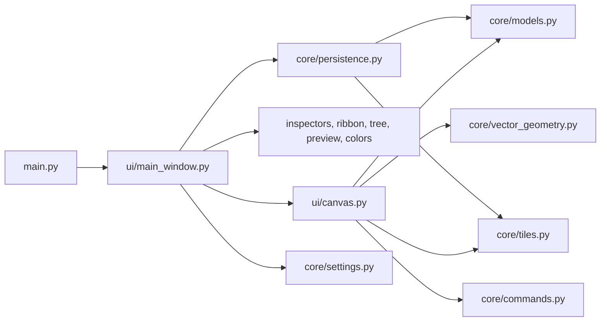

# Codebase hierarchy and script reference

## Repository map

```text
webtoon-maker/
├── main.py                         # desktop entry point
├── run.bat                         # Windows launcher
├── requirements.txt                # Python runtime/test dependencies
├── pytest.ini                      # pytest defaults
├── README.md                       # user-facing product/run overview
├── program-map.txt                 # older generated architecture map
├── comic_editor/
│   ├── __init__.py                 # package identity/version
│   ├── core/                       # Qt-light document, geometry, storage, persistence
│   │   ├── __init__.py
│   │   ├── models.py
│   │   ├── commands.py
│   │   ├── persistence.py
│   │   ├── pressure.py
│   │   ├── registry.py
│   │   ├── settings.py
│   │   ├── tiles.py
│   │   └── vector_geometry.py
│   └── ui/                         # PySide6 window, canvas, controls, models, theme
│       ├── __init__.py
│       ├── main_window.py
│       ├── canvas.py
│       ├── inspector.py
│       ├── layer_settings.py
│       ├── tree_model.py
│       ├── preview.py
│       ├── color_picker.py
│       ├── gradient_tools.py
│       ├── tool_ribbon_pages.py
│       ├── ribbon.py
│       ├── hotkeys.py
│       ├── hotkeys_dialog.py
│       ├── pencil_settings_dialog.py
│       ├── pressure_curve_editor.py
│       └── style.qss
├── tests/                           # offscreen Qt and pure-core regression suite
├── docs/llm/                        # this LLM-oriented documentation set
├── lighter-novel/                   # story/planning content, not application code
└── paint/handles.png                # currently unreferenced image asset
```

## Runtime flow



`MainWindow` is the application coordinator; the canvas is the editing/rendering engine; the core package defines data and algorithms; the remaining UI files break out contextual controls and Qt view models.

## Root files, one by one

### `main.py`

The executable Python entry point. Before creating `QApplication`, it disables Qt tablet-event compression, enables synthesized mouse handling for unhandled tablet events when the Qt build supports it, and sets the default OpenGL surface to core-profile 3.3 with no MSAA and no vertical-sync wait. It names the application/organization, constructs `MainWindow`, shows it, and returns the Qt event-loop exit code.

### `run.bat`

Windows convenience launcher. It changes the working directory to the batch file's own directory and invokes `python main.py`.

### `requirements.txt`

Declares PySide6 6.7+, Pillow 10+, NumPy 2+, and pytest 8+. PySide6 supplies the native UI/QPainter/OpenGL wrapper, Pillow is used for alpha bounding boxes, NumPy builds complex gradient fields, and pytest drives the suite.

### `pytest.ini`

Restricts discovery to `tests/` and enables quiet output by default.

### `README.md`

User-facing overview, run/test commands, default navigation/hotkeys, and detailed explanations of the current drawing, page, vector, selection, color, and gradient workflows. It is useful product context but does not explain every internal data path.

### `program-map.txt`

A prior generated program map containing an extensive feature and method summary. It is a secondary reference: current source line counts, canvas signals, and some method names have changed since it was produced. Prefer `docs/llm/` and the source when conflicts arise.

### `.gitignore`

Excludes Python caches, pytest/coverage output, builds, virtual environments, and `.artifacts/`.

### `.gitattributes`

Asks Git to auto-detect text and normalize it to LF.

## `comic_editor/` package

### `comic_editor/__init__.py`

Package docstring and public `__version__ = "0.1.0"`.

### `comic_editor/core/__init__.py`

Marks the core package and describes it as document, persistence, and raster core. It intentionally exports no aggregation API.

### `comic_editor/ui/__init__.py`

Marks the UI package with a PySide6 interface docstring. It has no runtime logic.

## Core scripts, one by one

### `comic_editor/core/models.py`

The canonical saved-data model and invariant layer.

- Declares schema version 12, chapter width 1080, default height 3240, and growth margin 1080.
- Normalizes colors to canonical ARGB and generates stable UUID IDs.
- Defines grids, path nodes/contours, shape style, and unified rectangle/ellipse/custom `BoundGeometry`.
- Defines mixed layer/object child references and `LayerNode` with shape, fill, page, mask, grid, and compound fields.
- Defines the object hierarchy: base object, Raster, Text, Gradient, color gradient, Vector Drawing, and Vector Fill.
- Defines vector stroke points/strokes and gradient field/ramp/preset value objects.
- Defines `ChapterDocument`, including validation, add/move/reorder/delete operations, vector-fill ownership, gradient uniqueness, inherited grid/opacity queries, compound-ancestor queries, automatic height growth, trimming, render-order iteration, serialization, and legacy migration.
- Defines `SeriesDocument`, chapter references, color palettes/swatches, gradient presets, and series serialization/migration.

This file is the first place to update when introducing a persisted entity or field.

### `comic_editor/core/commands.py`

Implements in-memory undo/redo:

- `Command` protocol;
- `CallbackCommand` for arbitrary model restores;
- `TilePatchCommand` for sparse raster tile before/after images plus optional frame state;
- `ObjectPatchCommand` for focused serialized object records with in-place same-type restoration; and
- `CommandStack`, with a 200-command default limit, redo clearing on push, and a UI callback.

### `comic_editor/core/persistence.py`

Implements portable series/chapter storage through `SeriesRepository`.

- Atomic JSON writes use temporary files, flush/fsync, and replace.
- Series creation requires an empty folder and initializes `chapters/`.
- New chapters receive a default page, drawing layer, and Raster object.
- Manual saves validate, create `last_good`, mark `.save_pending`, publish tiles before the manifest, clear the marker, and remove autosave recovery.
- Autosaves write an independent complete snapshot under `autosave/`.
- Loading can restore a detected interrupted save or explicitly load recovery.

### `comic_editor/core/pressure.py`

Defines pressure response and brush presets.

- `PressureCurve` stores min/max and a cubic control point. Exact evaluation solves X by binary search; hot-path evaluation uses a lazily built 256-value lookup table with interpolation.
- `BrushPreset` stores independent size/opacity curves, channel toggles, start/end taper ratios, density, antialiasing, validation, and serialization.
- `default_pencil_presets()` creates the protected Linear preset.

### `comic_editor/core/registry.py`

Defines small extensibility registries for object and bound types. It registers Raster, Text, Vector Drawing, Vector Fill, Gradient, and path bounds with their contextual-tool metadata. The current application mostly uses direct model type checks; the registries are the extension seam for loading/tool capabilities.

### `comic_editor/core/settings.py`

Defines per-user editor settings and their version-11 migration.

- Supplies default hotkeys and Hold flags.
- Defines validated formatting-only `TextPreset` values.
- Defines `EditorSettings` for renderer/navigation, brushes, presets, hotkeys, vector/fill/transform modes, splitter sizes, and recent projects.
- Normalizes all ranges and protects default presets.
- Locates the platform config file with `QStandardPaths`.
- Loads older versions with progressive backfills and saves through temp-file replacement.

### `comic_editor/core/tiles.py`

Owns sparse raster pixels.

- Allocates premultiplied ARGB QImages per object/tile only when touched.
- Paints circle/square dabs and density-spaced lines with SourceOver or Clear composition.
- Tracks dirty tile coordinates and snapshots selected tile sets for undo.
- Iterates tiles with optional rectangle culling, prunes empty tiles, and calculates alpha bounds.
- Transforms an object into a new sparse tile set through quad-to-quad projective mapping and inverse source queries.
- Loads/saves `<x>_<y>.png` tile directories atomically and removes orphan object directories.

### `comic_editor/core/vector_geometry.py`

The Qt-independent computational geometry library used by Vector Drawing, Shape, Fill, and gradient workflows.

- Cubic evaluation/derivatives, de Casteljau split/subsegment/reversal, adaptive flattening, and arc length.
- Nearest-point projection and centerline/variable-width stroke hits.
- Freehand sample cleanup, resampling, recursive cubic fitting, and pressure attribute mapping.
- Circular/square eraser corridor queries, interval extraction, curve splitting, and intersection-bounded erasing.
- Path/self intersection refinement.
- Whole/local simplification and cubic span reconstruction.
- Tangent bridge construction and endpoint connection.
- Polygon tests plus planar/cubic face tracing with provenance, gap closing, and face lookup.

Changes here should retain the dependency-light design and be covered by `test_vector_geometry.py` plus canvas integration tests.

## UI scripts, one by one

### `comic_editor/ui/main_window.py`

The application shell and workflow coordinator.

- Defines reusable collapsible and scrollable left-tool containers.
- Builds the project toolbar, tool sidebar, Shapes/Drawing Selection groups, colors, contextual ribbon pages, canvas/navigator, right hierarchy dock, layer settings, floating inspector, timers, and persisted splitters.
- Opens/creates series and chapters, prompts for autosave recovery, creates/deletes/reorders entities, and orchestrates transactional page insertion.
- Connects canvas/model signals to the outliner, inspectors, status bar, dirty state, and contextual ribbon routing.
- Implements the global chord/hold hotkey event filter, prefix timeout, text-edit suppression, and stylus forwarding to popups/outliner.
- Owns per-series color/palette/gradient-preset CRUD and debounce saves.
- Owns manual save, recovery autosave, recent series, brush-size/preset dialogs, settings writes, fullscreen, and close confirmation.

### `comic_editor/ui/canvas.py`

The largest and most central runtime script.

- Declares `ToolKind`, including 19 distinct tool values and two aliases.
- `_CanvasLogic` owns chapter/tile binding, selection, camera, every gesture state, command creation, signals, and all render caches.
- Builds QPainter paths/variable-width meshes and compound Boolean masks.
- Recursively renders layers, masks, objects, vector strokes/fills, gradients, sparse raster tiles, and text.
- Draws grids, selections, transform/shape/gradient handles, hover indicators, creation previews, and page-gap UI.
- Implements hit testing and all mouse, tablet, touch, key, wheel, IME, and navigation behavior.
- Implements page creation/gutters, drawing selections/transforms, vector pencil/eraser/redraw/connect/simplify/fill, shape creation/edit/flatten, raster creation/strokes/transforms, and text editing.
- Provides software and OpenGL-backed widget classes plus the OpenGL probe/factory.

See the dedicated canvas document for the rendering pipeline.

### `comic_editor/ui/color_picker.py`

All color and palette widgets.

- ARGB/QColor normalization helpers and checkerboard alpha painting.
- HSV/alpha picker with hue ring, SV square, alpha strip, drag modes, and interaction signals.
- Checker-backed color wells and swatches.
- Primary/secondary panel with active slot, swap, popout picker, hex edit/copy/paste, and palette-color routing.
- Popup color editor.
- Palette editor with stable IDs, legacy-format normalization, combo/name/swatch CRUD, single-click apply, double-click edit, and last-palette protection.

### `comic_editor/ui/gradient_tools.py`

Contextual Gradient Tools ribbon implementation.

- `GradientRampEditor` paints a checker-backed ramp and stable stop handles; handles can be selected, dragged, and double-clicked for color editing.
- `GradientToolsControls` builds create/select controls, field-specific direction/reverse/uniform/distance controls, ramp editing, and preset CRUD.
- Enforces field-type uniqueness through model queries.
- Coalesces ramp/distance drags into one undo operation and toggles reduced-resolution canvas preview during the drag.
- Includes the dynamic read-only Primary → Secondary preset identifier.

### `comic_editor/ui/hotkeys.py`

Normalizes and displays single simultaneous key chords, including modifier-only bindings. `ChordCaptureEdit` captures a chord until all keys are released, restores the original on Escape, and clears on Backspace/Delete.

### `comic_editor/ui/hotkeys_dialog.py`

Maps user-visible action names to hotkey keys, creates one capture editor per action, adds Hold checkboxes only for tool actions, returns normalized bindings, rejects duplicates, and resets to defaults.

### `comic_editor/ui/inspector.py`

The floating contextual inspector for selected text, vector, fill, and eligible shape-linked properties. Raster and Gradient objects are intentionally handled by ribbon pages.

- Edits name where permitted, visibility, opacity lock/value, mask escape, underlay, and direct/compound geometry reference.
- Provides text font/style/kerning/layout/alignment/margin and text-preset CRUD.
- Provides transform mode and legacy raster-tool control compatibility.
- Coalesces underlay slider drag into one undo command.
- Repositions above or below the current selection in screen space.

### `comic_editor/ui/layer_settings.py`

Permanent right-dock settings for the selected layer or an object's parent layer. It conditionally exposes name/type, visibility/opacity, compound operation/flatten, mask escape, rectangle mode, fill/core, open-shape thickness, outline, selected-node width/roundness, and grid override. Slider drags coalesce into single undo operations.

### `comic_editor/ui/pencil_settings_dialog.py`

Preset manager for pencil pressure behavior. It hosts size/opacity curve editors, pressure toggles, density and taper controls, tracks dirty drafts, prompts to save/discard when switching/deleting/closing, protects required preset behavior, and emits committed preset dictionaries.

### `comic_editor/ui/pressure_curve_editor.py`

Custom widget that draws a grid and cubic pressure response curve. It exposes draggable minimum, maximum, and shared control handles and emits a changed `PressureCurve` during interaction.

### `comic_editor/ui/preview.py`

The fixed-width chapter navigator. It renders the chapter into a small cached image, supports dirty-band invalidation, draws the current viewport overlay, and converts click/drag Y positions into canvas scroll fractions.

### `comic_editor/ui/ribbon.py`

Generic ribbon primitives: titled groups, horizontally scrolling pages, and a tab widget with stable page keys, page visibility, explicit selection, and tab rebuilding. It contains no drawing-specific business logic.

### `comic_editor/ui/tool_ribbon_pages.py`

Defines three contextual ribbon control owners.

- `ToolSettingsControls`: Pencil preset/size, Eraser size/shape/vector mode, Fill tracing/area/mode settings, and drawing-selection transform mode.
- `VectorToolsControls`: free/uniform transform mode; thickness/opacity Redraw parameter, interaction, operation, amount and pressure maximum; Connect; and Simplify amount/tool/apply.
- `RasterObjectControls`: Raster name, visibility, opacity lock/value, mask escape, underlay, geometry reference, and transform mode, with coalesced slider changes.

### `comic_editor/ui/tree_model.py`

Qt item model for the layer/object outliner.

- Builds the recursive mixed hierarchy and nests Vector Fills under their owner drawing.
- Supplies display/type/opacity/visibility/tooltip roles and protects stale indexes.
- Renames non-text entities and toggles visibility.
- Serializes a custom drag MIME payload and validates drop targets.
- Restricts pages to roots, fills to their owner, and container behavior to non-fill layers/Vector Drawings.
- Restores the old chapter snapshot when a move fails validation.

### `comic_editor/ui/style.qss`

The application-wide dark Qt stylesheet. It styles toolbars, scroll areas, splitters, color tabs, buttons, inputs, trees, docks, status bar, sliders, ribbon pages/groups/tabs, and tool-panel separators. The main colors are near-black gray surfaces, blue selection/accent, and hover/pressed variants.

## Test scripts, one by one

### `tests/conftest.py`

Forces Qt's offscreen platform, creates the shared `QApplication` fixture, and flushes deferred Qt deletion between tests.

### `tests/test_color_ribbon.py`

Covers canonical ARGB input, hex copy/paste, primary/secondary routing and swapping, HSV/alpha picker behavior, stable ribbon order, swatch single-vs-double click, palette stable IDs, and last-palette protection.

### `tests/test_compound_shapes.py`

Covers compound serialization, add/subtract/ignore/nested Boolean geometry, open-shape operands, parent-only styling, strict-text/raster geometry references, creation/selection placement, additional contour editing, and flattening with holes/ignored branches/object preservation.

### `tests/test_gradients.py`

Covers gradient model round trips and migrations, line/radial/parent rendering, creation and field uniqueness, center drag/reset, contextual ribbon and presets, stop edits, reparent coordinate preservation, arc-length/perpendicular mapping, cache reuse, reversed outward fields, uniform physical distance, line geometry editing, and the dynamic built-in preset.

### `tests/test_hotkeys.py`

Covers chord normalization/capture, modifier-only chords, clearing/canceling, duplicate rejection, modal persistence, sticky-vs-Hold behavior, long-hold restore, prefix chords, manual cancellation, and focus-loss cleanup.

### `tests/test_interaction_rework.py`

Covers mask translation, mouse/tablet/touch navigation, free text transforms/alignment/re-entry, grid-snapped/uniform transforms, sparse raster translation, frame expansion/refit, projective baking, raster edge interaction disambiguation, text sessions/clipboard/IME, canvas painting, selection promotion, and dynamic outliner behavior.

### `tests/test_layer_settings.py`

Covers layer-settings context and conditional rows, global rectangle mode, full bounded-layer field preservation, coalesced thickness sliders, ribbon-hosted raster/vector pencil settings, contextual ribbon tab persistence, and pressure-preset access.

### `tests/test_models.py`

Covers shape-style rounding, parent/reachability invariants, stable-ID mixed-child round trips, insertion/root ordering, grid/opacity inheritance, separation of bound geometry and translation, overlapping page order, trim safety, roundness normalization, legacy text migration, mask escape, and underlay clamping.

### `tests/test_page_insertion.py`

Covers root insertion index, page style limits, drawn-page insertion and lower-page movement, decline/cancel paths, invalid open/above-anchor pages, all page shape workflows through mouse/tablet/keyboard, confirmation retry, page-border selection, cross-page selection, gap insertion/drag behavior, transaction undo/restore, and height/top rebasing.

### `tests/test_persistence.py`

Covers portable series/chapter/tile round trips, independent recovery autosave, future-schema rejection, manual recovery cleanup, interrupted multi-file restoration, and legacy series primary-color seeding.

### `tests/test_rendering.py`

Covers non-destructive rectangular/circular/nested masks, compound render behavior, preview resolution, direct-parent mask escape for subtrees/raster, hit behavior outside parent masks, and editing-only Raster/Vector underlay behavior.

### `tests/test_ribbon_integration.py`

Covers contextual page visibility/routing, workspace splitter resizing, bottom-left color layout, shared selection transform mode, underlay coalescing, Raster property edits, Vector Fill-to-drawing insertion anchoring, outliner branch expansion, series preference autosave, and redraw control range restoration.

### `tests/test_settings.py`

Covers missing/partial/null settings, default hotkey merging, clean-window configuration, migrations, vector/fill value clamping, splitter normalization, rectangle-mode clamping, and protected formatting-only text presets.

### `tests/test_shape_paths.py`

The broad shape system suite. It covers serialization/migration, Bezier topology validation/repair, variable-width open shapes/caps, shape creation and editing, primitive colors/conversion, rectangle normal/free handles and rounding, grid snapping, tablet drafting, node type/lock/roundness/width/cap/delete/insertion gizmos, multi-selection, C1 smoothing, constant-screen handles/tooltips, and legacy Shape Edit hotkey migration.

### `tests/test_stylus_vector_refinements.py`

Covers stylus popup activation, outliner visibility taps, exact redraw slider behavior, stylus hover brush/simplify indicators, and navigation modifier suppression during selection tools.

### `tests/test_tiles_and_commands.py`

Covers blank-document sparsity, isolated tile allocation, `TilePatchCommand` undo/redo, and eraser pruning of empty tiles.

### `tests/test_ui.py`

Covers contextual Raster tools, chapter-wide selection despite the legacy page-scope setting, shape-border/frontmost hit order, outliner model/drop behavior, expansion/selection preservation, content-derived Text labels, inspector visibility/free-quad restore, insertion position, tablet-mode toolbar stability, and event-filter cleanup.

### `tests/test_v3_refinements.py`

Covers boundless fill layers, rendered layer fill/border/radius, frontmost hierarchy order, Raster frame creation/outside drawing/frame constraints, long-chapter preview centering, pressure preset channels, and text-edit hotkey suppression.

### `tests/test_vector_canvas.py`

Main Vector Drawing integration suite: pressure Pencil/dots/caps/rendering/cache invalidation, Vector Edit selection, object hit priority, all eraser modes/metrics, owned fills and refill, Connect, Redraw targeting, shape Fill context, narrow-area behavior, drag resampling, select-all and transform, Apply/Sweep Simplify, lasso/stroke modifier semantics, outside-click selection, and rotated selection-frame undo.

### `tests/test_vector_geometry.py`

Pure geometry coverage for cubic split/subsegment/flattening, arc length/projection, freehand fit/pressure retention, variable-width hits, intersections, corridor subtraction and metrics, simplification mapping, tangent connection, planar face tracing, and virtual gap edges.

### `tests/test_vector_models.py`

Covers Vector Drawing/Fill serialization and ownership, fill reorder/move/delete restrictions, render order, series palette/color migration and atomic persistence, and live-object identity through `ObjectPatchCommand`.

### `tests/test_vector_tree.py`

Covers Vector Fill nesting under its owner in the outliner and restriction of fill drops to that owner.

## Non-runtime content and assets

### `lighter-novel/`

User story-development material: prose chapters, world/character notes, process/QA/resource notes, pasted images, and Obsidian configuration. No application Python file imports or reads it. It should be treated as project content outside the editor implementation and preserved during code changes.

### `paint/handles.png`

An image asset that is not referenced by the current Python/QSS source. Current canvas handles are drawn procedurally with QPainter.

## Where to make common changes

| Change | Primary files | Usually related tests |
| --- | --- | --- |
| Add saved entity/field | `core/models.py`, possibly `core/persistence.py` | models, persistence, type-specific tests |
| Change raster brush/storage | `ui/canvas.py`, `core/tiles.py`, `core/pressure.py` | tiles/commands, interaction, rendering |
| Change vector algorithms | `core/vector_geometry.py`, `ui/canvas.py` | vector geometry, vector canvas |
| Change masks/shapes | `core/models.py`, `ui/canvas.py`, `ui/layer_settings.py` | shape paths, compound, rendering |
| Change project workflow | `ui/main_window.py`, `core/persistence.py` | persistence, page insertion, UI |
| Add tool/mode setting | `ui/canvas.py`, `core/settings.py`, appropriate ribbon/inspector | settings, hotkeys, integration |
| Change hierarchy behavior | `core/models.py`, `ui/tree_model.py`, `ui/main_window.py` | models, UI, vector tree |
| Change gradients | models, canvas, `ui/gradient_tools.py`, main window presets | gradients, ribbon/color tests |
| Change colors/palettes | models, `ui/color_picker.py`, main window | color/ribbon, vector models |
| Change text | models, canvas, inspector | interaction, UI, models |

