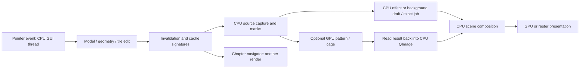

# Webtoon Maker: CPU/GPU and responsiveness review

12 September 2026 · Non-Blender editor · Current working tree based on `c1a9037daac9a4fd65dc084064d6e15c0ec178d4`, including the pre-existing uncommitted performance changes.

**The most immediately actionable finding is the chapter navigator.** On a copy of **“Chaper 1 Rewritten,”** its tiny 14 × 684-pixel thumbnail took **368 ms** to refresh with GPU effects enabled. Updating only a five-pixel-high band still took **355 ms**. The main 800 × 600 viewport took about **10 ms** for a warmed top-of-chapter repaint. This is enough work on the GUI thread to disrupt drawing and dragging even when the brush itself is fast.

**The editor is primarily a CPU renderer with GPU presentation and selected GPU effects.** Most interaction, scene preparation, raster painting, geometry, masks, and effects still run on the CPU. Changing a small part of a long chapter can trigger work across a large object, effect subtree, or the entire navigator. The most effective restructuring is to make that work proportional to the changed, visible region and keep it out of the immediate input path.

A follow-up raster drawing probe confirmed the practical connection: **0.15–0.21 ms of brush input work, about 8 ms until the canvas image was ready, and roughly 350 ms of additional navigator work**. This used the actual copied chapter and an RTX 5060. It isolates synchronous editor work; it is not a physical pen-latency measurement.

## Scope and confidence

I reviewed the actual source, existing performance work and tests, ran synthetic scaling probes, and loaded all three saved chapters from a separate copy of the supplied project. The copy is under `.artifacts/performance-review/Pocket-Boyfriend-copy`; experiments do not use the original project as a save destination. No application source was changed for this review. Final verification found the same 8,400 original files with unchanged sizes and modification times, and SHA-256 comparisons found zero content differences between the original and the initial project copy.

The machine has a Ryzen 7 7700X (8 cores/16 logical processors), approximately 31.1 GiB usable physical memory, integrated AMD graphics, and an NVIDIA RTX 5060. The benchmark Python environment is Python 3.11.15, PySide6 6.11.1, NumPy 2.4.6, SciPy 1.17.1, and Pillow 12.2.0. Native automatic-backend tests selected `GpuCanvasWidget` and successfully used the pattern GPU renderer. The drawing probe reported `NVIDIA GeForce RTX 5060/PCIe/SSE2`, OpenGL 3.3, NVIDIA 591.44. Forced-raster tests used Qt offscreen.

Measurements below are **local observations, not promised frame rates or speedup estimates**. Saved-scene tests time rendering helpers, with an 800 × 600 viewport at scale 1, warmed caches, three navigator repeats and five viewport repeats. Profiles are separate instrumented samples. These tests do not measure physical stylus-to-screen latency, display refresh, or every MainWindow callback. No editor window was running when initially inspected. Live Blender rendering, extension behavior, and external source refresh are excluded; cached images already embedded in chapters remain part of normal editor rendering.

## What the supplied project contains

| Saved chapter | Dimensions | Layers / objects | Effects / masks | Vector strokes | Decoded raster tile payload |
|---|---|---:|---:|---:|---:|
| Chaper 1 Rewritten | 1080 × 53,820 | 72 / 73 | 24 / 3 | 0 | 274.5 MiB |
| Actual Chapter 1 | 1080 × 36,000 | 19 / 30 | 6 / 0 | 0 | 296.5 MiB |
| Chapter 1 | 1080 × 42,267 | 28 / 21 | 1 / 0 | 498 | 160.3 MiB |

The rewritten chapter includes five halftones, five Scream effects, twelve outlines, an array, and a mirror. Its largest raster object has 283 occupied tiles and an interaction frame about 28,421 pixels tall. “Actual Chapter 1” has a 497-tile raster object and another with 349 tiles. Object counts alone therefore understate scene complexity.

These are decoded tile-pixel estimates, not observed total process RAM or proof of a leak. Image decoding, masks, float working arrays, effect caches, undo, and temporary captures add to them. The three chapters were inspected separately; their tile totals should not be interpreted as simultaneous editor memory use. Additional open series/asset sessions can retain their own images, caches, and history.

## CPU versus GPU responsibilities

| Operation | Where it runs now | Consequence |
|---|---|---|
| Pointer handling, selection, snapping, geometry edits, hierarchy/model changes, cache identities, undo construction | CPU/Python, usually GUI thread | A slow loop blocks subsequent input regardless of GPU speed. |
| Raster pencil/eraser, sparse tile updates, vector preview tiles | CPU Qt `QPainter` into `QImage` tiles | Mostly local and already optimized; effects and notifications can amplify the work afterward. |
| Main scene composition: paths, text, clipping, tile placement, ordinary layer blending | CPU raster painting into a viewport-sized `QImage` | Most scene rendering does not become GPU rendering when the GPU widget is selected. |
| Present cached scene; live ink, handles, some transform previews | GPU-backed QPainter when the widget is `QOpenGLWidget`; CPU in raster mode | GPU display and overlays help, but do not remove CPU scene preparation. |
| Halftone, Pixelate, and their pre-filter blur | Optional OpenGL shaders; CPU fallback | CPU source/mask preparation and GPU-to-CPU result transfer remain. |
| Cage image resampling | Optional OpenGL mesh draw; CPU mesh preparation and CPU fallback | Long images can exceed GPU path limits. |
| HSL, ordinary/focal blur, outlines, Posterize/value, color simplification, radial blur | CPU NumPy/Pillow/SciPy | Large exact work often uses a worker; preparation, small work, and certain fallbacks still block the GUI thread. |
| Opacity masks, gradient sampling, compound/Scream geometry, stroke effects, array/repeat composition | Primarily CPU | Geometry complexity and full intermediate-image dimensions matter, even for small displayed thumbnails. |
| Flood fill | CPU; larger fills use detached background work | Existing batching and cancellation help. |
| Autosave | CPU snapshot on GUI thread; encoding/file writing on worker | Background saving does not make full-model snapshot creation free. |
| Explicit saves, exports, baking | CPU-heavy exact rendering/serialization; some optional GPU kernels | Separate throughput workload; should not determine interactive frame quality/cadence. |

The central source evidence is [scene-cache rendering](C:/Users/hopper/Documents/GitHub/webtoon-maker/comic_editor/ui/canvas.py:1404), which constructs `QPainter(self._scene_cache)`, followed by [presentation and overlays](C:/Users/hopper/Documents/GitHub/webtoon-maker/comic_editor/ui/canvas.py:3227). [Canvas selection](C:/Users/hopper/Documents/GitHub/webtoon-maker/comic_editor/ui/canvas.py:24794) chooses QWidget or QOpenGLWidget around that same logic. Qt documents that QImage painting uses its software raster engine, whereas painting onto QOpenGLWidget can use OpenGL. [Qt QPainter documentation](https://doc.qt.io/qt-6/qpainter.html#performance).

The normal pipeline is approximately:

There is no defensible single “CPU percentage versus GPU percentage” from static code. It varies with tool, effects, backend, scene, cache state, and whether work is inside a worker. The responsibilities above are verified; hardware utilization percentages were not measured.

## Findings ranked by likely value

### 1. Remove chapter navigator rendering from the drawing-critical path

**Evidence: measured on the supplied chapter, high confidence.**

| Rewritten chapter operation | Forced CPU | Native auto/GPU effects |
|---|---:|---:|
| Warm top viewport repaint | 10.0 ms | 9.8 ms |
| Warm 35 × 35-pixel viewport dirty region | 7.8 ms | 7.9 ms |
| Broad invalidation + top viewport repaint | 11.7 ms | 11.5 ms |
| Entire navigator refresh | 205.6 ms | 367.7 ms |
| Five-pixel-high navigator band refresh | 192.2 ms | 354.7 ms |

The [navigator subscribes to both document and visual changes](C:/Users/hopper/Documents/GitHub/webtoon-maker/comic_editor/ui/preview.py:17). Its dirty bands clip the destination painter, but [render_preview](C:/Users/hopper/Documents/GitHub/webtoon-maker/comic_editor/ui/canvas.py:4543) still supplies the whole chapter as the visible source and traverses all root pages. A narrow destination clip does not prevent upstream source capture, effect execution, or geometry work.

In one native navigator profile, total time was 407 ms, including 173 ms in five pattern renders, **129 ms inside framebuffer `toImage()`**, 77 ms in two opacity-mask applications, and 48 ms in compound-layer rendering. The `toImage()` time can include waiting for GPU completion, readback, and conversion; it is not a measurement of pure transfer bandwidth. These are nested cumulative measurements; they must not all be added together. The profiler also observed 1,118 QPainter image-draw calls for this tiny thumbnail.

The follow-up drawing experiment made six short raster segments using an 8-pixel brush on an existing visible raster object without effect modifiers. It restored baseline tiles between scenarios and kept all edits in memory:

| Drawing-loop measurement | Median |
|---|---:|
| Continue-stroke input handler | 0.15–0.21 ms |
| Input + dirty flush + canvas image ready, navigator skipped | 8.21 ms |
| Navigator's dirty-band work alone, canvas-first scenario | 350.44 ms |
| Input + canvas + navigator synchronous work | 359.42 ms |
| Canvas image ready when deliberately running navigator first | 362.39 ms |

Actual Qt scheduling may choose a different order or coalesce repaints. The experiment measures the cost of servicing both dirty surfaces, not that the navigator runs once per tablet packet or always before the canvas. Whichever paint comes first, a long synchronous navigator paint delays subsequent events. Each changed navigator band was only **14 × 5 pixels**, yet it processed halftone inputs of 730 × 444, 486 × 258, 576 × 910, and **1527 × 6127 twice**. The latter is about 9.36 million source pixels for a 70-pixel thumbnail update.

GPU mode was slower for this particular navigator workload, not universally slower. The [pattern pipeline](C:/Users/hopper/Documents/GitHub/webtoon-maker/comic_editor/ui/effect_pipeline.py:178) attempts a full GPU effect before choosing the navigator's reduced CPU draft. That explains why the CPU-versus-auto thumbnail comparison is not a quality-equivalent GPU kernel benchmark. It exposes a scheduling/resolution-policy issue.

**Restructure:** maintain cached page/band thumbnails; inverse-map dirty thumbnail bands into document-space queries while preserving the existing full-chapter-to-thumbnail transform; evaluate every intermediate at navigator resolution before GPU dispatch; reuse committed thumbnails while drawing; refresh changed thumbnails after the gesture or at a deliberately limited cadence. Cache/downsample opacity masks and isolate navigator caches from interactive canvas caches. Preserve blur halos and cross-layer dependencies. Give the live brush priority over navigator refresh. Moving the navigator to a worker requires detached render state because its current renderer mutates shared canvas state.

Simply hiding the navigator is useful as a diagnostic. The implementation improvement is to prevent a thumbnail update from executing a second expensive full-scene pipeline during interaction.

### 2. Make invalidation and effects local to the change

**Evidence: verified code paths and real mask/effect profile; high confidence in the mechanism.**

A tiny raster dab can expand to chapter-wide dirtiness when the object contributes to a tone mask, is a halftone color source, or has Halftone/Pixelate in its ancestry: [modifier_expanded_dirty](C:/Users/hopper/Documents/GitHub/webtoon-maker/comic_editor/ui/canvas.py:1256). This does not allocate a chapter-sized main scene buffer; it causes broader redraws and navigator invalidation.

Meanwhile, [documentChanged connections](C:/Users/hopper/Documents/GitHub/webtoon-maker/comic_editor/ui/canvas.py:1036) clear global render bounds and other caches even when a changed rectangle is available. [Worker completions](C:/Users/hopper/Documents/GitHub/webtoon-maker/comic_editor/ui/effect_jobs.py:134) also invalidate the scene and emit an unbounded visual change. Shape/anchor dragging emits document changes during movement, so unrelated work can recur on every sample.

Effect source caches are not cheap to look up: [object signatures](C:/Users/hopper/Documents/GitHub/webtoon-maker/comic_editor/ui/canvas.py:8037) JSON-serialize the model, while [layer signatures](C:/Users/hopper/Documents/GitHub/webtoon-maker/comic_editor/ui/canvas.py:8047) recurse through descendants before checking cached pixels. Modified ancestors can repeat this work.

**Restructure:** introduce typed change records with entity IDs, changed properties, old/new bounds, dirty tiles, and content/geometry/effect revisions. Maintain reverse dependencies for masks, shared effects, compound contributors, and target-layer colors. Propagate revisions only to dependants. Keep gesture preview updates separate from committed document/history notifications. Make cache keys constant-size revision identities rather than serialized subtrees. Worker results should invalidate their affected regions.

This is foundational for drawing, shape motion, transforms, undo repaint, and navigator updates. Merely shrinking dirty rectangles without tracing dependencies would produce incorrect artwork.

### 3. Keep long drawings sparse through effect rendering and transforms

**Evidence: full-target allocation paths and the supplied tall raster objects; high confidence, exact per-gesture contribution varies.**

The ordinary scene cache is already viewport-sized. However, [modified-layer capture](C:/Users/hopper/Documents/GitHub/webtoon-maker/comic_editor/ui/canvas.py:4827), [modified-object capture](C:/Users/hopper/Documents/GitHub/webtoon-maker/comic_editor/ui/canvas.py:8196), and [spatial-effect capture](C:/Users/hopper/Documents/GitHub/webtoon-maker/comic_editor/ui/canvas.py:8283) can build full target-bounds images even when only a small portion is visible. Pattern/cage stages retain full-input requirements; masks and conversions can be processed before a bounded preview is selected.

A 1080 × 20,000 RGBA8 image is **82.4 MiB**; the same image as RGBA float32 is **329.6 MiB**. Several intermediates can greatly exceed the sparse input's occupied-pixel footprint. The rewritten chapter's full dimensions would be 221.7 MiB for one RGBA8 image and 886.9 MiB for one RGBA float32 array, **if** a full-width/full-height capture were requested. This is a scale illustration, not a claim that every frame allocates those arrays.

Source and result LRUs are each normally 64 MiB, with one oversized entry permitted. Two large targets can therefore evict one another. Separate retained worker results mitigate some rework; cache eviction is not itself evidence of a leak.

**Restructure:** evaluate effects in document-space tiles with stable pattern coordinates and explicit input-region dependencies. HSL/intensity are local; blur/outline need padded neighboring regions; mirror/array need inverse-mapped sources; cage/radial effects need conservative input bounds. Cache exact and preview tiles separately. Preserve sparse empty areas. Apply masks at the destination's required resolution and cache their results by dependency revision.

For raster selection transforms, [the commit loop](C:/Users/hopper/Documents/GitHub/webtoon-maker/comic_editor/ui/canvas.py:15143) submits every selected source tile to every destination tile. Reuse the inverse-query strategy already present in [TileStore.projective_transform](C:/Users/hopper/Documents/GitHub/webtoon-maker/comic_editor/core/tiles.py:1172). That is a focused improvement before a larger renderer redesign.

### 4. Fix synchronous fallback gaps before expanding GPU coverage

**Evidence: concrete control-flow defect; not reproduced with a large cage allocation in this review.**

The [cage tool preview](C:/Users/hopper/Documents/GitHub/webtoon-maker/comic_editor/ui/cage_features.py:207) tries GPU rendering, then submits a CPU worker job. If the estimate exceeds the normal 256 MiB budget, the request can be rejected because this call omits `allow_oversized=True`. Its final branch immediately computes the exact CPU warp on the GUI thread.

GPU pattern/cage code rejects targets beyond an 8192-pixel edge or approximately 16 million pixels. A hypothetical 1080 × 10,000 cage target crosses the edge limit and has an approximately 577 MiB job estimate, satisfying the conditions for this blocking fallback during an interactive preview. The modifier cage path already handles oversized work separately.

**Restructure:** guarantee a bounded immediate draft plus exclusive background execution for oversized cage work. Never use worker rejection as permission to execute an expensive exact render synchronously during a gesture. Audit Dot/Dash, repeat operations, source capture, and mask preparation for the same gap. Keep exact rendering for commit/export as a separately scheduled operation.

The existing one-worker effect queue controls memory, but common CPU stacks check cancellation around a whole stack. A stale job can occupy the only worker until its expensive calculation finishes. Use cancellable tile/stage units, prioritize visible/active work, coalesce exact requests, and retain fair progress. Increasing worker count first can multiply working memory and contention.

### 5. Use spatial indexes for selections and retain culling during edits

**Evidence: synthetic scaling reproduced; particularly relevant to the older vector chapter and future dense chapters.**

[General object/entity hit testing](C:/Users/hopper/Documents/GitHub/webtoon-maker/comic_editor/ui/canvas.py:12407) traverses chapter candidates; vector containment and [stroke selection](C:/Users/hopper/Documents/GitHub/webtoon-maker/comic_editor/ui/canvas.py:16803) examine all strokes. Stroke-selection hover invokes this before a click. The renderer and eraser have spatial indexes, but these hit paths do not share them.

| Synthetic drawing size | Object hit-test miss | Stroke-selection miss/hover | Move 100 anchors, input only |
|---:|---:|---:|---:|
| 100 two-point strokes | 3.4 ms | 2.9 ms | 0.5 ms |
| 1,000 | 29.5 ms | 28.5 ms | 5.3 ms |
| 5,000 | 157.1 ms | 145.6 ms | 28.1 ms |

Visible content was held constant. These exclude painting and MainWindow callbacks. A 60 Hz frame has 16.7 ms available, so even the 1,000-stroke miss is already too expensive for continuous hover.

[Anchor dragging](C:/Users/hopper/Documents/GitHub/webtoon-maker/comic_editor/ui/canvas.py:16973) rebuilds a drawing-wide point map and repeatedly scans for selected points. During some vector edit previews, the render candidate list becomes all strokes, although subsequent bounds checks still avoid painting offscreen strokes. [Scene culling](C:/Users/hopper/Documents/GitHub/webtoon-maker/comic_editor/ui/scene_culling.py:115) is bypassed for several transform/capture states; many effects lack usable conservative bounds, even non-expanding color effects.

**Restructure:** query pages/subtrees/objects/strokes by pointer or lasso bounds, then perform exact geometry checks on candidates in correct stacking order. Keep direct point-ID lookups and a small changed-stroke set during drags. Preserve the spatial index for unchanged artwork. Add conservative bounds for color effects immediately, then richer effect footprint interfaces.

There is residual traversal even in simple culled scenes: with 100/1,000/3,000 offscreen panel layers, warmed full viewport render was 1.1/7.7/25.6 ms. A small dirty rectangle was 0.8/7.4/25.8 ms. Navigator refresh was 7.2/72.4/227.7 ms. Culling already saves pixel work; an actual scene query index would also save node visits.

### 6. Replace broad history snapshots with focused commands

**Evidence: source and synthetic timings; secondary to navigator/effect work in the rewritten chapter, which has no vector strokes.**

Raster pencil already stores touched tile patches. Vector pencil still snapshots the selected drawing on press and commit; many shape/object/group transforms snapshot the entire chapter at start and end. Autosave [captures a deep copy of the serialized chapter on the GUI thread](C:/Users/hopper/Documents/GitHub/webtoon-maker/comic_editor/ui/autosave.py:32), before sending file work to its worker.

In a synthetic chapter with a 5,000-stroke drawing, ten points per stroke, one chapter serialization took **140 ms**, a recovery snapshot **366 ms**, vector history commit **169 ms**, and an unrelated raster move's two snapshots plus history **345 ms**. The optimized undo/redo handler pair was only **3.5 ms**. At 1,000 strokes, the corresponding figures were approximately 19, 52, 20, 40, and 0.7 ms. Fast replay therefore does not establish fast command construction.

The [object-only restore path](C:/Users/hopper/Documents/GitHub/webtoon-maker/comic_editor/ui/canvas.py:1849) also clears broad render/effect caches, so the next repaint can cost much more than the undo handler. History is bounded by command count, not retained byte size.

**Restructure:** store changed transform fields, added/changed strokes, selected geometry, and touched tiles in commands. Preserve unrelated render caches on undo. Use immutable/versioned records for autosave snapshots and perform serialization away from input. Add history memory accounting. Keep full snapshot restore for truly structural operations until equivalent correctness is established.

### 7. Make GPU acceleration end-to-end for the work that benefits

**Evidence: actual readback profile plus verified source; larger engineering effort.**

[GPU pattern output](C:/Users/hopper/Documents/GitHub/webtoon-maker/comic_editor/ui/gpu_pattern_effects.py:566) and [GPU cage output](C:/Users/hopper/Documents/GitHub/webtoon-maker/comic_editor/ui/gpu_textures.py:149) become QImages via synchronous framebuffer readback. Subsequent CPU composition may be followed by another GPU upload. Each renderer retains one source texture, so alternating targets can defeat the favorable one-source cache behavior. Qt explicitly identifies framebuffer `toImage()` as a potentially expensive pixel readback. [Qt framebuffer documentation](https://doc.qt.io/qt-6/qopenglframebufferobject.html#toImage).

A separate 1080 × 720 one-source benchmark found warmed GPU halftone/stippling updates around **4–5 ms**, with one source upload. First use was **434 ms**, including initialization. HSL + blur + outline remained CPU work: exact calls took **169–205 ms**, immediate drafts around **11 ms**, and exact results settled **319–338 ms** after the last edit. Final outputs matched the synchronous reference in that benchmark.

**Restructure:** retain byte-budgeted textures per tile/entity revision, chain compatible effects and mask blending in shared GPU contexts, composite resident tiles directly, and read back only for CPU consumers/export. First migrate high-volume composition/resampling/local image effects; keep geometry/model logic on CPU. Preserve premultiplied alpha, effect ordering, mask semantics, text quality, and CPU fallback.

A blanket GPU rewrite or faster GPU purchase would not resolve navigator scheduling, model snapshots, exhaustive hit testing, or Python cache-signature work. The useful GPU change is removing repeated full-image transfers and CPU composition from the interactive pipeline.

## Recommended implementation sequence

| Order | Work package | Expected benefit | Relative scope |
|---|---|---|---|
| 1 | Navigator scheduling, thumbnail-resolution intermediates, inverse dirty-band culling | Most directly supported improvement for drawing/dragging in the supplied rewritten chapter | Small to medium |
| 2 | Eliminate synchronous oversized cage fallback; bound other interactive preparation | Prevents a concrete class of long freezes | Small targeted fix, then audit |
| 3 | Typed changes, revision cache keys, reverse dependencies, local worker completion | Reduces repeated work across all core tools | Medium; central architectural change |
| 4 | Shared scene/stroke hit queries and direct point lookups | Large selection/hover/anchor improvement as geometry grows | Medium |
| 5 | Tiled effect captures/masks and inverse raster-selection tile queries | Largest general improvement for long raster chapters | Medium to large |
| 6 | Localized history and immutable save snapshots; preserve caches on undo | Reduces pen-down/pen-up, transform completion, and periodic stalls | Medium |
| 7 | Resident GPU tiles and effect chains; bounded cancellable scheduling | Raises sustained effect-heavy performance after locality is established | Large |

Retain the work already done: sparse 256 × 256 tiles, dirty-region coalescing, predictive/live ink, transform background caches, outline distance caching, worker drafts, exact-result retention, targeted vector undo replay, and outliner row caching. The remaining problem is coverage and coordination of those mechanisms, not an absence of optimization.

## How to verify improvements

Use the supplied chapter copy as a permanent local regression fixture and synthetic scenes to test growth. Measure pen-down, per-packet input, event-queue delay, canvas paint, navigator paint, pen-up/history, and time to exact effects separately. Include warm/cold caches, long strokes, nested effects, mask contributors, many offscreen objects, compound-child movement, multi-object transforms, lasso commits, and undo followed by its repaint.

Suggested engineering targets, **not current measured guarantees**: immediate input/ink work below 8 ms at p95; ordinary interactive frames below 16.7 ms at p95, with a separately agreed budget for expensive effects; no navigator render on the active gesture's critical path; no exact full-image fallback caused by queue rejection. Record p99 stalls as well as medians. Do not discard tablet samples when coalescing display updates.

Record actual backend and GL device, source captures in pixels/bytes, GPU uploads/readbacks, cache hit cost, visited entities/strokes, queued work/bytes, cancellation delay, peak memory, and frame presentation. Compare steady-state quality with steady-state quality; distinguish a quick draft from exact output. Validate pixels and interaction semantics across clipping, long-coordinate geometry, projective transforms, masks, mirrored/array content, and undo/export.

Existing `docs/editor-performance.md` records prior improvements and historical measurements; they are valuable context but are not substituted for this review's new measurements. In particular, small-scene handler/undo benchmarks do not cover the slow navigator or long-target effect captures found here.

A focused run of the canvas-input, scene-culling, vector-cache, undo-performance, and hierarchy-performance test files completed all 76 cases with exit code 0. Both the ordinary run and the isolated-plugin retry emitted a Windows `0xc0000139` diagnostic during Qt TLS backend discovery before continuing through the tests. This is an unresolved startup diagnostic, not evidence of a lag cause or a clean startup certification. The report does not claim a new full-suite pass. [Test output](C:/Users/hopper/Documents/GitHub/webtoon-maker/.artifacts/performance-review/focused-tests-isolated.txt).

## Evidence and reproduction files

All review evidence is local under [.artifacts/performance-review](C:/Users/hopper/Documents/GitHub/webtoon-maker/.artifacts/performance-review). It includes a project copy and rendered artwork; it was not uploaded or published.

| Evidence | File |
|---|---|
| Saved chapter + navigator benchmark | [benchmark_saved_chapters.py](C:/Users/hopper/Documents/GitHub/webtoon-maker/.artifacts/performance-review/benchmark_saved_chapters.py) (`--auto` for native GPU paths; default forced raster) |
| Saved chapter measurements | [CPU](C:/Users/hopper/Documents/GitHub/webtoon-maker/.artifacts/performance-review/saved-chapter-timings.json), [auto](C:/Users/hopper/Documents/GitHub/webtoon-maker/.artifacts/performance-review/saved-chapter-timings-auto.json) |
| Native rendering profile | [saved-chapter-profiles-auto.txt](C:/Users/hopper/Documents/GitHub/webtoon-maker/.artifacts/performance-review/saved-chapter-profiles-auto.txt) |
| Actual copied-chapter drawing probe | [drawing_saved_chapter_probe.py](C:/Users/hopper/Documents/GitHub/webtoon-maker/.artifacts/performance-review/drawing_saved_chapter_probe.py), [results](C:/Users/hopper/Documents/GitHub/webtoon-maker/.artifacts/performance-review/drawing-saved-chapter-timings.json) |
| Constant-visible-content scaling | [scene-navigator-scaling.json](C:/Users/hopper/Documents/GitHub/webtoon-maker/.artifacts/performance-review/scene-navigator-scaling.json) |
| Selection/anchor probe | [interaction_probe.py](C:/Users/hopper/Documents/GitHub/webtoon-maker/.artifacts/performance-review/interaction_probe.py), [results](C:/Users/hopper/Documents/GitHub/webtoon-maker/.artifacts/performance-review/interaction_probe.json) |
| History/snapshot probe | [benchmark_document_snapshots.py](C:/Users/hopper/Documents/GitHub/webtoon-maker/.artifacts/performance-review/benchmark_document_snapshots.py), [results](C:/Users/hopper/Documents/GitHub/webtoon-maker/.artifacts/performance-review/document-snapshot-timings.json) |
| Project structural/memory inventory | [project-inventory.json](C:/Users/hopper/Documents/GitHub/webtoon-maker/.artifacts/performance-review/project-inventory.json), [project-memory-inventory.json](C:/Users/hopper/Documents/GitHub/webtoon-maker/.artifacts/performance-review/project-memory-inventory.json) |
| Original project preservation checks | [metadata comparison](C:/Users/hopper/Documents/GitHub/webtoon-maker/.artifacts/performance-review/original-preservation-check.json), [content hashes](C:/Users/hopper/Documents/GitHub/webtoon-maker/.artifacts/performance-review/project-content-verification.json) |
| Existing effect benchmark rerun | `python tests/benchmark_modifier_interactions.py --backend auto --frames 6`; [console](C:/Users/hopper/Documents/GitHub/webtoon-maker/.artifacts/performance-review/modifier-auto-console.txt) |
| Detailed source audits | [renderer](C:/Users/hopper/Documents/GitHub/webtoon-maker/.artifacts/performance-review/rendering-findings.md), [interactions](C:/Users/hopper/Documents/GitHub/webtoon-maker/.artifacts/performance-review/interaction-findings.md), [document/history](C:/Users/hopper/Documents/GitHub/webtoon-maker/.artifacts/performance-review/document-findings.md) |

The project-specific tests require the isolated copy; never repoint the harness at the original. `SeriesRepository.load_chapter()` can perform interrupted-save recovery, so even opening through the ordinary repository API is done only on the copy.
