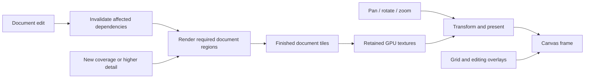

# Rendering architecture and performance evidence — 2026-09-26

This report records the earlier architecture benchmark. Its timings do not
represent sustained drawing with the later captured chapter and settings.
The [drawing-stall investigation](drawing-stutters-2026-09-26.md) supersedes
its performance conclusions with continuous-input and draw–navigate–draw
measurements, final fixes, and the remaining cold-render limitations. The
implementation and test counts below describe that earlier checkpoint.

## Current implementation and verification

Make navigation, drawing, erasing, and transforms inexpensive without replacing
finished artwork with blocky or temporarily distorted previews. Navigation is
the highest-impact priority. Reduced-quality previews remain a separate policy
for actively changing modifier controls. File-format compatibility and existing
artwork are requirements, not tradeoffs for speed.

The GPU canvas now retains finished document tiles independently of the camera
and presents them directly as GPU textures. Warm panning, rotation, and zoom-out
reuse those pixels. New areas, edits, or higher resolution levels render only
the required document regions. Capture devices retain a fixed origin and size
to keep Qt's path-clipping antialiasing stable across partial invalidations. Changed
tiles are rendered exactly before presentation; navigation does not replace
finished art with draft effects. Grid and editing overlays remain separate
from the retained artwork. The existing exact effect renderer and file format
remain in use.

The final native run, `projection-regions`, measures the retained projection,
restricted capture regions, outline coverage reuse, and corrected invalidation
after the broad test process finished. Warm navigation is substantially cheaper
and produces finished artwork immediately. Cold visits, first zoom-in, and
drawing are still slower than the preserved original implementation in these
samples. This is a navigation improvement and a foundation for further effect
work, not a claim that all rendering operations became faster.

| Matched native operation | Original median | Final median |
|---|---:|---:|
| Warm pan | 15.1 ms | 1.8 ms |
| Tilt/untilt | 14.3 ms | 5.3 ms |
| Zoom out | 24.6 ms | 5.8 ms |
| First zoom in | 28.0 ms | 57.4 ms |
| Drawing segment | 14.4 ms | 19.5 ms |
| Erasing segment | 13.9 ms | 19.3 ms |

The final production transform path measures 21.4 ms per segment. Historical
transform timings used different invalidation behavior and are not a clean
speed comparison. Warm pan, tilt/untilt, and zoom-out invoke no modifier work or
new effect jobs; warm pans upload no textures. These are synchronous
scene-ready times, not monitor latency or a sustained frame-rate guarantee.

All 75 operations finish with zero first-versus-settled pixel differences.
Every completed frame is byte-identical to the preceding visually inspected
`projection-stable` run. Native-scale views at y=12,000, 27,000, and 42,000 are
byte-identical to the original renderer; the remaining two native-scale views
have maximum channel differences of 6 and 3. Zoomed/rotated retained textures
have known sampling differences, including sparse one-pixel raster edges at
1.25×; this does not establish identical pixels at every scale.

The separate `projection-regions-dirty` run repeats invalidation at the former
shape-edge seam and across a capture-block boundary. All four redraws preserve
every pixel. Both final runs preserve all 2,580 copied project-file hashes and
never load or save the original project. Results, operation-level work counters,
golden comparisons, first/settled PNGs, and hash manifests are in the respective
artifact directories under `.artifacts/render-architecture-20260926`.

Cold first visits cost 30–565 ms, compared with 8–337 ms in the original native
run. First zoom-in costs 28–132 ms. The most expensive measured scene improves
relative to the preceding retained implementation (y=12,000 cold: 660→565 ms;
zoom-in: 203→132 ms), but remains an important optimization target. At y=6,456,
three pattern-renderer calls alone take 241 ms of the 445 ms cold frame. These
remaining costs support the GPU-intermediate/readback priority below.

`tests/test_projection_compatibility.py` adds five passing compatibility cases.
They compare every exported pixel with a fresh, uncached renderer after warmed,
dirty-but-not-redrawn, and rebuilt projection states, including raster and
embedded-image content beyond the viewed capture block. Normal saves and
autosaves preserve the complete model, sparse raster and mask pixels, original
embedded PNG bytes, and full-document export pixels after loading and warming
the projection again. The tests use synthetic documents and isolated temporary
repositories; no user project or live application is involved.

The final consolidated Windows renderer suite passes all 117 tests, with no
failures or skips (`final-renderer-tests.xml` and `.txt`). The broader run has
3,306 passing, 27 failing, and 45 skipped tests. Four failures exercised the
earlier invalidation implementation already imported into that long-running
process; all 14 current invalidation tests pass in a fresh process after the
fixes. The other 23 UI failures reproduce unchanged against the preserved
baseline: 12 Distort panel-width cases, one Curves panel-width case, and ten
text-editing canvas-size comparisons. Their paired baseline/current evidence
is recorded in `tiles-test-triage.md` under the artifact directory. The broad
suite was not rerun in full after those fixes, so these results are not an
all-suite-green claim. Blender tests and connections were excluded.

## Architecture recommendation and next priorities

Keep Qt for the application UI and use the retained document projection as the
rendering boundary. A camera move changes how finished document textures are
presented. An edit invalidates the affected content and dependent effects.
Newly exposed areas or a higher detail level require rendering the needed
regions. The user explicitly narrowed the immediate work from a possible full
rewrite to the highest-impact feasible improvements; this foundation satisfies
that direction without claiming that every effect now runs on the GPU.



Switching graphics APIs alone does not remove repeated composition or
unnecessary invalidation. OpenGL already supports the retained presentation
implemented here; Vulkan would still need the same ownership, caching, and
dependency decisions. There is no measured reason in this work to rewrite the
whole application or its UI around another API.

The next priority is the expensive work required when finished pixels do not
exist yet: keep effect and mask intermediates on the GPU, reuse them across
dependent operations, and avoid transferring full results back to the CPU.
Preserve exact CPU rendering and saved-image comparisons as numerical and
visual reference paths during that migration. Optimize the effect stacks with
measured cold/zoom costs first, then widen coverage to drawing and transforms;
do not trade stable artwork for an apparent frame-time improvement.

## Original architectural problem

The baseline demonstrates two distinct issues: repeated CPU composition
when only the camera changes, and expensive effect/capture work when a camera
change crosses an effect's cached rectangle or disables a cropping shortcut.
Many ordinary pans already reuse modifier output; it would be inaccurate to say
that every view change recalculates every modifier.

## Safe, reproducible baseline

`tests/benchmark_render_architecture.py` loads the complete saved chapter from
`.artifacts/render-architecture-20260926/project-copy`, a fresh copy of the
previously isolated `.artifacts/responsiveness-20260924/Pocket-Boyfriend-copy`.
The original project is not loaded or saved. The harness does not instantiate
MainWindow, start the application broker, use Blender sync, or connect to
Blender. Edits occur only in memory. Settings resolve into the benchmark's
artifact directory.

The copy contains 2,580 files totaling 50,944,057 bytes. SHA-256 manifests of every
copied project file before and after the baseline are identical. They are saved
as `baseline/project-files-before.json` and `baseline/project-files-after.json`
under the artifact directory. The pre-rewrite Python source snapshot is retained
in `baseline-source/comic_editor` for repeatable comparisons while production
code changes.

Baseline document and machine:

- Saved chapter: `Chaper 1 Rewritten`, ID `0a72f08009294aa0a3d14e6a38e22bbb`.
- Document: 1,080 × 54,896; 95 objects, 74 layers, 31 modifiers; all remain loaded
  and render through their normal hierarchy, masks, and effect paths.
- Native Windows Qt; `GpuCanvasWidget`; NVIDIA GeForce RTX 5060;
  OpenGL `3.3.0 NVIDIA 591.44`.
- Viewport: 1,000 × 800; chapter positions y=300, 6,456, 12,000, 27,000, 42,000.
- Grid hidden in matched timing runs; transform and selection overlays are
  exercised by the edit sequence. Grid correctness has separate native tests.
- At each position: cold view, identical warm view, pan, return, 15° tilt,
  untilt, 1.25× zoom, 0.75× zoom, restore. Additional saved-raster drawing,
  erasing, transforming, commits, and undo give 75 measured operations.

Reproduce the original scene-cache baseline:

```powershell
python tests/benchmark_render_architecture.py --baseline --label baseline-repeat
```

For a native frame comparison, add `--native-frame --save-all`. That mode creates
only a nonactivating window with `WA_DontShowOnScreen`. It exercises the actual
paint event and reads back the already-painted framebuffer for visual validation.
The benchmark's deliberate readback is reported separately and excluded from
scene-ready timing. It does not represent a readback added to production.

## Baseline findings

The original scene-cache baseline completed all 75 operations and all effect
jobs settled. Full rows, cache sizes, modifier work, first/settled pixel
differences, and images are in `baseline/results.json`, `baseline/events.json`,
and `baseline-run.log` under the artifact directory.

| Operation | Synchronous scene-ready time | Additional work / quality |
|---|---:|---|
| Warm pan across five chapter positions | 5.6–17.4 ms | Most reused effects; top view invoked one small GPU pattern pass |
| Zoom out at y=6,456 | 110.0 ms | Four source captures; 8.0-million-pixel GPU pattern input |
| Tilt at y=12,000 | 176.0 ms | 20.7-million-pixel image; draft; another 1,109 ms to settle |
| Zoom out at y=12,000 | 52.0 ms | Draft; another 31 ms to settle |
| Raster drawing segment median | 11.5 ms | No modifier calls in these six segments |
| Raster erasing segment median | 11.6 ms | No modifier calls in these six segments |
| Transform segment, scene-cache helper median | 14.0 ms | Does not include the separate transform paint fast path |
| Cold view at y=6,456 | 908.9 ms | Five source captures; two GPU pattern passes |

At y=12,000, the first tilted frame differs from the settled frame in 13,737
channel bytes, with a maximum difference of 175. Visual inspection confirms
white outline artifacts that disappear after settling. Zoom-out changes 5,820
channel bytes after settling. These are changes at an identical camera and
document state, so they are evidence of a temporary rendering result, rather
than expected differences from moving or resampling the camera.

## Measurement limits and remaining acceptance criteria

- The original baseline measures private scene-cache helpers and CPU
  scene-ready work. It is not input-to-photon latency, GPU completion timing, or
  proof of a sustained display refresh rate. Native-frame runs exercise the
  production paint path but still do not measure monitor presentation latency.
- Timings include instrumentation and one sample per navigation operation at
  each position. Cold shader/resource initialization, OS scheduling, and other
  workloads can affect individual numbers. Use repeated warm sequences for
  final performance conclusions.
- The original `gpu_pattern_readback` event counter records calls to the GPU
  pattern renderer; unsupported calls may return without performing a draw.
  Successful pattern renders in the snapshotted implementation call `toImage()`.
  Do not interpret the counter as a general hardware transfer profiler.
- Zero first-versus-settled differences show temporal consistency, not that
  either frame is correct. Compare completed frames against the preserved
  baseline, inspect differences, and test effect boundaries and transforms
  independently. Intentional interpolation changes require explicit review.
- These edit samples use one real raster object. They do not prove performance
  for every modifier stack, vector gesture, large masked transform, or navigator
  refresh. The saved chapter contains no vector drawing objects.
- Completion requires warm navigation within retained coverage to reuse exact
  artwork without modifier recomputation, output-size readback, or draft
  replacement; bounded work for newly exposed areas; correct detail at zoom;
  correct edits/undo and masks; and unchanged project-file compatibility.
  The user accepted prioritizing the highest-impact feasible subset. Report
  completion of that scope separately from the remaining effect-pipeline work;
  a retained viewport does not imply that every rendering stage is GPU-native.

The validated native-frame baseline is `baseline-native-verified/results.json`.
It completed all 75 operations with unchanged project hashes and reproduced both
temporary-image differences above. Every first and settled frame is saved in
that directory for post-change comparisons. Its median scene-ready time was
14.8 ms, with a 337.2 ms maximum; these numbers are not directly comparable with
the scene-helper baseline because the native run includes actual paint paths
and was performed after initial driver/shader warm-up. The earlier
`baseline-native` experiment is not a visual reference: it exposed a harness
race in which an event-loop completion could be accepted after capture but
before the newly finished pixels were captured. The validated run fixes that
race by checking the effect completion count around every captured frame.

## First projection integration: progress and failures

The `projection-first` native run completed 75 operations with no first-frame
versus settled-frame differences and unchanged project hashes. This is useful
temporal-stability evidence, but the implementation is not yet accepted: newly
required tiles cause significant synchronous stalls, and visual comparison found
tile-generation differences at native scale.

| Native-frame operation | Preserved baseline median | First projection median |
|---|---:|---:|
| Pan across five positions | 15.1 ms | 2.0 ms |
| Zoom out across five positions | 24.6 ms | 2.0 ms |
| First zoom in across five positions | 28.0 ms | 400.3 ms |
| Raster drawing segments | 14.4 ms | 19.3 ms |
| Raster erasing segments | 13.9 ms | 28.2 ms |

Warm pans and most zoom-outs invoked no effect work and reused GPU textures.
First zoom-in required a new resolution level and took 360–646 ms. The y=12,000
cold view took 908 ms. First tilt at y=6,456 took 136 ms. These results support
keeping the retained presentation architecture, while showing that missing-tile
generation and resolution changes still need bounded work and reuse.

`projection-first/golden-comparison.json` compares all settled frames to the
preserved native images. At 1× unrotated, y=27,000 and y=42,000 are byte-identical;
y=6,456 and y=12,000 differ only by small rounding (maximum channel errors 4 and
2). Rotated and zoomed images differ due to changed resampling and require
visual/correctness review. They are not automatically accepted based on a low
average error.

The y=300 comparison identified a real tile-generation issue: a one-pixel-high,
256-pixel-wide line segment differs by up to 74 channel levels, along with other
line-art differences. A same-canvas isolation in `y300-isolate` proves:

- Current direct CPU renderer is byte-identical to the preserved baseline.
- Projection tiles presented through CPU still change 6,150 pixels, including
  3,010 with channel error above 8. The artwork issue precedes GPU presentation.
- Native presentation adds a separate 2,000-pixel difference at the chapter's
  top border, caused by its different antialiasing path.

The first projection run also emitted a deleted-OpenGL-context warning during
teardown; the GPU presenter owner is addressing resource lifetime separately.

The initial native transform measurements used an inherited explicit full-scene
invalidation after each preview update. That differs from the real pointer path
and overinvalidates document tiles, so the resulting 154 ms transform median
must not be treated as normal interaction latency. The harness now uses the
production `update()` path for native transform measurement and labels this in
its JSON. The scene-helper mode retains explicit invalidation. Actual preview
pixels must still be compared with the intended transformed result; a fast but
stationary cached image is a correctness failure.

## Batched projection measurements

`projection-batched` repeats all 75 native operations after adjacent missing
tiles share scene traversal and the warmed coverage window stays stable. Project
hashes remain unchanged. Warm pan median is 1.9 ms, warm tilt 1.5–2.7 ms,
zoom-out median 2.1 ms, drawing median 12.5 ms, erasing 14.0 ms, and the corrected
production transform path 22.0 ms. First zoom-in improves from 400.3 ms to a
101.6 ms median (53–180 ms), but still requires further work.

This run exposes a missing-artwork problem on the first y=12,000 frame: an
unfinished batch omits 16 tiles, leaving most of the viewport blank. Its 538 ms
initial frame differs from the completed frame in 2,027,267 channel bytes;
completion takes approximately 46 ms more. This is a failed quality criterion,
even though finished neighboring tiles stay sharp. It must not be described as
achieving stable navigation.

Completed native-scale frames improve in fidelity: y=12,000, 27,000, and 42,000
are byte-identical to the preserved baseline; y=6,456 differs in 58 pixels with
maximum channel error 3. At y=300 the 256-pixel dark seam disappears; all 2,000
pixels with channel error above 8 are the chapter-border antialiasing difference.
The remaining 1,110 artwork-pixel differences have channel error at most 8.

Independent instrumentation attributes the original dark seam to the ordinary
`comb` layer's clipped fill and border, not to effect processing or culling.
`qt_path_clip_translation_probe.py` in the artifact directory reproduces it using
only one rounded `QPainterPath`: identical path, scale, and integer-shifted
origin produce different edge coverage on a full image versus a 260-pixel image
when `setClipPath(..., IntersectClip)` is active. Disabling clipping makes those
samples identical. This is causal evidence, not a recommendation to remove
clipping. Larger batches avoid the observed seam, but partial redraws and other
batch boundaries still need visual validation.

## Stable projection verification

`projection-stable` uses fixed-size capture blocks for consistent clipping,
closer resolution buckets, exact first captures for missing blocks, and the
shared document-border drawing path. All 75 native operations settle with zero
first-versus-settled pixel changes. The previously missing y=12,000 artwork is
present on the first frame. All 2,580 copied project-file hashes remain unchanged.

| Native operation | Stable projection median |
|---|---:|
| Warm pan | 2.0 ms |
| Tilt/untilt | 5.3 ms |
| Zoom out | 5.8 ms |
| First zoom in | 55.6 ms |
| Drawing segment | 20.7 ms |
| Erasing segment | 21.2 ms |
| Production transform segment | 22.7 ms |

Cold first visits still cost 34–660 ms, and first zoom-in costs 33–203 ms in
these scenes. Drawing and erasing are slower than the preserved native baseline
in this run. The retained architecture markedly improves warm navigation; these
measurements do not establish cheap cold rendering or improved performance for
every editing operation.

At native scale, completed views at y=12,000, 27,000, and 42,000 are byte-identical
to the preserved baseline. y=300 has 1,110 differing pixels with maximum channel
error 6; y=6,456 has 58 differing pixels with maximum channel error 3. The border
difference is resolved. At 1.25× zoom, y=27,000 is exact and y=300/6,456 have only
small rounding differences. The y=12,000 and y=42,000 zoomed raster art has sparse
high-contrast edge differences (2,697 and 3,078 pixels), visually at one-pixel
edges rather than missing or shifted objects. Rotation and zoom-out resample
retained images and differ more broadly from direct rendering. No transient
drafts, missing tiles, or new block seams were observed in the inspected stable
frames; this is not a claim of byte-identical rendering at every camera scale.

`projection-stable-dirty` separately verifies unchanged redraws. It invalidates
the original seam area at world `(630,159,20,20)` twice, then invalidates
`(500,1018,30,12)` across the y=1,024 capture-block boundary twice. Every native
frame remains byte-identical to its pre-invalidation frame, with no temporary
changes and unchanged file hashes. Reproduce these checks with:

```powershell
python tests/benchmark_render_architecture.py --native-frame --save-all --positions '' --skip-edits --dirty-checks --label dirty-repeat
```
